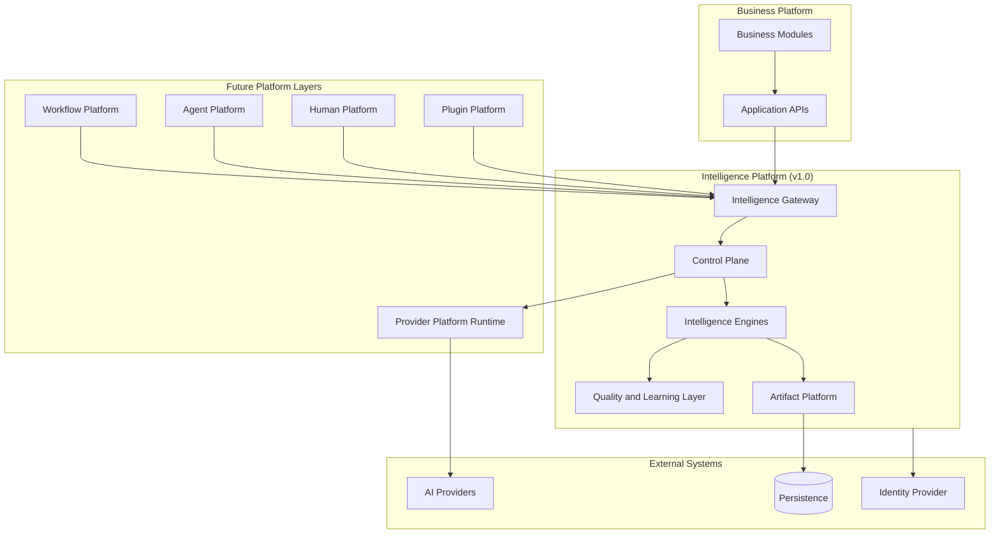
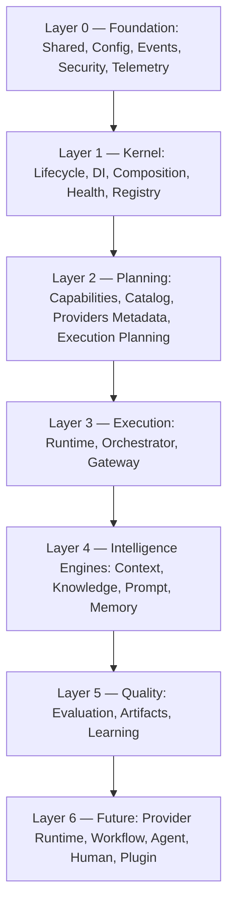
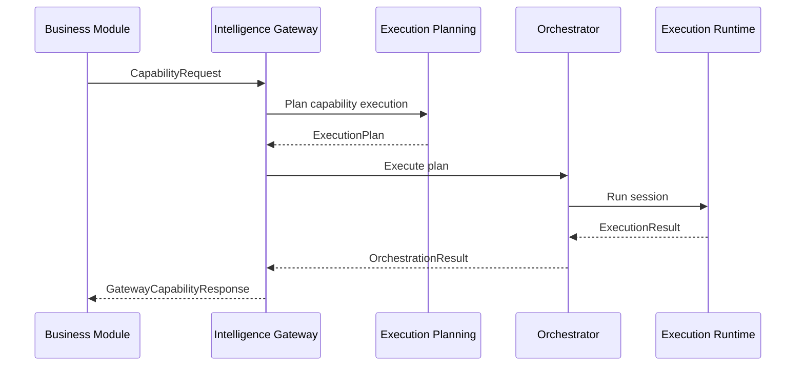

# UNAGENCY Intelligence Operating System — System Overview

**Specification Version:** 1.0  
**Status:** Approved

---

## Purpose

This document provides a high-level view of the UNAGENCY Intelligence Operating System, its layered architecture, and its relationship to adjacent platform layers.

---

## Overall Architecture

The UNAGENCY platform consists of multiple cooperating layers. The Intelligence OS sits between business applications and external AI providers, governing all intelligence operations.

---

## Layered Architecture

| Layer | Responsibility |
|-------|----------------|
| Foundation | Primitives, errors, results, identifiers, configuration, events, security contracts, telemetry |
| Kernel | Platform bootstrap, dependency injection, module registry, health, composition root |
| Planning | Capability definitions, discovery, provider metadata, execution plan generation |
| Execution | Session lifecycle, orchestration, public gateway |
| Intelligence Engines | Context, knowledge, prompt, and memory construction |
| Quality | Evaluation, artifact canonicalization, learning recommendations |
| Future | Provider runtime, workflows, agents, human review, plugins |

---

## Business Platform

Business modules represent UNAGENCY product domains: campaigns, content, analytics, client management, and related services.

**Integration rule:** Business modules may depend only on `IIntelligenceGateway`. They must not import intelligence engine internals, provider adapters, or planning modules directly.

The gateway translates business capability requests into platform execution flows and returns structured responses.

---

## Intelligence Platform

The Intelligence Platform (v1.0) is the subject of this specification. It includes all modules implemented through Milestones M0–M3.

### Control Plane

Modules that govern intelligence without performing inference:

- Capability Registry and Catalog
- Provider Platform (metadata and matrix; runtime deferred to M4)
- Execution Planning Engine
- Execution Runtime
- Intelligence Orchestrator
- Intelligence Gateway
- Policies and Scheduler (contract layer)

### Intelligence Engines

Modules that construct provider-independent intelligence inputs:

- Context Intelligence Engine
- Knowledge Intelligence Engine
- Prompt Compiler
- Memory Intelligence Engine

### Quality and Canonicalization

Modules that assess, record, and learn from intelligence outcomes:

- Intelligence Evaluation Platform
- Intelligence Artifact Platform
- Learning Intelligence Platform

---

## Future Provider Platform

Documented in [13-PROVIDER_PLATFORM.md](./13-PROVIDER_PLATFORM.md). Not implemented in v1.0.

The current Provider Platform (M1.3) supplies metadata, registry, factory contracts, capability matrix, and health ports. Full provider runtime execution — authentication, streaming, retries, circuit breakers, cost metering — is deferred to M4.

---

## Future Workflow Platform

Documented in [14-WORKFLOW_PLATFORM.md](./14-WORKFLOW_PLATFORM.md). Not implemented in v1.0.

Workflows will orchestrate multi-step intelligence pipelines including conditions, loops, human nodes, and event-driven transitions.

---

## Future Agent Platform

Documented in [15-AGENT_PLATFORM.md](./15-AGENT_PLATFORM.md). Not implemented in v1.0.

Agents will operate atop the control plane and workflow layer, using memory, context, and evaluation feedback without bypassing gateway boundaries.

---

## Future Human Platform

Documented in [16-HUMAN_PLATFORM.md](./16-HUMAN_PLATFORM.md). Not implemented in v1.0.

The evaluation platform already emits review disposition signals (`mandatory`, `recommended`, `optional`, `skip`). The Human Platform will operationalize these into review queues, approvals, and escalation.

---

## Future Plugin Platform

Documented in [17-PLUGIN_PLATFORM.md](./17-PLUGIN_PLATFORM.md). Not implemented in v1.0.

Plugins will extend capabilities, artifact types, and analyzers through registered descriptors without modifying core modules.

---

## Enterprise Governance

Cross-cutting governance spans:

| Concern | v1.0 Module | Future |
|---------|-------------|--------|
| Authentication / Authorization | Security contracts | M9 Governance |
| Audit | Security `IAuditLogger` | M9 Governance |
| Data classification | Security `IDataClassifier` | M9 Governance |
| Tenant isolation | Identity scoping in all contracts | M9 Governance |
| Policy enforcement | Policies module (contracts) | M9 Governance |
| Telemetry | Telemetry module | M10 Analytics |

Governance is embedded in contracts from v1.0. Dedicated governance administration is a future milestone.

---

## Canonical Entry Point

All intelligence entering or leaving the platform for business consumption passes through the gateway.
