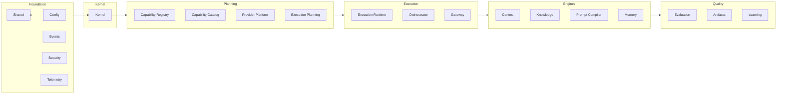
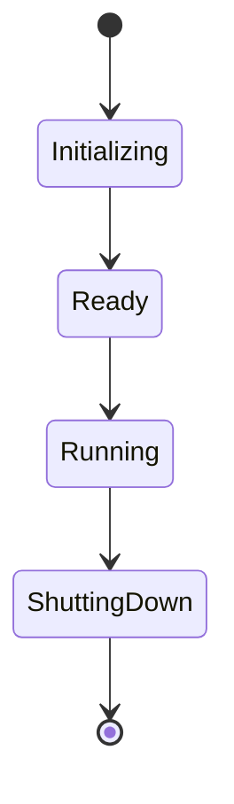

# UNAGENCY Intelligence Operating System — Architecture

**Specification Version:** 1.0  
**Status:** Approved

---

## Purpose

This document describes every architecture module in the Intelligence Platform v1.0: responsibilities, inputs, outputs, dependencies, future extensions, and explicit non-responsibilities.

---

## Module Map

---

## Foundation Modules

### Shared

| Aspect | Description |
|--------|-------------|
| **Responsibilities** | Branded identifiers, `Result<T>` pattern, base error hierarchy, common types, clock and ID generator ports |
| **Inputs** | None (root module) |
| **Outputs** | Primitives consumed by all modules |
| **Dependencies** | None |
| **Future Extensions** | Additional branded types as domains grow |
| **Non-Responsibilities** | Business logic, AI execution, persistence |

### Config, Events, Security, Telemetry

| Module | Responsibilities | Non-Responsibilities |
|--------|------------------|----------------------|
| **Config** | Centralized environment-driven configuration | Direct `process.env` access by other modules |
| **Events** | In-memory event bus contract (`IEventBus`) | External message brokers |
| **Security** | Authz, audit, classification, trust gate contracts | Identity provider implementation |
| **Telemetry** | Metrics, tracing, logging contracts | External observability backends |

---

## Kernel

| Aspect | Description |
|--------|-------------|
| **Responsibilities** | Platform lifecycle, dependency injection (`ServiceContainer`), module registry, health management, composition root |
| **Inputs** | Platform configuration, module registrations |
| **Outputs** | Bootstrapped platform, resolved services, health status |
| **Dependencies** | Shared, Config, Events, Security, Telemetry |
| **Future Extensions** | Remote health aggregation, plugin module loading |
| **Non-Responsibilities** | Business logic, AI execution, capability planning, provider calls |

---

## Capability Registry

| Aspect | Description |
|--------|-------------|
| **Responsibilities** | Source of truth for capability definitions; versioning, status, validation |
| **Inputs** | `CapabilityDefinition` registrations |
| **Outputs** | Resolved capability metadata |
| **Dependencies** | Shared |
| **Future Extensions** | External registry store, approval workflows |
| **Non-Responsibilities** | Provider selection, execution, discovery search (delegated to Catalog) |

---

## Capability Catalog

| Aspect | Description |
|--------|-------------|
| **Responsibilities** | Read-only discovery, query, filter, and sort over the registry |
| **Inputs** | Catalog queries |
| **Outputs** | Filtered capability listings |
| **Dependencies** | Shared, Capability Registry (interface) |
| **Future Extensions** | Faceted search, recommendation of capabilities |
| **Non-Responsibilities** | Mutating registry, provider selection, execution |

---

## Provider Platform

| Aspect | Description |
|--------|-------------|
| **Responsibilities** | Provider metadata, registry, factory contracts, capability matrix, health store |
| **Inputs** | `ProviderDefinition`, capability feature requirements |
| **Outputs** | Provider profiles, adapter factory, matrix matches |
| **Dependencies** | Shared |
| **Future Extensions** | Full runtime (M4): SDK adapters, streaming, retries |
| **Non-Responsibilities** | Provider SDK imports in v1.0 engines; execution planning; business logic |

---

## Execution Planning

| Aspect | Description |
|--------|-------------|
| **Responsibilities** | Transform `CapabilityRequest` into `ExecutionPlan`; sole owner of provider selection strategy |
| **Inputs** | Capability request, catalog metadata, provider matrix, policies |
| **Outputs** | `ExecutionPlan` with graph, stages, provider selection |
| **Dependencies** | Shared, Capability Catalog, Provider Matrix, Policies (interfaces) |
| **Future Extensions** | Cost optimization strategies, multi-provider plans |
| **Non-Responsibilities** | Executing plans, calling providers, business module integration |

---

## Execution Runtime

| Aspect | Description |
|--------|-------------|
| **Responsibilities** | Execution sessions, state machine, monitoring, in-memory store, lifecycle events |
| **Inputs** | Approved `ExecutionPlan` |
| **Outputs** | `ExecutionResult`, `ExecutionSnapshot`, session events |
| **Dependencies** | Shared, Events |
| **Future Extensions** | Durable session store, distributed execution |
| **Non-Responsibilities** | Provider SDK calls in v1.0; planning; orchestration coordination |

---

## Orchestrator

| Aspect | Description |
|--------|-------------|
| **Responsibilities** | Coordinate approved plan lifecycle: validate, initialize runtime, dispatch, aggregate results, handle failures |
| **Inputs** | `ExecutionPlan` |
| **Outputs** | `OrchestrationResult` |
| **Dependencies** | Shared, Execution Runtime (interface), Events |
| **Future Extensions** | Distributed orchestration, saga patterns |
| **Non-Responsibilities** | Planning, gateway exposure, provider SDK calls |

---

## Gateway

| Aspect | Description |
|--------|-------------|
| **Responsibilities** | Sole public entry point for business modules; wires control plane; health aggregation |
| **Inputs** | `GatewayCapabilityRequest` |
| **Outputs** | `GatewayCapabilityResponse` |
| **Dependencies** | Planning, Orchestrator, Runtime, Kernel (composition) |
| **Future Extensions** | Rate limiting, request validation middleware, API versioning |
| **Non-Responsibilities** | Direct provider calls; bypassing planning; exposing internal engines to business |

---

## Context

| Aspect | Description |
|--------|-------------|
| **Responsibilities** | Construct provider-independent `IntelligenceContext` from sources via builders, resolvers, enrichment, normalization, validation |
| **Inputs** | `ContextBuildRequest` |
| **Outputs** | `IntelligenceContext`, `ContextSnapshot` |
| **Dependencies** | Shared |
| **Future Extensions** | Additional section resolvers, external context sources |
| **Non-Responsibilities** | Knowledge retrieval, prompt rendering, provider calls, persistence |

---

## Knowledge

| Aspect | Description |
|--------|-------------|
| **Responsibilities** | Discover, retrieve, filter, rank, and package knowledge into `KnowledgeSnapshot` |
| **Inputs** | `KnowledgeRequest` |
| **Outputs** | `KnowledgeSnapshot`, `KnowledgeResult` |
| **Dependencies** | Shared |
| **Future Extensions** | Vector search, RAG, external knowledge connectors |
| **Non-Responsibilities** | Vector DB implementation in v1.0; prompt compilation; provider calls |

---

## Prompt Compiler

| Aspect | Description |
|--------|-------------|
| **Responsibilities** | Transform `IntelligenceContext` and `KnowledgeSnapshot` into provider-independent `CompiledPrompt` |
| **Inputs** | `PromptCompilationRequest` |
| **Outputs** | `CompiledPrompt`, `PromptCompilationResult` |
| **Dependencies** | Shared, Context contracts, Knowledge contracts |
| **Future Extensions** | Provider-specific renderers (behind `IPromptRenderer`), template repositories |
| **Non-Responsibilities** | Provider SDK calls; knowledge retrieval; execution |

---

## Memory

| Aspect | Description |
|--------|-------------|
| **Responsibilities** | Store, classify, retrieve, and snapshot intelligence experience artifacts |
| **Inputs** | `MemoryIngestInput`, `MemoryRequest` |
| **Outputs** | `MemoryRecord`, `MemorySnapshot`, `MemoryResult` |
| **Dependencies** | Shared, Context/Knowledge/Prompt contracts (for artifact ingestion) |
| **Future Extensions** | Durable stores, vector indexing |
| **Non-Responsibilities** | Conversation history replacement; learning engine; evaluation; vector DB in v1.0 |

---

## Evaluation

| Aspect | Description |
|--------|-------------|
| **Responsibilities** | Evaluate execution outputs via judge pipeline; produce reports, confidence, review disposition |
| **Inputs** | `EvaluationRequest` (includes `ExecutionResult`) |
| **Outputs** | `EvaluationReport`, `ConfidenceReport`, `ReviewDecision` |
| **Dependencies** | Shared, Execution Runtime contracts, Prompt/Memory contracts |
| **Future Extensions** | LLM judges, calibration engine, human review integration |
| **Non-Responsibilities** | AI execution; provider calls; learning; human review UI |

---

## Artifacts

| Aspect | Description |
|--------|-------------|
| **Responsibilities** | Canonical immutable intelligence objects: identity, versioning, lineage, provenance, signatures, snapshots |
| **Inputs** | `ArtifactInput` |
| **Outputs** | `Artifact`, `ArtifactSnapshot`, `ArtifactResult` |
| **Dependencies** | Shared, engine contracts (Context, Knowledge, Prompt, Memory, Evaluation, Execution) |
| **Future Extensions** | External persistence adapters, cryptographic signatures, binary serialization |
| **Non-Responsibilities** | Storage, database, ORM, HTTP APIs |

---

## Learning

| Aspect | Description |
|--------|-------------|
| **Responsibilities** | Transform historical artifact snapshots into signals, patterns, statistics, and recommendations |
| **Inputs** | `LearningRequest` (artifact snapshots) |
| **Outputs** | `LearningResult` with signals, patterns, recommendations, insights |
| **Dependencies** | Shared, Artifacts, Evaluation contracts, Memory contracts |
| **Future Extensions** | Experiment runners, ML models (external), clustering |
| **Non-Responsibilities** | Modifying platform behavior; automatic optimization; ML training; provider SDKs |

---

## Cross-Cutting: Policies, Runtime, Scheduler

| Module | Status in v1.0 | Role |
|--------|----------------|------|
| **Policies** | Contracts | Cost, quota, retry, capability, and provider policy ports |
| **Runtime** | Contracts | In-flight execution context, scope, cache ports |
| **Scheduler** | Contracts | Deferred and scheduled execution ports |

These modules define interfaces consumed by planning and future workflow layers. Full implementations are deferred.

---

## Composition Root

Only the kernel composition root and gateway composition root may instantiate concrete implementations and wire them to interfaces. No other module may act as a service locator or global singleton registry.
