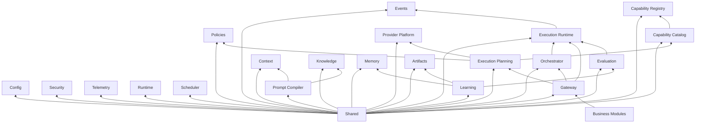

# UNAGENCY Intelligence Operating System — Dependency Rules

**Specification Version:** 1.0  
**Status:** Approved

---

## Purpose

This document defines allowed and forbidden dependencies between Intelligence Platform modules. These rules preserve architectural integrity, enable testing, and prevent uncontrolled coupling.

---

## Core Principles

### Dependency Inversion

High-level modules define interfaces. Low-level modules implement them. No module should depend on concrete implementations of another module's internals.

```
Business Module → IIntelligenceGateway (interface)
                      ↓
              Execution Planning (interface)
                      ↓
              Provider Adapter (implementation, leaf)
```

### Module Boundaries

Each module is a bounded context with:

- A public interface surface (`interfaces/`)
- Immutable contracts (`contracts/`)
- Internal implementation (not imported by other modules)
- A README stating responsibilities and non-responsibilities

Cross-module communication uses contracts and interfaces only.

### Contracts

Contracts are immutable data types representing domain objects. They contain no behavior beyond structural definition. Modules may depend on another module's contracts without depending on its implementation.

### Composition Root

The composition root (kernel and gateway bootstrap) is the only location where:

- Concrete classes are instantiated
- Interface implementations are bound
- Module dependency graphs are assembled

---

## Allowed Dependencies

### Layer 0 — Root

```
shared (no upstream dependencies)
```

### Layer 1 — Foundation

```
shared ← config, events, security, telemetry
```

### Layer 2 — Kernel

```
shared, config, events, security, telemetry ← kernel
```

### Layer 3 — Planning

```
shared ← capability-registry
shared ← capability-catalog → capability-registry (interface)
shared ← providers
shared ← policies (contracts)
shared, capability-catalog, providers, policies ← execution-planning
```

### Layer 4 — Execution

```
shared, events ← execution-runtime
shared, execution-runtime ← orchestrator
shared, execution-planning, orchestrator, execution-runtime, kernel ← gateway
```

### Layer 5 — Intelligence Engines

```
shared ← context
shared ← knowledge
shared, context, knowledge ← prompt-compiler
shared, context, knowledge, prompt-compiler, execution-runtime ← memory
```

### Layer 6 — Quality

```
shared, execution-runtime, prompt-compiler, memory ← evaluation
shared, all engine contracts ← artifacts
shared, artifacts, evaluation, memory ← learning
```

### Business Integration

```
business modules → IIntelligenceGateway ONLY
```

---

## Forbidden Dependencies

| From | To | Reason |
|------|----|--------|
| Any module except `config` | `process.env` | Configuration must be centralized |
| Business modules | Intelligence internals | Gateway is the sole entry point |
| Intelligence engines | Provider SDKs | Provider independence |
| Intelligence engines | Provider Platform (runtime) | Adapters are leaf nodes |
| Evaluation, Learning | Provider Platform | Quality layer is provider-independent |
| Artifacts | Provider Platform | Canonical objects are provider-independent |
| Capability Catalog | Execution Planning | Catalog is read-only metadata |
| Provider Matrix | Provider modules | Matrix describes features, not implementations |
| Execution Planning | Provider SDKs | Planning is provider-independent |
| Foundation modules | MongoDB, Redis, Kafka, BullMQ | Persistence deferred behind interfaces |
| `shared` | Any other intelligence module | Shared is the acyclic root |
| Any module | Circular imports | Use events or interface ports |
| Learning | Direct module mutation | Recommendations are advisory only |
| Frozen modules | In-place modification | Requires ACP |

---

## Dependency Diagram



---

## Interface Dependency Pattern

Modules must depend on interfaces, not implementations:

| Consumer | Depends On | Via |
|----------|------------|-----|
| Gateway | Planning, Orchestrator, Runtime | `IExecutionPlanningEngine`, `IIntelligenceOrchestrator`, `IExecutionRuntime` |
| Orchestrator | Runtime | `IExecutionRuntime` |
| Execution Planning | Catalog, Matrix, Policies | `ICapabilityCatalog`, `IProviderCapabilityMatrix`, `IPolicyEngine` |
| Learning | Artifacts | `ArtifactSnapshot` contracts |
| Evaluation | Execution | `ExecutionResult` contracts |

---

## Event-Based Decoupling

When direct dependencies would create cycles or unnecessary coupling, modules should communicate through the event bus:

- Execution lifecycle events (runtime → subscribers)
- Evaluation completion events (future)
- Artifact creation events (future)

Events carry contract payloads. Event handlers must not mutate shared state across module boundaries.

---

## Testing Implications

Dependency rules enable:

- Unit testing with mock interface implementations
- Contract testing without full platform bootstrap
- Isolated module test configurations

Test modules may import implementation details of the module under test. Test code is not subject to production dependency rules but should mirror them.

---

## Architecture Change Proposals

Any change that:

- Adds a new cross-module dependency
- Removes an interface boundary
- Moves responsibilities between modules
- Modifies a frozen milestone

Requires a formal Architecture Change Proposal (ACP) before implementation.
