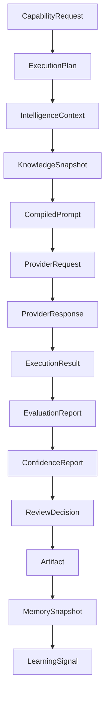
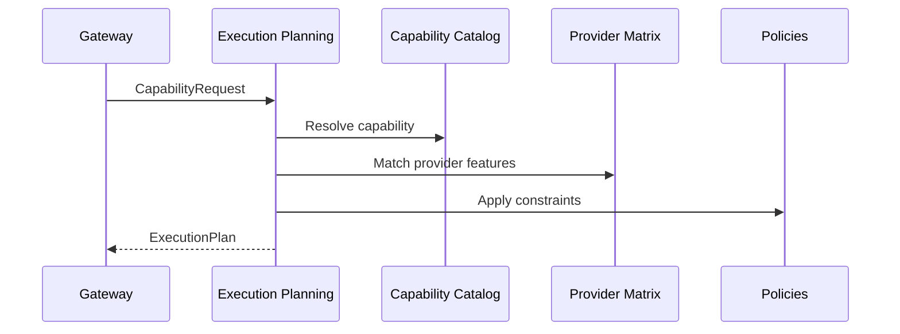
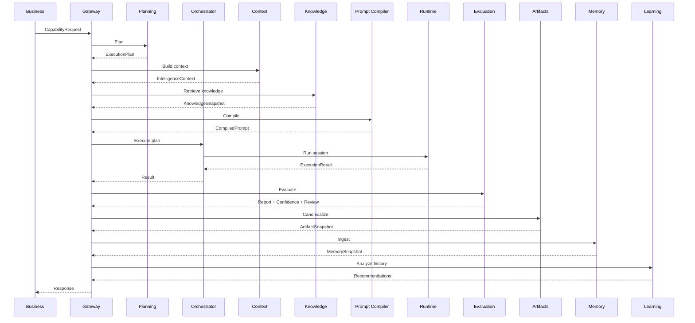

# UNAGENCY Intelligence Operating System — Intelligence Pipeline

**Specification Version:** 1.0  
**Status:** Approved

---

## Purpose

This document describes the complete intelligence lifecycle from capability request through learning signal generation. Each step defines purpose, inputs, outputs, responsible module, and future extension points.

---

## Pipeline Overview

---

## Step 1: Capability Request

| Field | Value |
|-------|-------|
| **Purpose** | Express business intent to execute an intelligence capability |
| **Input** | Business domain parameters, tenant identity, capability identifier |
| **Output** | `CapabilityRequest` / `GatewayCapabilityRequest` |
| **Responsible Module** | Business Module (originates); Gateway (receives) |
| **Future Extensions** | Batch requests, async request handles, priority tiers |

---

## Step 2: Execution Plan

| Field | Value |
|-------|-------|
| **Purpose** | Determine how and where the capability will execute |
| **Input** | `CapabilityRequest`, catalog metadata, provider matrix, policies |
| **Output** | `ExecutionPlan` with graph, stages, provider selection |
| **Responsible Module** | Execution Planning Engine |
| **Future Extensions** | Multi-provider plans, cost-optimized routing, fallback chains |

---

## Step 3: Intelligence Context

| Field | Value |
|-------|-------|
| **Purpose** | Assemble provider-independent operational context |
| **Input** | `ContextBuildRequest` with identity, scope, sources |
| **Output** | `IntelligenceContext`, `ContextSnapshot` |
| **Responsible Module** | Context Intelligence Engine |
| **Future Extensions** | External context connectors, real-time context streams |

Context includes organization, workspace, brand, capability, execution, security, and policy sections.

---

## Step 4: Knowledge Snapshot

| Field | Value |
|-------|-------|
| **Purpose** | Package relevant knowledge for prompt compilation |
| **Input** | `KnowledgeRequest` with scope, filters, ranking preferences |
| **Output** | `KnowledgeSnapshot` |
| **Responsible Module** | Knowledge Intelligence Engine |
| **Future Extensions** | Vector retrieval, RAG pipelines, federated knowledge sources |

---

## Step 5: Compiled Prompt

| Field | Value |
|-------|-------|
| **Purpose** | Produce provider-independent prompt representation |
| **Input** | `PromptCompilationRequest` (context + knowledge + template) |
| **Output** | `CompiledPrompt` with AST, messages, variables, constraints |
| **Responsible Module** | Prompt Compiler |
| **Future Extensions** | Provider-specific renderers, template versioning, A/B prompt variants |

---

## Step 6: Provider Request

| Field | Value |
|-------|-------|
| **Purpose** | Translate compiled prompt into provider-specific invocation |
| **Input** | `CompiledPrompt`, provider selection from plan |
| **Output** | `ProviderRequestArtifact` payload (future runtime) |
| **Responsible Module** | Provider Platform Runtime (M4 — not implemented in v1.0) |
| **Future Extensions** | Streaming requests, tool-use payloads, multimodal attachments |

In v1.0, provider request artifacts may be created as canonical records without live provider invocation.

---

## Step 7: Provider Response

| Field | Value |
|-------|-------|
| **Purpose** | Capture provider execution output |
| **Input** | Provider API response |
| **Output** | `ProviderResponseArtifact` payload (future runtime) |
| **Responsible Module** | Provider Platform Runtime (M4) |
| **Future Extensions** | Streaming token assembly, tool call results, usage metadata |

---

## Step 8: Execution Result

| Field | Value |
|-------|-------|
| **Purpose** | Represent terminal execution state and output |
| **Input** | Approved `ExecutionPlan`, runtime session lifecycle |
| **Output** | `ExecutionResult` with state, success flag, output payload |
| **Responsible Module** | Execution Runtime (via Orchestrator coordination) |
| **Future Extensions** | Partial results, checkpointing, distributed execution |

---

## Step 9: Evaluation Report

| Field | Value |
|-------|-------|
| **Purpose** | Objectively assess execution output quality |
| **Input** | `EvaluationRequest` with `ExecutionResult`, optional prompt and memory |
| **Output** | `EvaluationReport` with judge results and summary |
| **Responsible Module** | Intelligence Evaluation Platform |
| **Future Extensions** | LLM judges, custom rubrics, domain-specific judges |

---

## Step 10: Confidence Report

| Field | Value |
|-------|-------|
| **Purpose** | Separate confidence assessment from quality score |
| **Input** | `EvaluationReport`, execution and evidence context |
| **Output** | `ConfidenceReport` with confidence score, level, and factors |
| **Responsible Module** | Intelligence Evaluation Platform |
| **Future Extensions** | Uncertainty quantification, ensemble confidence |

---

## Step 11: Review Decision

| Field | Value |
|-------|-------|
| **Purpose** | Determine whether human review is required |
| **Input** | `EvaluationReport`, `ConfidenceReport` |
| **Output** | `ReviewDecision` with disposition: mandatory, recommended, optional, skip |
| **Responsible Module** | Intelligence Evaluation Platform |
| **Future Extensions** | Human Platform integration (M7), SLA-based routing |

The evaluation platform emits disposition signals only. It does not perform human review.

---

## Step 12: Artifact

| Field | Value |
|-------|-------|
| **Purpose** | Canonicalize intelligence output as immutable object |
| **Input** | `ArtifactInput` with typed payload |
| **Output** | `Artifact`, `ArtifactSnapshot`, `ArtifactResult` |
| **Responsible Module** | Intelligence Artifact Platform |
| **Future Extensions** | External persistence, cryptographic signatures |

Every major pipeline output should be representable as an artifact type.

---

## Step 13: Memory

| Field | Value |
|-------|-------|
| **Purpose** | Record intelligence experience for future retrieval |
| **Input** | Execution artifacts, evaluation artifacts, ingest requests |
| **Output** | `MemorySnapshot`, `MemoryRecord` |
| **Responsible Module** | Memory Intelligence Engine |
| **Future Extensions** | Durable stores, retention policies, compression strategies |

---

## Step 14: Learning Signal

| Field | Value |
|-------|-------|
| **Purpose** | Extract observable patterns from historical artifacts |
| **Input** | `LearningRequest` with artifact snapshots |
| **Output** | `LearningSignal`, `LearningPattern`, `LearningRecommendation` |
| **Responsible Module** | Learning Intelligence Platform |
| **Future Extensions** | Experiment frameworks, ML-backed analyzers |

Learning produces recommendations only. It never modifies platform behavior directly.

---

## End-to-End Sequence

Note: In v1.0, not all pipeline stages are wired end-to-end through the gateway. This diagram represents the target canonical flow. Individual modules are implemented and composable through their interfaces.

---

## Pipeline Invariants

1. Provider selection occurs only in Execution Planning.
2. Prompt compilation is provider-independent until rendering (M4).
3. Evaluation does not execute AI or call providers.
4. Artifacts are immutable; corrections create new versions.
5. Learning observes and recommends; it does not auto-optimize.
6. Business modules interact only through the Gateway.
