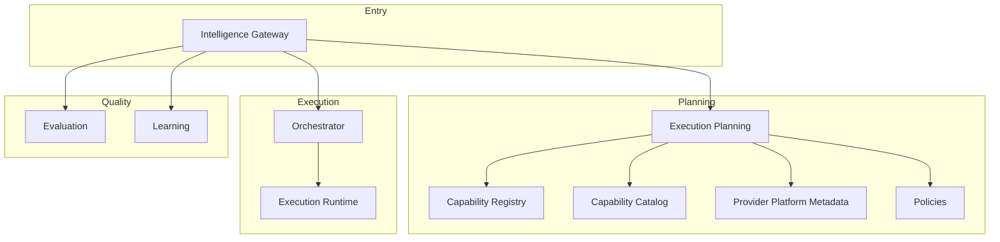
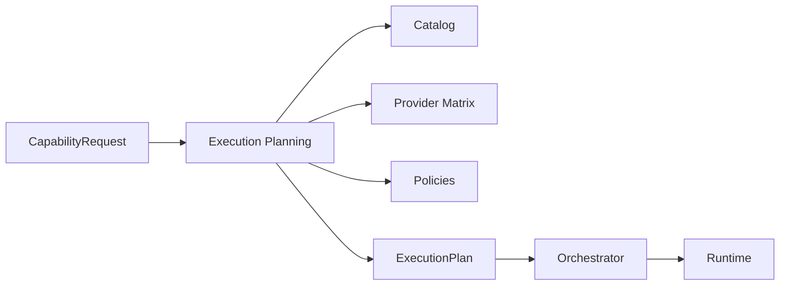
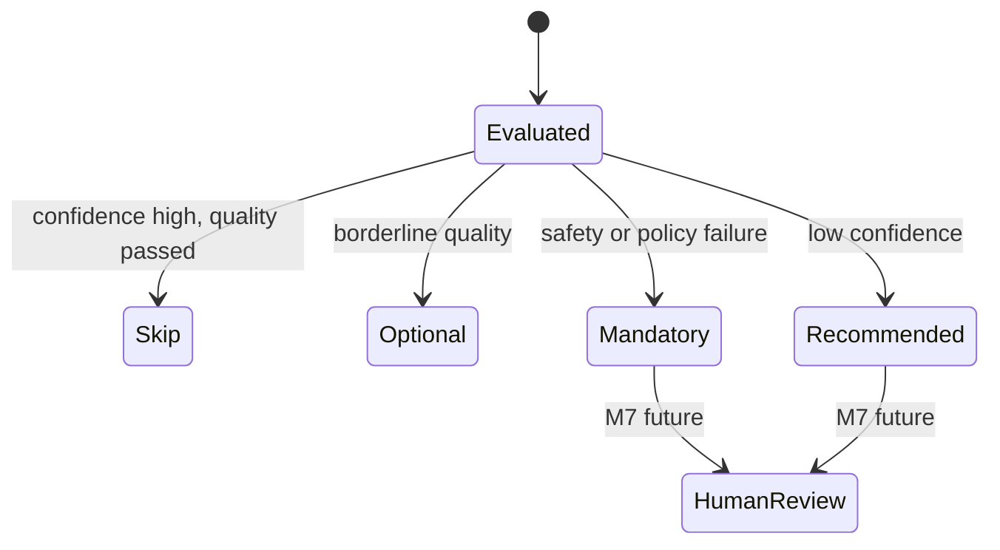
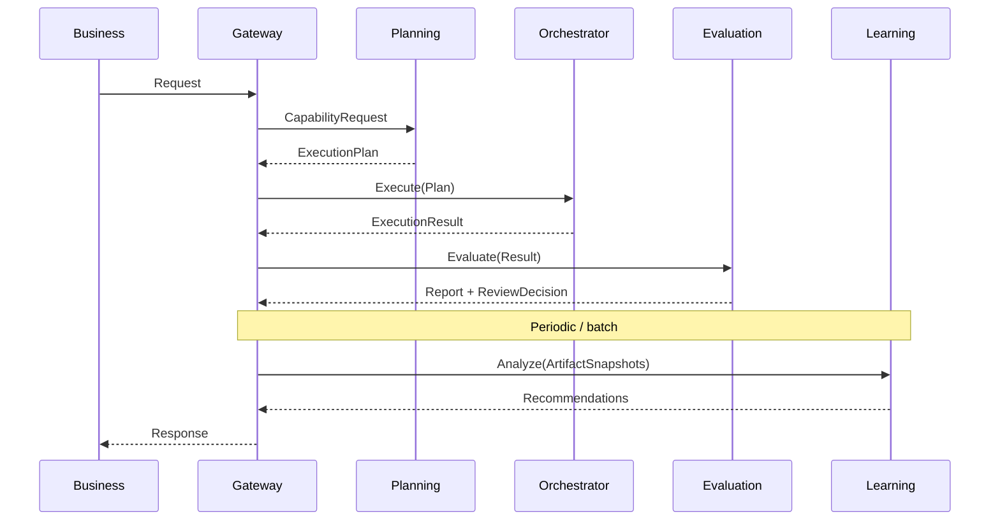

# UNAGENCY Intelligence Operating System — Control Plane

**Specification Version:** 1.0  
**Status:** Approved

---

## Purpose

This document describes the Intelligence Platform control plane: the modules that govern intelligence operations without performing provider inference.

---

## Control Plane Definition

The control plane answers:

- **What** capability is being invoked?
- **How** should it be planned and routed?
- **Where** should it execute?
- **Whether** it meets quality and policy requirements?
- **What** should be learned from outcomes?

The control plane does not answer how a specific provider model generates tokens. That is the data plane (Provider Platform Runtime, M4).

---

## Control Plane Components

---

## Planning

### Capability Resolution

1. Business submits capability identifier via gateway
2. Execution Planning queries Capability Catalog
3. Catalog returns capability definition: constraints, defaults, required features
4. Planning validates request against capability schema

### Provider Selection

Provider selection is owned exclusively by Execution Planning:

1. Planning queries Provider Capability Matrix for feature matches
2. Policies filter candidates (cost, quota, region, compliance)
3. Selection strategy chooses provider and execution graph
4. Result is embedded in `ExecutionPlan` — immutable for the execution

No other module may override provider selection after planning completes.

---

## Routing

Routing determines the execution path through the plan graph:

| Routing Concern | Owner |
|-----------------|-------|
| Provider selection | Execution Planning |
| Graph topology | Execution Planning |
| Stage ordering | Execution Planning |
| Session dispatch | Orchestrator |
| Runtime state transitions | Execution Runtime |

---

## Policy Resolution

The Policies module (contract layer in v1.0) defines ports for:

- Capability policies
- Provider policies
- Cost constraints
- Quota limits
- Retry behavior

Execution Planning consults policy ports during plan generation. Policies do not execute at runtime in v1.0; they influence plan shape and constraints.

---

## Execution Strategy

Execution Planning supports pluggable strategies:

| Strategy | Purpose |
|----------|---------|
| Provider selection | Choose provider given requirements |
| Cost estimation | Estimate execution cost |
| Graph building | Construct execution nodes and edges |

Strategies are injected into the planning engine. New strategies extend planning without modifying the orchestrator or runtime.

---

## Human Review

Human review is a control plane concern at the decision level:

1. Evaluation Platform produces `ReviewDecision`
2. Disposition: `mandatory`, `recommended`, `optional`, `skip`
3. Triggers include safety failures, policy failures, low confidence, borderline quality

In v1.0, review decisions are signals only. The Human Platform (M7) will operationalize them into queues and workflows.

---

## Evaluation in the Control Plane

Evaluation is a post-execution control plane function:

- Judge pipeline assesses output against rubric
- Confidence engine separates trust from quality
- Review decision engine determines human review need

Evaluation does not block execution in v1.0 unless integrated at the gateway layer in future versions.

---

## Learning in the Control Plane

Learning is a retrospective control plane function:

1. Historical artifact snapshots are analyzed
2. Signals are extracted by domain analyzers
3. Patterns are detected across signal groups
4. Recommendations are generated with evidence

Learning never modifies modules, configurations, or routing directly. Recommendations require human or governance approval before action.

---

## Intelligence Flow Through the Control Plane

---

## Control Plane vs Data Plane

| Concern | Control Plane (v1.0) | Data Plane (M4+) |
|---------|----------------------|------------------|
| Capability metadata | Capability Registry/Catalog | — |
| Plan generation | Execution Planning | — |
| Session lifecycle | Orchestrator, Runtime | — |
| Quality assessment | Evaluation | — |
| Recommendations | Learning | — |
| Provider API calls | — | Provider Runtime |
| Token streaming | — | Provider Runtime |
| Model inference | — | Provider adapters |

---

## Failure Handling

| Failure Type | Control Plane Response |
|--------------|------------------------|
| Planning failure | Return structured error; no execution |
| Orchestration failure | Failure hooks, aggregated error result |
| Evaluation failure | Structured validation error |
| Learning failure | Structured error; no side effects |
| Policy violation | Plan rejection or review disposition |

All failures use the `Result<T>` pattern with typed errors.

---

## Extension Points

| Extension | Integration Point |
|-----------|-------------------|
| New capability types | Capability Registry |
| New planning strategies | Execution Planning engine |
| New policy rules | Policies module ports |
| New evaluation judges | Evaluation judge pipeline |
| New learning analyzers | Learning analyzer registry |
| Provider runtime | Provider Platform M4 (data plane) |
