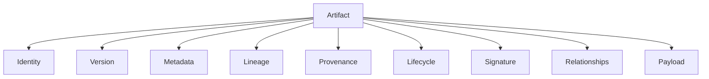
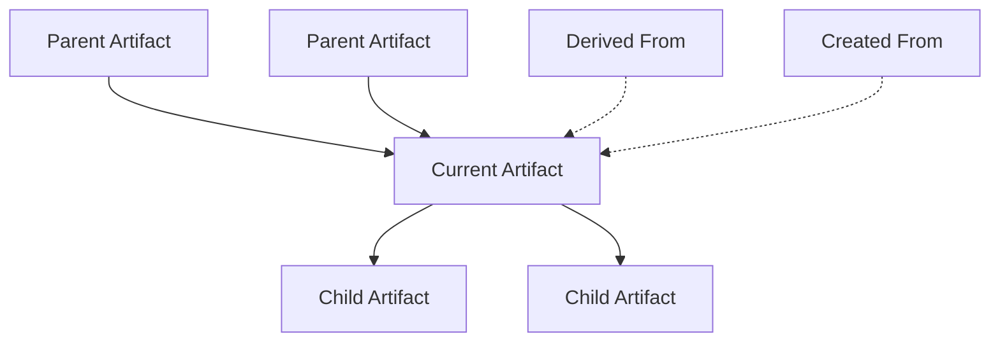
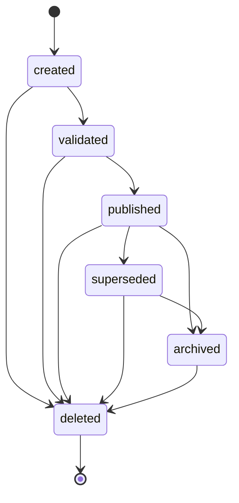

# UNAGENCY Intelligence Operating System — Artifact Model

**Specification Version:** 1.0  
**Status:** Approved

---

## Purpose

This document specifies the Intelligence Artifact Model — the canonical representation for all intelligence objects produced within the UNAGENCY Intelligence Operating System.

Artifacts are the platform's universal interchange format. They are comparable to version control objects: immutable, addressable, and lineage-aware.

---

## What Is an Artifact?

An artifact is an immutable, versioned, self-describing intelligence object. Every major intelligence output — context, knowledge, prompts, execution results, evaluations, memory snapshots, and learning signals — can be represented as a typed artifact.

---

## Artifact Structure



---

## Identity

`ArtifactIdentity` uniquely identifies an artifact within organizational scope.

| Field | Purpose |
|-------|---------|
| `artifactId` | Stable unique identifier |
| `type` | Artifact type enumeration |
| `organizationId` | Tenant boundary |
| `workspaceId` | Workspace boundary |
| `executionId` | Execution correlation |
| `capabilityId` | Originating capability |
| `sessionId`, `conversationId`, etc. | Optional scope dimensions |

Identity is assigned at creation and never changes.

---

## Metadata

`ArtifactMetadata` provides descriptive and operational context:

- Title and description
- Tags and source module
- Content type
- Creation and update timestamps
- Extensible attributes bag

Metadata supports indexing and discovery without inspecting payload contents.

---

## Versioning

`ArtifactVersion` uses semantic-style versioning:

```
major.minor.patch+revision
```

| State | Meaning |
|-------|---------|
| `draft` | Under construction |
| `published` | Authoritative version |
| `deprecated` | Superseded but retained |
| `archived` | Inactive, retained for audit |

New content produces new artifact versions. Existing artifacts are never mutated.

---

## Lineage

`ArtifactLineage` records position in the intelligence graph:



Supported references: `parents`, `children`, `createdFrom`, `derivedFrom`, plus scope dimensions (execution, organization, workspace, campaign, project, task, conversation, session).

---

## Relationships

`ArtifactRelationship` models typed edges between artifacts:

| Kind | Meaning |
|------|---------|
| `parent` | Direct parent |
| `child` | Direct child |
| `derived_from` | Content derivation |
| `created_from` | Creation source |
| `supersedes` | Replaces prior version |
| `references` | Non-destructive reference |
| `depends_on` | Execution dependency |

Relationships complement lineage with explicit graph semantics.

---

## Provenance

`ArtifactProvenance` records creation path and origins:

| Source Kind | Description |
|-------------|-------------|
| `context` | Context artifact consumed |
| `knowledge` | Knowledge snapshot used |
| `prompt` | Compiled prompt used |
| `provider` | Provider invocation (optional) |
| `model` | Model identifier (optional) |
| `evaluation` | Evaluation report |
| `human` | Human feedback |
| `workflow` | Workflow step |
| `execution` | Execution runtime |
| `capability` | Capability definition |
| `policy` | Policy artifact |

Provenance includes `createdByModule`, timestamps, and optional version map.

---

## Snapshots

`ArtifactSnapshot` is the downstream consumption unit:

```
Artifact + Manifest + capturedAt + checksum = Snapshot
```

Rules:

- Downstream modules consume snapshots, not mutable references
- Snapshots are point-in-time records
- Manifest provides content-addressed integrity reference

---

## Lifecycle



Lifecycle transitions are enforced by the lifecycle manager. Transitions do not mutate payload content.

---

## Manifest

`ArtifactManifest` provides a content-addressed summary:

- Manifest identifier
- Artifact identifier and type
- Version label
- Checksum
- Creation timestamp

Manifests enable verification without loading full artifact payloads.

---

## Registry

`IArtifactRegistry` manages artifact type descriptors:

- Register new artifact types
- Resolve descriptors by type
- List active types

Fifteen default types are registered in v1.0. Plugins may register additional types through the same interface (M8).

### Registered Types (v1.0)

| Type | Payload |
|------|---------|
| `context` | IntelligenceContext |
| `knowledge` | KnowledgeSnapshot |
| `prompt` | CompiledPrompt |
| `provider_request` | Provider request payload |
| `provider_response` | Provider response payload |
| `execution` | ExecutionResult |
| `evaluation` | EvaluationReport |
| `memory` | MemorySnapshot |
| `learning` | Learning signal payload |
| `workflow` | Workflow state |
| `decision` | Decision record |
| `human` | Human feedback |
| `brand` | Brand asset |
| `capability` | Capability metadata |
| `policy` | Policy definition |

---

## Signatures

`ArtifactSignature` provides integrity guarantees:

| Field | Purpose |
|-------|---------|
| `algorithm` | Signing algorithm (canonical SHA-256 in v1.0) |
| `checksum` | Content hash |
| `signature` | Placeholder for future cryptographic signature |
| `signedAt` | Signature timestamp |
| `tamperDetected` | Integrity flag |

Future: HSM/KMS-backed cryptographic signatures.

---

## Immutability

**Artifacts never change.**

| Rule | Behavior |
|------|----------|
| Content correction | Create new artifact with new version |
| Lifecycle change | Transition state on immutable object |
| Downstream consumption | Always via snapshot |
| Storage | External to artifact platform |
| Deletion | Logical lifecycle state only |

---

## How Modules Should Consume Artifacts

### Producers

1. Construct `ArtifactInput` with typed payload
2. Invoke `IArtifactEngine.create()`
3. Receive `ArtifactResult` (artifact + snapshot + validation)
4. Hand snapshot to external persistence (if needed)

### Consumers

1. Obtain `ArtifactSnapshot` by reference
2. Verify signature and manifest checksum
3. Deserialize typed payload
4. Never mutate — request new version for changes

### Anti-Patterns

- Storing artifacts inside engine modules
- Bypassing artifact model for cross-module exchange
- Mutating artifact payloads in place
- Coupling artifact platform to storage technology

---

## Artifact Creation Pipeline

```mermaid
flowchart LR
  IN[ArtifactInput] --> ID[Identity Builder]
  ID --> META[Metadata Builder]
  META --> VER[Version Resolver]
  VER --> LIN[Lineage Builder]
  LIN --> PRO[Provenance Builder]
  PRO --> VAL[Validation]
  VAL --> LIF[Lifecycle Transition]
  LIF --> SIG[Signature]
  SIG --> SNAP[Snapshot]
  SNAP --> OUT[ArtifactResult]
```



---

## Collections

`ArtifactCollection` groups snapshots in memory for search, filter, group, and iterate operations. Collections are not persistent in v1.0. External indexes (M10) will provide durable collection semantics.

---

## Future Extensions

| Extension | Approach |
|-----------|----------|
| Blob/S3 persistence | External store adapter |
| Cryptographic signatures | Extend signature engine |
| Binary serialization | New serializer format |
| Semantic index | External index service |
| Plugin artifact types | Registry registration at bootstrap |
