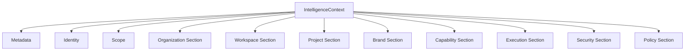
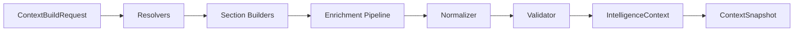
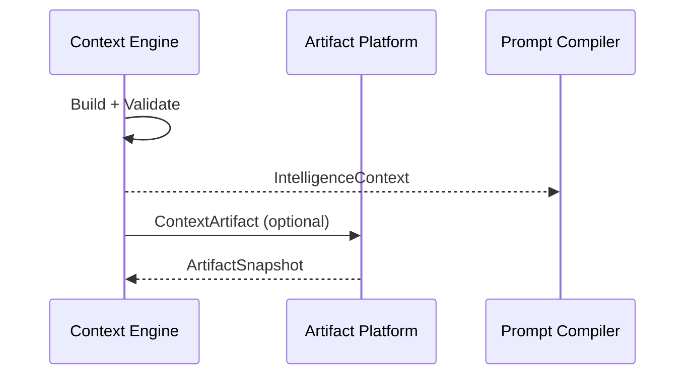

# UNAGENCY Intelligence Operating System — Context Model

**Specification Version:** 1.0  
**Status:** Approved

---

## Purpose

This document specifies the Context Intelligence Engine model: how operational context is constructed, normalized, validated, and delivered to downstream modules.

---

## Context Philosophy

Context is the structured operational environment in which intelligence executes. It is not raw user input, not knowledge, and not a prompt. Context answers: *who, where, what capability, under what constraints*.

Context must be provider-independent. The same `IntelligenceContext` can feed any prompt compiler or provider renderer.

---

## Intelligence Context Structure

---

## Context Construction Pipeline

| Stage | Purpose |
|-------|---------|
| Resolvers | Gather raw inputs from declared sources |
| Section Builders | Construct typed context sections |
| Enrichment | Apply cross-section enhancements |
| Normalizer | Ensure consistent structure and defaults |
| Validator | Verify required sections and constraints |
| Snapshot | Immutable point-in-time capture |

---

## Section Builders

Each section builder produces a typed slice of context:

| Section | Content |
|---------|---------|
| Organization | Tenant identity, settings, hierarchy |
| Workspace | Workspace scope, members, configuration |
| Project | Project metadata, campaign linkage |
| Brand | Brand voice, style, constraints |
| Capability | Capability definition, parameters |
| Execution | Runtime execution slice |
| Security | Classification, trust level |
| Policy | Applicable policy references |
| User | User identity and preferences |
| Locale / Language / Timezone | Localization context |

Builders are composable and independently testable.

---

## Normalization

The normalizer ensures:

- Required sections are present or explicitly empty
- Identifier formats are consistent
- Default values are applied where appropriate
- Cross-section references are valid

Normalization produces a deterministic context structure for identical inputs.

---

## Validation

The validator checks:

- Required identity fields (organization, workspace)
- Section completeness per capability requirements
- Policy and security constraint satisfaction
- Schema conformance

Validation failures return structured `Result<T>` errors.

---

## Snapshots

`ContextSnapshot` is an immutable capture of context at a point in time. Downstream modules (Prompt Compiler, Artifact Platform) should consume snapshots rather than live mutable context references.

---

## Scope

`ContextScope` defines the operational boundary:

| Scope Kind | Description |
|------------|-------------|
| Platform | Platform-wide defaults |
| Organization | Tenant scope |
| Workspace | Team or project workspace |
| Project | Specific project |
| Campaign | Marketing campaign |
| Task | Individual task |
| Conversation | Conversation thread |
| Session | Execution session |

Scope determines which resolvers are activated and which defaults apply.

---

## Identity

`ContextIdentity` carries branded identifiers:

- Organization ID
- Workspace ID
- User ID (optional)
- Capability ID (optional)
- Execution ID (optional)
- Correlation ID (optional)

All identifiers use branded types to prevent identifier confusion across domains.

---

## Organization and Workspace

Organization and workspace sections provide tenant isolation context. All intelligence operations are scoped to an organization and workspace. Cross-tenant context assembly is forbidden.

---

## Capability Context

The capability section embeds the resolved capability definition: parameters, constraints, and defaults from the Capability Registry. This connects context to the control plane's capability model.

---

## Execution Context

The execution section provides the runtime slice: session state, execution identifiers, and timing. It links context to the current execution lifecycle without coupling to provider internals.

---

## Future Resolvers

| Resolver | Purpose |
|----------|---------|
| External CRM | Client and account context |
| Calendar | Temporal scheduling context |
| Asset library | Brand asset references |
| Permission service | Dynamic authorization context |
| Real-time events | Live context updates |

Resolvers implement `IContextResolver` and are injected into the context engine. New resolvers extend context without modifying existing sections.

---

## Inputs and Outputs

| Direction | Type |
|-----------|------|
| Input | `ContextBuildRequest` |
| Output | `IntelligenceContext` |
| Snapshot | `ContextSnapshot` |

---

## Dependencies

- Shared module only
- No provider platform dependency
- No knowledge or prompt module dependency for construction

---

## Non-Responsibilities

- Knowledge retrieval
- Prompt rendering
- Provider calls
- Persistence
- Business logic execution

---

## Artifact Integration

Context is representable as `ContextArtifact`. Producers should emit context snapshots as artifacts for lineage and audit.

