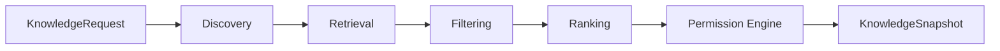
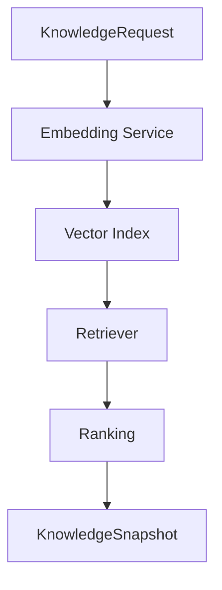

# UNAGENCY Intelligence Operating System — Knowledge Model

**Specification Version:** 1.0  
**Status:** Approved

---

## Purpose

This document specifies the Knowledge Intelligence Engine model: how knowledge is discovered, retrieved, filtered, ranked, and packaged for downstream consumption.

---

## Knowledge Philosophy

Knowledge is curated, retrievable information that informs intelligence execution. It is distinct from memory (experience records) and context (operational environment).

Knowledge must be provider-independent. The `KnowledgeSnapshot` is a self-contained package that any downstream module can consume.

---

## Knowledge Pipeline

---

## Knowledge Sources

`IKnowledgeSource` defines pluggable knowledge origins:

| Source Type | Description |
|-------------|-------------|
| Internal registry | Platform-registered knowledge items |
| Structured documents | Brand guides, policy documents |
| Capability metadata | Capability-linked knowledge |
| External connectors | Future: CMS, DAM, CRM (behind interface) |

Sources are discovered at request time based on scope and classification.

---

## Retrieval

`IKnowledgeRetriever` fetches knowledge items matching request criteria:

- Scope (organization, workspace, project)
- Classification tags
- Temporal filters
- Attribute filters

Retrieval returns candidate items before filtering and ranking.

---

## Ranking

`IKnowledgeRankingStrategy` orders retrieved items by relevance:

| Strategy | Basis |
|----------|-------|
| Relevance score | Request attribute matching |
| Recency | Temporal freshness |
| Importance | Explicit importance weight |
| Capability affinity | Capability-specific weighting |

Multiple strategies may be composed. Ranking is deterministic for identical inputs in v1.0.

---

## Filtering

`IKnowledgeFilterEngine` removes items that do not meet criteria:

- Classification exclusion
- Scope mismatch
- Stale content beyond retention threshold
- Duplicate detection

---

## Permission Engine

`IKnowledgePermissionEngine` enforces access control on knowledge items:

- Organization/workspace boundary checks
- Classification-based access (e.g., restricted brand assets)
- User-level permissions (when user identity is present)

Items failing permission checks are excluded from the snapshot.

---

## Snapshots

`KnowledgeSnapshot` is the immutable output package:

| Field | Purpose |
|-------|---------|
| `snapshotId` | Unique snapshot identifier |
| `identity` | Organizational scope |
| `items` | Ranked, filtered knowledge items |
| `capturedAt` | Snapshot timestamp |
| `checksum` | Content integrity hash |
| `metadata` | Source and retrieval metadata |

Snapshots are consumed by the Prompt Compiler and representable as `KnowledgeArtifact`.

---

## Knowledge Item Structure

Each knowledge item within a snapshot carries:

- Unique item identifier
- Classification
- Content payload (structured record)
- Source reference
- Importance score
- Metadata and tags

---

## Inputs and Outputs

| Direction | Type |
|-----------|------|
| Input | `KnowledgeRequest` |
| Output | `KnowledgeSnapshot`, `KnowledgeResult` |

---

## Dependencies

- Shared module only
- No provider platform dependency
- No vector database in v1.0

---

## Non-Responsibilities

- Vector search implementation (v1.0)
- RAG pipeline execution (v1.0)
- Prompt compilation
- Context construction
- Provider calls
- Persistent indexing

---

## Future Vector Search

Vector search will be implemented behind `IKnowledgeRetriever` without changing the snapshot contract.

---

## Future RAG

Retrieval-Augmented Generation will compose:

1. Knowledge retrieval (this module)
2. Prompt compilation (Prompt Compiler)
3. Provider execution (Provider Platform M4)

The Knowledge Engine supplies retrieved context only. It does not invoke models.

---

## Future Indexing

| Index Type | Purpose |
|------------|---------|
| Keyword | Full-text search |
| Metadata | Attribute-based lookup |
| Vector | Semantic similarity |
| Temporal | Time-range queries |
| Graph | Relationship traversal |

Indexes are external to the knowledge engine. The engine consumes index ports.

---

## Difference from Memory

| Aspect | Knowledge | Memory |
|--------|-----------|--------|
| Purpose | Inform execution | Record experience |
| Content | Curated reference material | Execution artifacts |
| Lifecycle | Managed knowledge base | Append experience records |
| Retrieval | Discovery and ranking | Classification and scope query |
| Mutability | Source updates create new versions | Immutable records with retention |
| Examples | Brand guide, policy doc | Prompt used, response received |

---

## Artifact Integration

Knowledge snapshots are representable as `KnowledgeArtifact` with full lineage to source knowledge items and consuming prompts.
