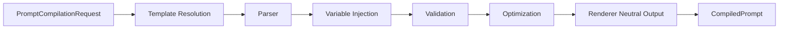
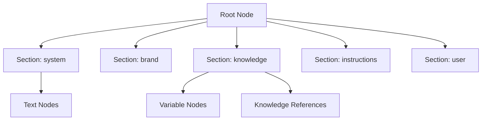
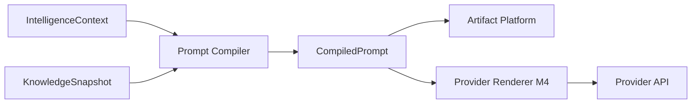
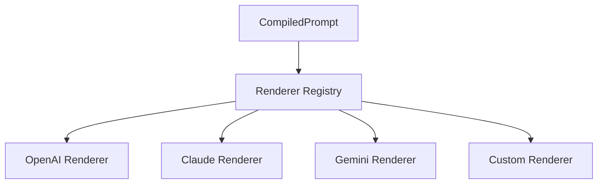

# UNAGENCY Intelligence Operating System — Prompt Compiler

**Specification Version:** 1.0  
**Status:** Approved

---

## Purpose

This document specifies the Prompt Compiler: how intelligence context and knowledge are transformed into provider-independent compiled prompts.

---

## Compiler Philosophy

The Prompt Compiler separates **what to say** from **how a provider formats it**. Compilation produces a canonical prompt representation. Provider-specific rendering is a downstream concern (Provider Platform M4).

---

## Compilation Pipeline

| Stage | Purpose |
|-------|---------|
| Template Resolution | Load template by ID and version |
| Parser | Build abstract syntax tree (AST) |
| Variable Injection | Resolve variables from context and knowledge |
| Validation | Verify constraints and required sections |
| Optimization | Apply structural optimizations |
| Rendering | Produce neutral message list (not provider-specific) |

---

## Templates

`PromptTemplate` defines reusable prompt structures:

| Field | Purpose |
|-------|---------|
| `id` | Template identifier |
| `version` | Template version |
| `name` | Human-readable name |
| `body` | Template source text |
| `variables` | Declared variable definitions |
| `constraints` | Compilation constraints |
| `sections` | Expected section roles |
| `isActive` | Availability flag |

Templates are stored behind `IPromptTemplateRepository` (in-memory in v1.0).

---

## Abstract Syntax Tree (AST)

`PromptAST` represents the parsed template structure:

Node kinds: document, section, text, variable, constraint, asset, knowledge reference.

Section roles: system, identity, brand, capability, knowledge, instructions, user, output.

---

## Variables

`PromptVariable` defines injectable values:

| Field | Purpose |
|-------|---------|
| `name` | Variable identifier |
| `path` | Resolution path in context/knowledge |
| `required` | Whether variable must resolve |
| `defaultValue` | Fallback value |
| `description` | Documentation |

Variables are resolved from `IntelligenceContext`, `KnowledgeSnapshot`, and explicit request overrides.

---

## Optimization

`IPromptOptimizer` applies structural improvements:

- Remove empty sections
- Deduplicate repeated content
- Enforce constraint limits (max tokens, max sections)
- Reorder sections for coherence

Optimization does not change semantic meaning.

---

## Validation

`IPromptValidator` verifies:

- Required sections present
- Required variables resolved
- Constraint satisfaction
- Template version compatibility

Validation failures return structured errors before compilation completes.

---

## Rendering

`IPromptRenderer` produces the final neutral output. In v1.0, the renderer is **provider-neutral** — it outputs `CompiledPromptMessage` objects with role and content, not vendor-specific API payloads.

Provider-specific renderers will be registered in the Provider Platform (M4):

| Renderer | Target |
|----------|--------|
| OpenAI renderer | Chat completion format |
| Claude renderer | Messages API format |
| Gemini renderer | Google AI format |

---

## Compiled Prompt Output

`CompiledPrompt` contains:

| Field | Purpose |
|-------|---------|
| `compilationId` | Unique compilation identifier |
| `templateId` / `templateVersion` | Source template |
| `document` | Full prompt document with AST |
| `messages` | Neutral message list |
| `resolvedVariables` | Variable resolution map |
| `constraints` | Applied constraints |
| `checksum` | Content integrity hash |
| `compiledAt` | Compilation timestamp |

---

## Provider Independence

The compiled prompt is the contract boundary. No provider SDK imports exist in the Prompt Compiler.

---

## Inputs and Outputs

| Direction | Type |
|-----------|------|
| Input | `PromptCompilationRequest` |
| Output | `CompiledPrompt`, `PromptCompilationResult` |

---

## Dependencies

- Shared
- Context contracts
- Knowledge contracts

---

## Non-Responsibilities

- Provider SDK calls
- Knowledge retrieval
- Context construction
- Model inference
- Execution

---

## Future Renderers

Renderers implement `IPromptRenderer` and are registered per provider:

New renderers extend the platform without modifying the compiler.

---

## Artifact Integration

Compiled prompts are representable as `PromptArtifact` with lineage to source context and knowledge artifacts.

---

## Versioning

Template versions are tracked via `PromptVersion` records. Compilation records the template version used, enabling reproducibility and audit.
