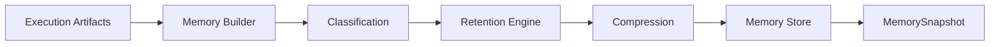
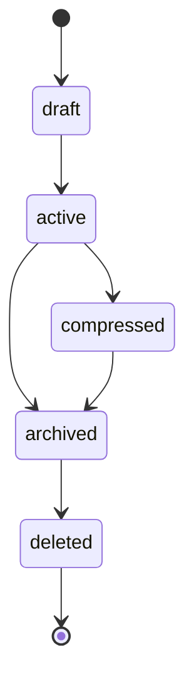

# UNAGENCY Intelligence Operating System — Memory Model

**Specification Version:** 1.0  
**Status:** Approved

---

## Purpose

This document specifies the Memory Intelligence Engine model: how intelligence experience is recorded, classified, retained, and retrieved.

---

## Memory Philosophy

Memory is the **experience layer** of the Intelligence OS. It records what happened during intelligence operations — prompts used, responses received, executions completed, evaluations produced — so future operations can reference historical experience.

Memory is not:

- A conversation history database
- A knowledge base
- A learning engine
- A vector store

---

## Memory vs Knowledge

| Dimension | Memory | Knowledge |
|-----------|--------|-----------|
| Nature | Experiential record | Curated reference |
| Direction | Backward-looking (what occurred) | Forward-informing (what to use) |
| Content | Execution artifacts | Documents, guides, policies |
| Growth | Append via ingestion | Managed source updates |
| Retrieval | Scope and classification query | Discovery and ranking |
| Retention | Lifecycle and compression policies | Source lifecycle |

---

## Memory Pipeline

---

## Artifact Storage

Memory ingests intelligence artifacts as classified records:

| Classification | Source |
|----------------|--------|
| `prompt` | Compiled prompt artifacts |
| `knowledge` | Knowledge snapshot references |
| `execution` | Execution results |
| `response` | Provider/execution responses |
| `evaluation` | Evaluation reports |
| `human_feedback` | Human review input |
| `brand_asset` | Brand-related records |
| `decision` | Decision records |
| `learning_reference` | Learning signal references |
| `conversation` | Conversation artifacts |

Ingestion accepts `MemoryArtifact` inputs derived from execution outputs.

---

## Classification

Every memory record carries a `MemoryClassification` that determines:

- Retention policy defaults
- Retrieval filter categories
- Compression eligibility
- Importance weighting

---

## Retention

`IMemoryRetentionEngine` applies retention policies:

| Retention Class | Typical Use |
|-----------------|-------------|
| `temporary` | Transient session data |
| `short_term` | Recent prompts and responses |
| `working` | Active session working memory |
| `long_term` | Decisions and brand assets |
| `archived` | Historical records |
| `deleted` | Logical deletion marker |

Retention policies include optional `retainUntil` timestamps and `maxRecords` limits.

---

## Compression

`IMemoryCompressionStrategy` reduces record sets:

| Strategy | Behavior |
|----------|----------|
| `merge` | Combine related records |
| `deduplicate` | Remove duplicate content |
| `summarize` | Produce summary record |
| `importance_ranking` | Keep highest importance records |

Compression is applied before snapshot creation, not in place on stored records.

---

## Scopes

`MemoryScope` defines the boundary for records:

| Scope Kind | Description |
|------------|-------------|
| Platform | Platform-wide |
| Organization | Tenant |
| Workspace | Workspace |
| Project | Project |
| Campaign | Campaign |
| Task | Task |
| Conversation | Conversation thread |
| Session | Execution session |

`IMemoryScopeResolver` determines scope from ingest or query input.

---

## Snapshots

`MemorySnapshot` is an immutable package of memory records:

| Field | Purpose |
|-------|---------|
| `snapshotId` | Unique identifier |
| `identity` | Organizational scope |
| `records` | Classified memory records |
| `scopes` | Active scopes |
| `capturedAt` | Snapshot timestamp |
| `checksum` | Integrity hash |

Snapshots are consumed by Evaluation and Learning modules and representable as `MemoryArtifact`.

---

## Memory Record Structure

Each `MemoryRecord` contains:

- Unique record ID
- Identity (organization, workspace, execution, etc.)
- Scope
- Classification
- Lifecycle state (draft, active, compressed, archived, deleted)
- Retention policy
- Content payload
- Metadata (title, tags, source module, timestamps)
- Optional importance score

---

## Inputs and Outputs

| Operation | Input | Output |
|-----------|-------|--------|
| Ingest | `MemoryIngestInput` | `MemoryResult` |
| Write | `MemoryWriteInput` | `MemoryRecord` |
| Query | `MemoryRequest` | `MemoryResult` |
| Snapshot | `MemoryRequest` | `MemorySnapshot` |

---

## Dependencies

- Shared
- Context, Knowledge, Prompt Compiler, Execution Runtime contracts (for artifact ingestion)

---

## Non-Responsibilities

- Knowledge base management
- Learning and recommendation generation
- Evaluation judging
- Vector indexing
- Database persistence (v1.0)
- Conversation UI

---

## Lifecycle States

---

## Future Extensions

| Extension | Approach |
|-----------|----------|
| Durable store | `IMemoryStore` adapter (MongoDB, Redis) |
| Vector indexing | External index behind `IMemoryIndex` |
| Cross-session recall | Enhanced retrieval strategies |
| Federated memory | Multi-workspace aggregation ports |

---

## Artifact Integration

Memory snapshots flow into the Artifact Platform as `MemoryArtifact` and serve as input to the Learning Platform's analyzers.
