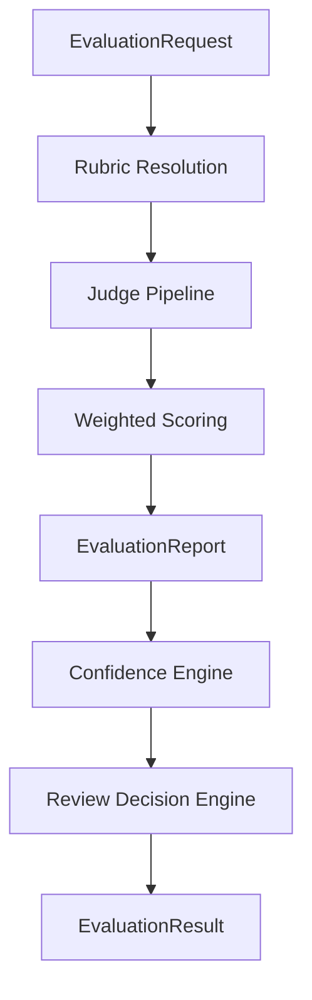
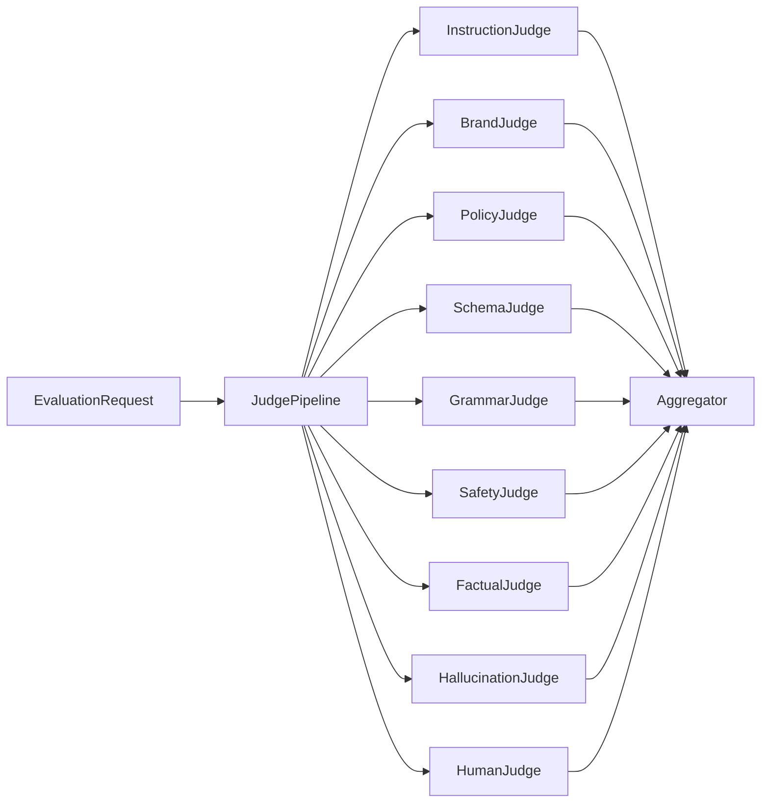
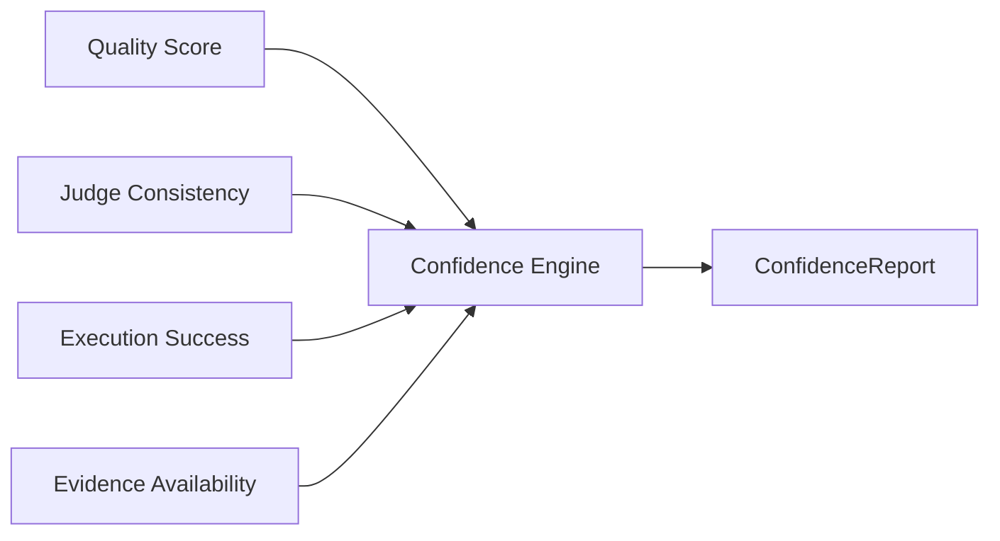
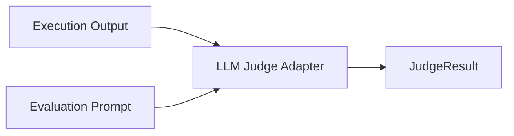
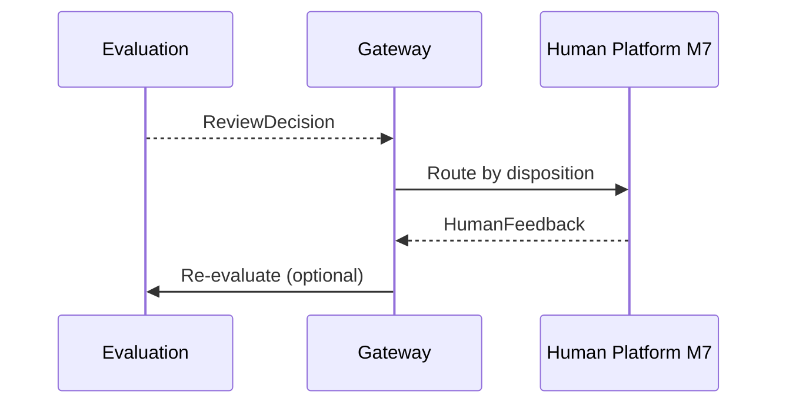

# UNAGENCY Intelligence Operating System — Evaluation Model

**Specification Version:** 1.0  
**Status:** Approved

---

## Purpose

This document specifies the Intelligence Evaluation Platform model: how execution outputs are assessed, how confidence is separated from quality, and how review decisions are produced.

---

## Evaluation Philosophy

Evaluation is objective quality assessment. It does not execute AI, does not call providers, does not learn, and does not perform human review. It produces structured reports that downstream systems act upon.

---

## Evaluation Pipeline

---

## Judge Pipeline

The judge pipeline runs independent judges against execution output:

| Judge | Assesses |
|-------|----------|
| Instruction | Adherence to compiled prompt instructions |
| Brand | Brand alignment |
| Policy | Policy compliance |
| Schema | Output structure conformance |
| Grammar | Text quality heuristics |
| Safety | Safety marker detection |
| Factual | Factual consistency signals |
| Hallucination | Hallucination risk markers |
| Human | Human review disposition signal |

Each judge implements `IJudge` and produces `JudgeResult` with per-criterion scores.

In v1.0, judges are placeholder heuristics. Future judges may use LLM assessment behind the same interface.

---

## Rubrics

`EvaluationRubric` defines evaluation criteria:

| Field | Purpose |
|-------|---------|
| `id` | Rubric identifier |
| `criteria` | Weighted criteria with thresholds |
| `passingScore` | Minimum overall score to pass |
| `version` | Rubric version |

Each `EvaluationCriterion` specifies: kind, weight, threshold, and whether it is required.

---

## Weighted Scoring

`IScoreAggregator` computes the evaluation summary:

1. Collect all `JudgeScore` entries across judges
2. Compute weighted average: `sum(normalizedScore × weight) / sum(weight)`
3. Check required criteria pass/fail
4. Determine overall pass: `overallScore >= passingScore AND no required failures`

Output: `EvaluationSummary` with overall score, pass flag, failed criteria, and highlights.

---

## Confidence

Confidence is **separate from quality**. The confidence engine assesses how much trust to place in the evaluation itself.

| Factor | Description |
|--------|-------------|
| Quality signal | Aggregated judge score |
| Judge consistency | Ratio of judges that passed |
| Execution success | Whether execution completed successfully |
| Evidence availability | Memory artifacts available for context |

Output: `ConfidenceReport` with score, level (low/medium/high/very_high), and factor breakdown.

---

## Review Decisions

`IReviewDecisionEngine` produces human review disposition:

| Disposition | Meaning |
|-------------|---------|
| `mandatory` | Human review required before use |
| `recommended` | Human review advised |
| `optional` | Review at operator discretion |
| `skip` | No review needed |

Triggers include: evaluation failure, safety judge failure, policy judge failure, low confidence, borderline quality, human review signals.

The evaluation platform emits disposition only. It does not route to human reviewers.

---

## Calibration

`ICalibrationEngine` is defined as an interface only in v1.0:

- Offline sample ingestion
- Criterion offset adjustments
- Calibration profiles

Calibration does not perform learning. It adjusts evaluation sensitivity based on approved samples. Full implementation is a future extension.

---

## Inputs and Outputs

| Direction | Type |
|-----------|------|
| Input | `EvaluationRequest` (includes `ExecutionResult`) |
| Output | `EvaluationResult` containing: |
| | `EvaluationReport` |
| | `ConfidenceReport` |
| | `ReviewDecision` |

---

## Dependencies

- Shared
- Execution Runtime contracts
- Prompt Compiler contracts
- Memory contracts

No provider platform dependency.

---

## Non-Responsibilities

- AI execution
- Provider SDK calls
- Learning and model training
- Human review UI and routing
- Automatic output modification

---

## Future LLM Judges

LLM-based judges will implement `IJudge`:

LLM judges operate behind the judge interface with feature flags. The evaluation engine pipeline remains unchanged.

---

## Future Human Review

The Human Platform (M7) will consume `ReviewDecision`:

---

## Artifact Integration

Evaluation reports are representable as `EvaluationArtifact` with lineage to execution and prompt artifacts.
