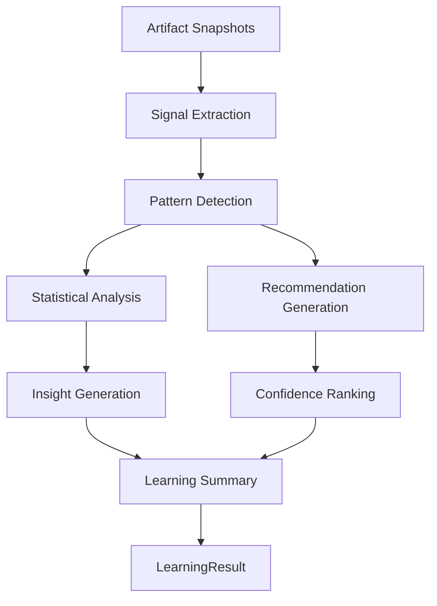
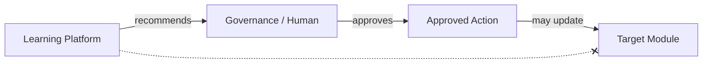

# UNAGENCY Intelligence Operating System — Learning Model

**Specification Version:** 1.0  
**Status:** Approved

---

## Purpose

This document specifies the Learning Intelligence Platform model: how historical artifacts are transformed into explainable learning recommendations.

---

## Learning Philosophy

The Learning Platform **observes, analyzes, and recommends**. It never modifies platform behavior directly. Recommendations are advisory inputs for human operators, governance processes, or future approved automation.

---

## Learning Pipeline

---

## Signals

`LearningSignal` is the atomic observation extracted from an artifact:

| Field | Purpose |
|-------|---------|
| `signalId` | Unique identifier |
| `kind` | Signal category |
| `sourceArtifactId` | Originating artifact |
| `value` / `normalizedValue` | Signal strength |
| `label` | Human-readable description |

Signal kinds: quality, latency, cost, brand, prompt, provider, human, workflow, evaluation, knowledge, memory, routing, pattern, anomaly.

Signals are extracted by domain analyzers (12 in v1.0).

---

## Analyzers

Each analyzer implements `IAnalyzer` and produces signals for specific artifact types:

| Analyzer | Artifact Types |
|----------|----------------|
| Provider | provider_request, provider_response |
| Prompt | prompt |
| Brand | brand, context, prompt |
| Human | human, decision |
| Workflow | workflow |
| Cost | provider_request, provider_response, execution |
| Latency | execution, provider_response |
| Quality | execution, evaluation |
| Evaluation | evaluation |
| Knowledge | knowledge |
| Memory | memory |
| Routing | execution, capability, policy |

Analyzers are placeholder heuristics in v1.0.

---

## Patterns

`IPatternDetector` identifies recurring signal groups:

| Pattern Kind | Trigger |
|--------------|---------|
| `quality_degradation` | Low quality signals across artifacts |
| `latency_spike` | Low latency scores |
| `cost_increase` | High cost signals |
| `brand_drift` | Low brand alignment |
| `evaluation_failure` | Failed evaluations |
| `human_review_spike` | Elevated human review signals |
| `routing_imbalance` | Routing anomalies |
| `recurring_failure` | Persistent low scores |

Patterns carry frequency, confidence, and linked signal IDs.

---

## Statistics

`LearningStatistics` provides aggregate analysis:

| Category | Content |
|----------|---------|
| Aggregates | Count, sum, average, min, max |
| Trends | Direction (up/down/stable), delta |
| Distributions | Value bucket counts |
| Frequencies | Signal kind occurrence counts |

Statistics are placeholder computations in v1.0. No external analytics engine.

---

## Recommendations

`LearningRecommendation` is the primary output for operators:

| Field | Required | Purpose |
|-------|----------|---------|
| `reason` | Yes | Why this recommendation exists |
| `confidence` | Yes | Recommendation confidence (0–1) |
| `evidence` | Yes | Supporting `LearningEvidence` records |
| `affectedModule` | Yes | Which module would benefit |
| `applicableScope` | Yes | Organizational scope |
| `type` | Yes | Recommendation category |

Recommendation types: improvement, investigation, optimization_hint, policy_review, quality_alert, cost_alert, latency_alert, brand_alignment, routing_adjustment, experiment_suggestion.

**Recommendations never modify modules.** They are consumed by humans or governance workflows.

---

## Evidence

`LearningEvidence` links recommendations to observable facts:

- Source artifact ID and type
- Metric name and value
- Observation timestamp
- Descriptive message

Evidence provides explainability for every recommendation.

---

## Insights

`LearningInsight` provides narrative summaries:

- Aggregate observations
- Pattern descriptions
- Severity classification (info, warning, critical)

Insights support dashboards and reports. They do not trigger actions.

---

## Experiments

`IExperimentManager` is interface-only in v1.0:

| Experiment Kind | Purpose |
|-----------------|---------|
| `ab_test` | Compare prompt or routing variants |
| `shadow_evaluation` | Evaluate without affecting production |
| `regression_test` | Verify quality against baseline |

Experiments are created in `draft` status. Execution is a future capability.

---

## Why Learning Never Modifies Behavior

Direct modification would:

- Bypass governance and audit
- Create uncontrolled feedback loops
- Conflict with frozen module boundaries
- Prevent human oversight of intelligence changes

The `IOptimizationEngine` interface exists but `supported = false` in v1.0. It returns recommendations unchanged.

---

## Inputs and Outputs

| Direction | Type |
|-----------|------|
| Input | `LearningRequest` with `ArtifactSnapshot[]` |
| Output | `LearningResult` with signals, patterns, statistics, insights, recommendations, summary |

---

## Dependencies

- Shared
- Artifacts
- Evaluation contracts
- Memory contracts

No provider platform dependency.

---

## Non-Responsibilities

- Automatic optimization
- ML model training
- Online learning
- Provider SDK analysis
- Module configuration changes
- Database persistence

---

## Artifact Integration

Learning outputs are representable as `LearningArtifact`. Input artifacts maintain full lineage chain.

---

## Future Extensions

| Extension | Approach |
|-----------|----------|
| ML analyzers | Implement `IAnalyzer` with model backends |
| Experiment execution | Implement `IExperimentManager` runtime |
| Clustering | Implement `IClusteringEngine` |
| Feedback loops | Human-approved action pipeline (M7/M9) |
