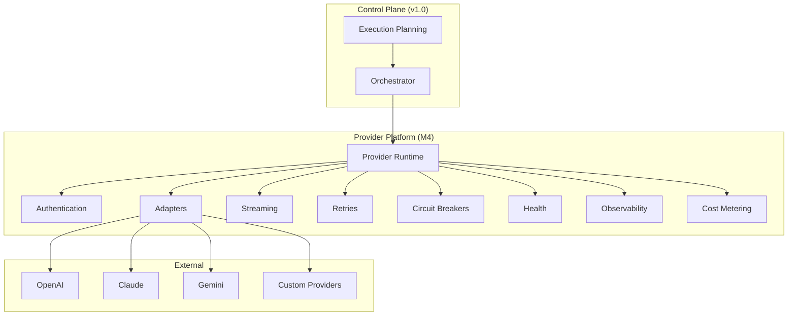
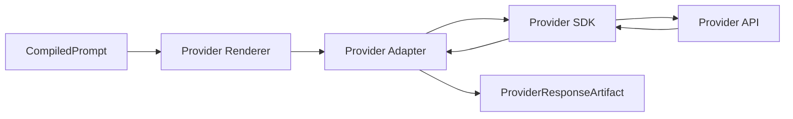

# UNAGENCY Intelligence Operating System — Provider Platform

**Specification Version:** 1.0  
**Status:** Future (M4) — Documentation Only

---

## Purpose

This document describes the future Provider Platform runtime layer. The Provider Platform is **not implemented** in v1.0 beyond metadata, registry, factory contracts, and capability matrix.

v1.0 delivers provider-independent planning and artifact models. M4 delivers live provider execution.

---

## Current State (v1.0)

| Component | Status |
|-----------|--------|
| Provider Registry | Implemented (metadata) |
| Provider Factory | Contract only |
| Provider Adapter | Abstract interface |
| Provider Capability Matrix | Implemented |
| Provider Health Store | In-memory placeholder |
| Provider Runtime | Not implemented |
| Provider SDK Adapters | Not implemented |

---

## Future Architecture

---

## Provider Runtime

The Provider Runtime executes approved provider requests:

1. Receive `CompiledPrompt` and provider selection from execution plan
2. Select provider-specific renderer
3. Authenticate with provider credentials
4. Execute request (sync or streaming)
5. Capture response as `ProviderResponseArtifact`
6. Return execution metadata (latency, tokens, cost)

---

## Provider Authentication

| Concern | Approach |
|---------|----------|
| API keys | Secrets manager integration |
| OAuth | Provider-specific OAuth flows |
| IAM roles | Cloud provider IAM for managed services |
| Key rotation | Automated rotation with grace period |
| Per-tenant credentials | Tenant-scoped credential isolation |

Authentication is handled exclusively within provider adapters. No credentials in intelligence engines.

---

## Streaming

| Feature | Description |
|---------|-------------|
| Token streaming | Incremental response delivery |
| Event assembly | Aggregate stream into complete response |
| Stream cancellation | Abort on timeout or user cancellation |
| Backpressure | Flow control for slow consumers |

Streaming interfaces extend `IProviderAdapter` without changing compiled prompt contracts.

---

## Retries

| Policy | Behavior |
|--------|----------|
| Transient errors | Exponential backoff retry |
| Rate limits | Respect retry-after headers |
| Idempotency | Idempotency keys for safe retry |
| Max attempts | Configurable per provider and capability |

Retry policies are defined in the Policies module and applied by the Provider Runtime.

---

## Circuit Breakers

| State | Behavior |
|-------|----------|
| Closed | Normal operation |
| Open | Fail fast, route to fallback |
| Half-open | Probe with limited requests |

Circuit breaker state is tracked per provider and region in the health store.

---

## Health

| Signal | Source |
|--------|--------|
| Availability | Successful probe ratio |
| Latency | P50/P95 response times |
| Error rate | Failed request percentage |
| Capacity | Rate limit headroom |

Health data feeds back into Execution Planning for provider selection.

---

## Observability

| Signal | Description |
|--------|-------------|
| Request logs | Structured provider request/response logs |
| Metrics | Latency, token count, error rate |
| Traces | Distributed tracing across provider calls |
| Cost | Per-request cost attribution |

Observability integrates with the Telemetry module.

---

## Cost and Usage

| Metric | Purpose |
|--------|---------|
| Token usage | Input/output token counts |
| Cost per request | Provider billing attribution |
| Cost per capability | Business cost allocation |
| Quota consumption | Tenant quota tracking |

Cost data flows to Governance (M9) and Analytics (M10).

---

## Adapters

`IProviderAdapter` is the leaf node for provider integration:

Each adapter implements:

- `execute(request)` — synchronous execution
- `stream(request)` — streaming execution
- `healthCheck()` — provider availability probe
- `estimateCost(request)` — cost estimation

---

## Future Providers

| Provider | Adapter |
|----------|---------|
| OpenAI | GPT, DALL-E, embedding models |
| Anthropic | Claude models |
| Google | Gemini models |
| Azure OpenAI | Enterprise OpenAI deployment |
| Custom | Self-hosted or third-party models |

New providers require only a new adapter and matrix registration. No changes to intelligence engines.

---

## Artifact Integration

Provider requests and responses are canonicalized as `ProviderRequestArtifact` and `ProviderResponseArtifact` with full provenance to compiled prompts and execution plans.

---

## Boundaries

| Provider Platform Owns | Provider Platform Does Not Own |
|------------------------|-------------------------------|
| SDK integration | Capability definitions |
| API authentication | Execution planning |
| Streaming transport | Context/knowledge/prompt construction |
| Retry and circuit breaking | Evaluation |
| Cost metering | Learning |
| Health probes | Business logic |

---

## Migration from v1.0

M4 implementation will:

1. Implement `IProviderAdapter` for first provider
2. Wire adapter into Provider Runtime
3. Connect runtime to Orchestrator dispatch
4. Enable provider-specific renderers in Prompt Compiler
5. Preserve all v1.0 contracts unchanged

No frozen module modifications required. Provider runtime is additive.
