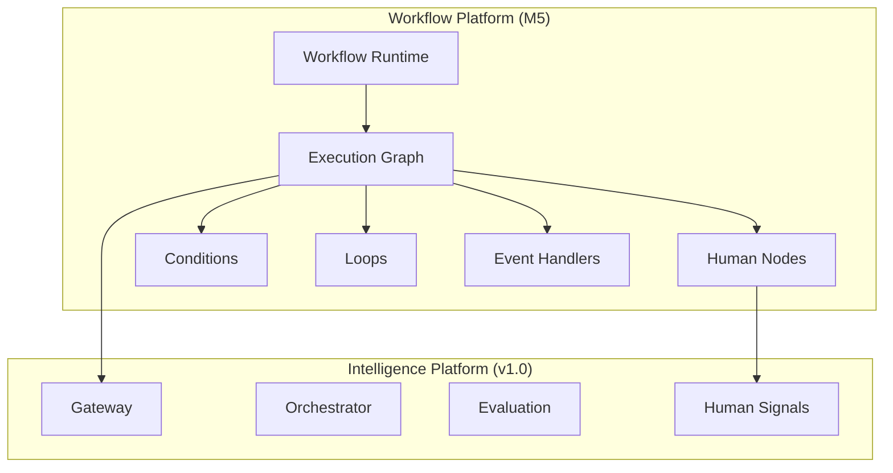
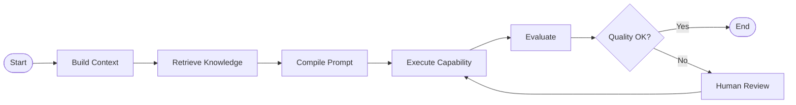

# UNAGENCY Intelligence Operating System — Workflow Platform

**Specification Version:** 1.0  
**Status:** Future (M5) — Documentation Only

---

## Purpose

This document describes the future Workflow Platform. Workflows are not implemented in v1.0. The Scheduler module provides contract ports only.

---

## Workflow Philosophy

Workflows orchestrate multi-step intelligence operations that may span capabilities, human review, conditions, and external events. Workflows operate through the Intelligence Gateway — they do not bypass the control plane.

---

## Future Architecture

---

## Workflow Runtime

The Workflow Runtime manages workflow instance lifecycle:

| State | Description |
|-------|-------------|
| Created | Workflow instance initialized |
| Running | Active execution |
| Waiting | Paused for human or event |
| Completed | All nodes finished |
| Failed | Unrecoverable failure |
| Cancelled | Operator cancellation |

Each workflow instance maintains state as `WorkflowArtifact`.

---

## Execution Graph

Workflows are directed graphs of nodes and edges:

Node types:

| Node | Action |
|------|--------|
| Capability | Invoke gateway capability |
| Context | Build intelligence context |
| Knowledge | Retrieve knowledge snapshot |
| Prompt | Compile prompt |
| Evaluation | Evaluate execution output |
| Human | Await human input |
| Condition | Branch on expression |
| Loop | Iterate over collection |
| Event | Wait for external event |
| Parallel | Fan-out execution |

---

## Human Nodes

Human nodes integrate with the Human Platform (M7):

1. Workflow reaches human node
2. Review task created with evaluation context
3. Workflow enters `Waiting` state
4. Human provides input or approval
5. Workflow resumes with human artifact in lineage

---

## Conditions

Condition nodes evaluate expressions against workflow state:

- Evaluation report pass/fail
- Confidence level thresholds
- Review disposition
- Custom attribute comparisons
- Artifact field values

Conditions produce graph branching without modifying modules.

---

## Loops

Loop nodes iterate over:

- Knowledge item collections
- Capability parameter sets
- Evaluation retry attempts
- Batch artifact processing

Loop bounds (max iterations, timeout) are enforced by the runtime.

---

## Events

Event nodes wait for external triggers:

| Event | Source |
|-------|--------|
| Webhook | External system notification |
| Schedule | Scheduler module |
| Approval | Human Platform |
| Artifact | New artifact created |
| Evaluation | Evaluation completed |

Events are delivered through the Events module with durable backing (future).

---

## Integration with v1.0

| v1.0 Module | Workflow Usage |
|-------------|----------------|
| Gateway | Execute capability nodes |
| Orchestrator | Run execution subgraphs |
| Evaluation | Quality gate nodes |
| Artifacts | State and lineage records |
| Scheduler | Trigger scheduled workflows |
| Policies | Workflow-level constraints |

---

## Artifact Model

Workflow state is captured as `WorkflowArtifact`:

- Current node
- Graph position
- Variable bindings
- Execution history
- Human interaction records

---

## Non-Responsibilities (Future)

- Provider SDK calls (delegated to Provider Platform)
- Direct business module access
- Bypassing gateway for capability execution
- Modifying frozen v1.0 modules

---

## Dependencies (Future)

- Intelligence Gateway
- Artifact Platform
- Scheduler
- Human Platform (M7)
- Events (durable)

---

## Extension Strategy

M5 will be implemented as a new module layer that composes v1.0 modules through their public interfaces. No modifications to frozen milestones.
