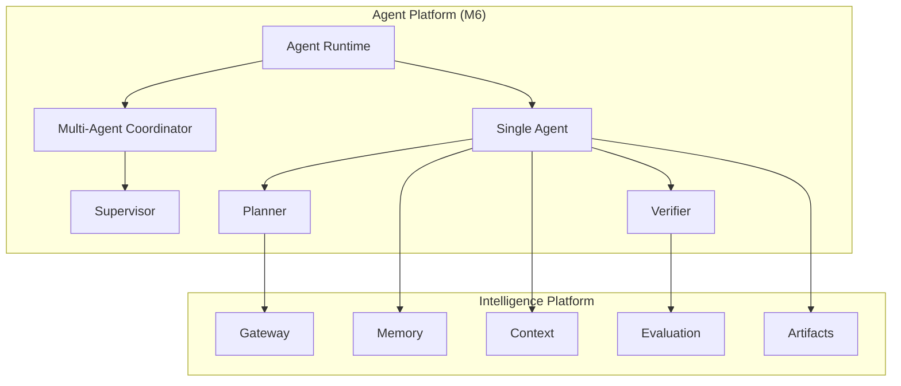
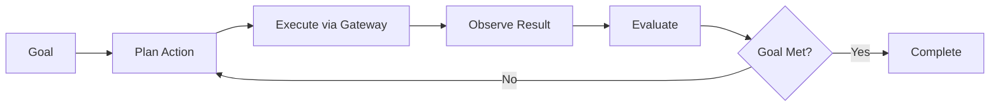
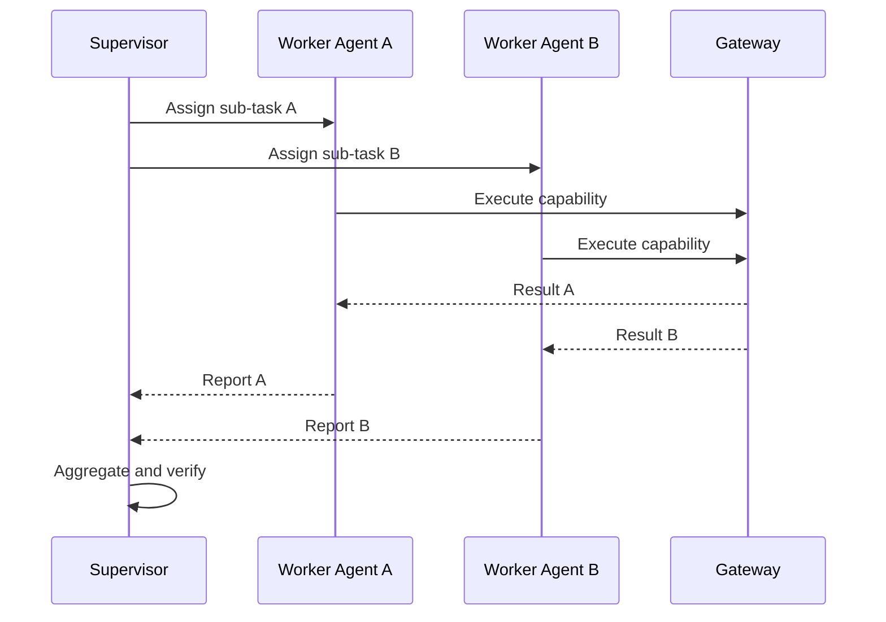

# UNAGENCY Intelligence Operating System — Agent Platform

**Specification Version:** 1.0  
**Status:** Future (M6) — Documentation Only

---

## Purpose

This document describes the future Agent Platform. Agents are not implemented in v1.0.

---

## Agent Philosophy

Agents are autonomous or semi-autonomous actors that pursue goals using intelligence capabilities. Agents operate within the control plane boundaries — they invoke capabilities through the gateway, consume artifacts, and respect evaluation and policy constraints.

Agents do not replace the control plane. They compose it.

---

## Future Architecture

---

## Single Agent

A single agent executes a goal-directed loop:

| Component | Role |
|-----------|------|
| Planner | Determine next action |
| Executor | Invoke capability through gateway |
| Observer | Process execution result |
| Verifier | Validate against goal criteria |
| Memory | Recall prior actions and outcomes |

---

## Multi-Agent

Multi-agent coordination supports:

| Pattern | Description |
|---------|-------------|
| Pipeline | Sequential agent handoff |
| Parallel | Concurrent agent execution |
| Debate | Agents propose and critique |
| Hierarchy | Supervisor delegates to workers |

Multi-agent state is captured as `WorkflowArtifact` with agent lineage.

---

## Supervisor

The supervisor agent:

- Decomposes complex goals into sub-tasks
- Assigns tasks to worker agents
- Monitors progress and quality
- Escalates to human review when needed
- Aggregates sub-task results

Supervisors consume evaluation reports and review decisions.

---

## Planner

The agent planner determines actions within policy constraints:

- Available capabilities (from Capability Catalog)
- Current context and memory
- Prior evaluation feedback
- Cost and quota policies

Planning at the agent level is distinct from execution planning. Agent planning selects *what to do next*; execution planning selects *how to execute a capability*.

---

## Verifier

The verifier validates agent outputs:

- Goal satisfaction criteria
- Evaluation report thresholds
- Policy compliance
- Confidence requirements

Failed verification triggers retry, replanning, or human escalation.

---

## Memory-Aware Agents

Agents consume memory snapshots for:

- Prior conversation context
- Previous execution outcomes
- Evaluation history
- Learning recommendations

Agents write new memory records after each action cycle.

---

## Agent Collaboration

---

## Artifact Integration

Agent actions produce artifacts:

- Context artifacts per planning cycle
- Execution artifacts per capability invocation
- Evaluation artifacts per verification
- Decision artifacts for agent choices

Full lineage enables audit of agent behavior.

---

## Boundaries

| Agents Own | Agents Do Not Own |
|------------|-------------------|
| Goal decomposition | Provider selection |
| Action planning | Prompt compilation internals |
| Multi-agent coordination | Direct provider calls |
| Verification logic | Module modification |
| Memory consumption | Policy definition |

---

## Safety Constraints

- Agents must respect evaluation review dispositions
- Mandatory human review blocks autonomous continuation
- Cost and quota policies limit agent iteration count
- All agent actions are artifact-recorded for audit

---

## Dependencies (Future)

- Intelligence Gateway
- Memory Intelligence Engine
- Context Intelligence Engine
- Evaluation Platform
- Artifact Platform
- Workflow Platform (M5) for complex agent flows
- Human Platform (M7) for escalation

---

## Extension Strategy

M6 will be implemented as a new platform layer. Agent runtime will compose v1.0 modules through public interfaces without modifying frozen milestones.
