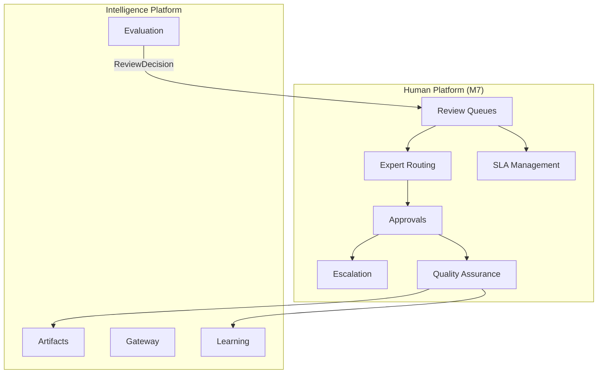
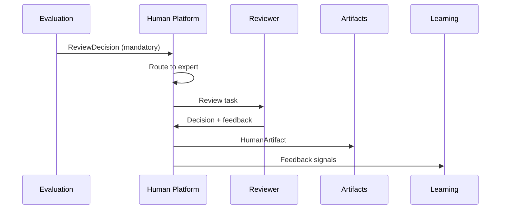

# UNAGENCY Intelligence Operating System — Human Platform

**Specification Version:** 1.0  
**Status:** Future (M7) — Documentation Only

---

## Purpose

This document describes the future Human Platform. Human review operationalization is not implemented in v1.0. The Evaluation Platform emits review disposition signals only.

---

## Human Platform Philosophy

Human intelligence remains essential for quality assurance, brand governance, policy compliance, and high-stakes decisions. The Human Platform operationalizes human involvement without embedding review logic in evaluation or business modules.

---

## Current State (v1.0)

| Component | Status |
|-----------|--------|
| Review disposition signals | Implemented (Evaluation) |
| Human judge signal | Implemented (placeholder) |
| Review queues | Not implemented |
| Expert routing | Not implemented |
| Approval workflows | Not implemented |
| SLA management | Not implemented |

---

## Future Architecture

---

## Human Review

Review workflow triggered by `ReviewDecision`:

| Disposition | Queue Behavior |
|-------------|----------------|
| `mandatory` | Block until reviewed |
| `recommended` | Priority queue assignment |
| `optional` | Standard queue |
| `skip` | No queue entry |

Review tasks include:

- Execution output
- Evaluation report
- Confidence report
- Source artifacts with lineage
- Applicable rubric and failed criteria

---

## Expert Routing

Route review tasks to qualified reviewers:

| Routing Factor | Description |
|----------------|-------------|
| Capability domain | Match reviewer expertise |
| Brand scope | Brand guardian assignment |
| Policy classification | Compliance reviewer |
| Language/locale | Localization expert |
| Workload | Load-balanced distribution |
| SLA tier | Priority-based routing |

---

## Approvals

Approval workflows support:

| Approval Type | Description |
|---------------|-------------|
| Accept | Output approved for use |
| Reject | Output blocked |
| Revise | Request re-execution with feedback |
| Escalate | Forward to senior reviewer |
| Defer | Postpone decision with reason |

Approvals produce `HumanArtifact` and `DecisionArtifact` records.

---

## Escalation

Escalation triggers:

- SLA breach
- Mandatory review timeout
- Reviewer uncertainty (low confidence rating)
- Policy violation severity
- Repeated quality failures

Escalation paths are configurable per organization and capability.

---

## SLA Management

| Metric | Description |
|--------|-------------|
| Time to first review | Queue entry to assignment |
| Time to resolution | Assignment to decision |
| Breach rate | Percentage exceeding SLA |
| Reviewer throughput | Reviews completed per period |

SLA data feeds Analytics (M10) and Learning (M3.3).

---

## Quality Assurance

QA processes include:

- Inter-reviewer agreement sampling
- Review decision audit
- Calibration against evaluation reports
- Reviewer performance scoring
- Feedback loop to Learning Platform

QA does not modify evaluation judges directly. Calibration adjustments follow governance approval.

---

## Integration with Evaluation

---

## Integration with Workflow Platform

Human nodes in workflows (M5) delegate to the Human Platform for task creation and completion signaling.

---

## Artifact Model

| Artifact | Content |
|----------|---------|
| `HumanArtifact` | Reviewer feedback, ratings, comments |
| `DecisionArtifact` | Approval/rejection decision |
| `PolicyArtifact` | Policy override justifications |

All human interactions are artifact-recorded with full provenance.

---

## Boundaries

| Human Platform Owns | Human Platform Does Not Own |
|---------------------|----------------------------|
| Review queues and routing | Evaluation judging |
| Approval workflows | Execution blocking (gateway concern) |
| SLA tracking | Learning recommendations |
| Reviewer management | Provider operations |
| QA sampling | Business logic |

---

## Dependencies (Future)

- Evaluation Platform (review signals)
- Artifact Platform
- Learning Platform (feedback)
- Workflow Platform (human nodes)
- Security (authorization for reviewers)
- Governance (M9) for policy configuration

---

## Extension Strategy

M7 will consume v1.0 evaluation signals without modifying the Evaluation Platform. Human Platform is an additive layer.
