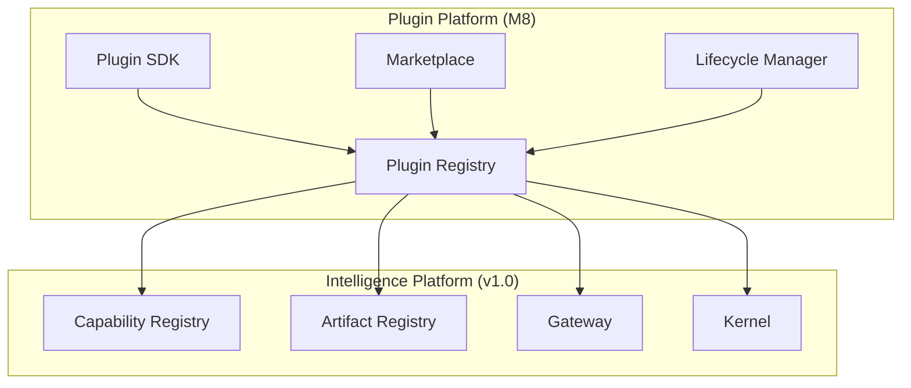
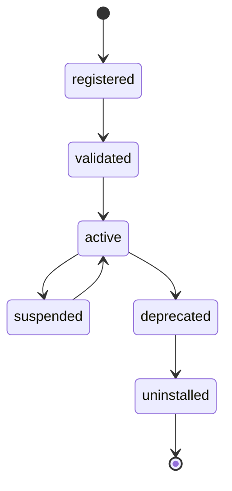

# UNAGENCY Intelligence Operating System — Plugin Platform

**Specification Version:** 1.0  
**Status:** Future (M8) — Documentation Only

---

## Purpose

This document describes the future Plugin Platform for extending the Intelligence OS without modifying core modules.

---

## Plugin Philosophy

The Intelligence OS must be extensible by third parties and internal teams without forking core modules. Plugins register capabilities, artifact types, analyzers, and connectors through defined registration interfaces.

Plugins operate within the same boundary rules as core modules: dependency inversion, contract-based communication, no direct core module modification.

---

## Future Architecture

---

## Plugin SDK

The Plugin SDK provides:

| Capability | Description |
|------------|-------------|
| Capability registration | Register new intelligence capabilities |
| Artifact type registration | Register new artifact descriptors |
| Analyzer registration | Register learning analyzers |
| Knowledge source registration | Register knowledge connectors |
| Context resolver registration | Register context sources |
| Provider adapter registration | Register provider adapters |
| Event subscription | Subscribe to platform events |

Plugins export a manifest describing registrations, dependencies, and version compatibility.

---

## Marketplace

The marketplace enables:

- Plugin discovery and installation
- Version management
- Compatibility verification
- Security review status
- Usage analytics
- Revenue and licensing (if applicable)

Marketplace installation triggers kernel module registration through the composition root.

---

## Extensions

| Extension Type | Registration Target |
|----------------|---------------------|
| Capability | Capability Registry |
| Artifact type | Artifact Registry |
| Judge | Evaluation judge pipeline |
| Analyzer | Learning analyzer pipeline |
| Knowledge source | Knowledge engine |
| Context resolver | Context engine |
| Provider adapter | Provider Platform (M4) |
| Policy rule | Policies module |
| Prompt template | Prompt Compiler repository |

---

## Plugin Lifecycle

| State | Description |
|-------|-------------|
| Registered | Plugin manifest accepted |
| Validated | Security and compatibility checks passed |
| Active | Available for use |
| Suspended | Temporarily disabled |
| Deprecated | Scheduled for removal |
| Uninstalled | Removed from platform |

---

## Capability Registration

Plugins register capabilities through the Capability Registry:

1. Submit `CapabilityDefinition` with schema, constraints, defaults
2. Registry validates definition
3. Catalog indexes for discovery
4. Gateway routes requests to plugin capability handler

Plugin capabilities follow the same `CapabilityRequest → ExecutionPlan` flow as core capabilities.

---

## Artifact Consumers

Plugins may consume artifacts as read-only snapshots:

- Verify signature before consumption
- Respect tenant isolation boundaries
- Emit derived artifacts with proper lineage
- Never mutate source artifacts

---

## Security Model

| Control | Description |
|---------|-------------|
| Sandboxing | Plugin execution isolation |
| Permission model | Declared permissions in manifest |
| Code review | Marketplace security review |
| Tenant isolation | Plugin data scoped to tenant |
| Audit | All plugin actions logged |

---

## Versioning

Plugins declare compatibility:

- Platform version range
- Contract version dependencies
- Provider version requirements

Incompatible plugins are rejected at registration.

---

## Boundaries

| Plugins May | Plugins May Not |
|-------------|-----------------|
| Register new types | Modify frozen core modules |
| Consume artifact snapshots | Bypass gateway |
| Implement interfaces | Access core internals |
| Subscribe to events | Modify other plugins' state |
| Provide adapters | Disable platform security |

---

## Dependencies (Future)

- Kernel (module registration)
- Capability Registry
- Artifact Registry
- Gateway (capability routing)
- Security (plugin authorization)

---

## Extension Strategy

M8 will add plugin registration infrastructure to the kernel composition root. Core module interfaces remain unchanged. Plugins are additive registrations.
