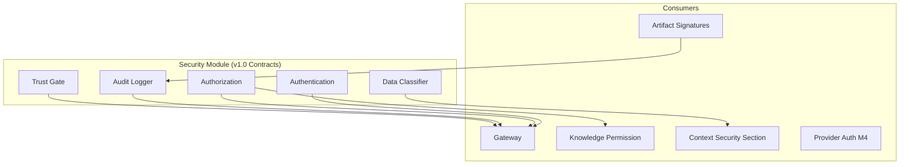

# UNAGENCY Intelligence Operating System — Security Model

**Specification Version:** 1.0  
**Status:** Approved

---

## Purpose

This document specifies the security model for the Intelligence Operating System, covering authentication, authorization, audit, tenant isolation, classification, and artifact integrity.

---

## Security Architecture

---

## Authentication

v1.0 defines authentication contracts without implementing an identity provider.

| Concern | v1.0 | Future |
|---------|------|--------|
| Identity verification | Contract port | Identity provider integration |
| Token validation | Gateway responsibility | JWT/OAuth middleware |
| Service-to-service auth | Composition root | mTLS, service tokens |
| API key management | Config module | Secrets manager |

Authentication occurs at the gateway boundary before intelligence processing begins.

---

## Authorization

`IAuthorizationPolicy` defines authorization ports:

| Policy Type | Scope |
|-------------|-------|
| Capability access | Which capabilities a principal may invoke |
| Workspace access | Tenant and workspace boundaries |
| Knowledge access | Classification-based knowledge permissions |
| Admin operations | Platform administration actions |

Authorization is checked at the gateway and within engines that enforce domain-specific permissions (e.g., Knowledge Permission Engine).

---

## Audit

`IAuditLogger` records security-relevant events:

| Event | Data |
|-------|------|
| Capability invocation | Principal, capability, tenant, timestamp |
| Evaluation completion | Report ID, disposition, outcome |
| Artifact creation | Artifact ID, type, creator module |
| Policy violation | Policy ID, violation details |
| Authentication failure | Principal, reason, source |

Audit events use `AuditEventId` branded identifiers. Audit storage is external to the platform (future Governance M9).

---

## Tenant Isolation

All intelligence contracts carry organizational scope:

| Identifier | Boundary |
|------------|----------|
| `organizationId` | Primary tenant boundary |
| `workspaceId` | Sub-tenant workspace |
| `userId` | Individual principal |

Rules:

- Cross-tenant artifact access is forbidden
- Cross-tenant memory retrieval is forbidden
- Cross-tenant knowledge retrieval is forbidden
- Planning respects tenant-scoped provider credentials (M4)
- Learning analysis is scoped to tenant artifacts

---

## Classification

`IDataClassifier` classifies intelligence content:

| Level | Handling |
|-------|----------|
| Public | No restrictions |
| Internal | Organization-scoped |
| Confidential | Restricted access, audit required |
| Restricted | Explicit authorization required |

Classification is embedded in context security sections and knowledge permission checks.

---

## Encryption

| Layer | v1.0 | Future |
|-------|------|--------|
| In transit | Application responsibility | TLS enforcement |
| At rest | Storage adapter responsibility | Platform encryption standards |
| Artifact payloads | Not encrypted in v1.0 | Field-level encryption for sensitive artifacts |
| Secrets | Config module | KMS integration (M9) |

---

## Provider Security

Provider security is deferred to Provider Platform (M4):

- Credential isolation per tenant
- No credentials in intelligence engines
- Provider request/response artifacts exclude raw credentials
- Audit of provider invocations

---

## Artifact Integrity

| Mechanism | Purpose |
|-----------|---------|
| Canonical SHA-256 checksum | Content integrity verification |
| Artifact signature | Tamper detection |
| Manifest checksum | Snapshot verification |
| Lineage chain | Provenance audit trail |

Future: cryptographic signatures with HSM/KMS backing.

---

## Secrets Management

| Secret Type | Storage |
|-------------|---------|
| Provider API keys | External secrets manager (M4) |
| Encryption keys | KMS (M9) |
| Service tokens | Config with rotation (M9) |
| Platform configuration | Config module (environment variables) |

No module except `config` may access `process.env` directly.

---

## Future KMS

Key Management Service integration (M9 Governance):

- Envelope encryption for artifact payloads
- Signing key management for artifact signatures
- Tenant-specific encryption keys
- Key rotation without artifact re-creation

---

## Security Boundaries

| Module | Security Responsibility |
|--------|------------------------|
| Gateway | Authentication, authorization entry point |
| Security | Contract definitions for authz, audit, classification |
| Knowledge | Permission engine enforcement |
| Context | Security section construction |
| Artifacts | Signature and integrity verification |
| Evaluation | Safety and policy judges (signals) |
| Provider Platform (M4) | Credential management, transport security |

---

## Threat Model Summary

| Threat | Mitigation |
|--------|------------|
| Unauthorized capability access | Gateway authorization |
| Cross-tenant data leak | Branded identifiers, scope enforcement |
| Artifact tampering | Checksum and signature verification |
| Provider credential exposure | Adapter-only credential access |
| Unaudited intelligence operations | Audit logger contracts |
| Uncontrolled AI outputs | Evaluation + review disposition |
| Plugin malicious behavior | Plugin sandboxing (M8) |

---

## Compliance Readiness

The v1.0 security model establishes contracts for:

- Audit trail generation
- Data classification
- Tenant isolation
- Artifact provenance

Full compliance workflows (SOC 2, GDPR data handling) are addressed in Governance (M9).
