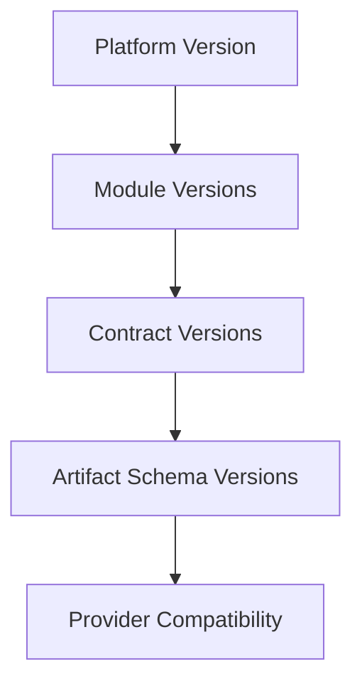
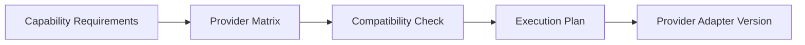

# UNAGENCY Intelligence Operating System — Versioning

**Specification Version:** 1.0  
**Status:** Approved

---

## Purpose

This document defines versioning strategy across the Intelligence Operating System: platform, modules, artifacts, contracts, and provider compatibility.

---

## Versioning Layers



---

## Platform Versioning

The Intelligence OS uses milestone-based platform versioning:

| Version | Milestones | Status |
|---------|------------|--------|
| v1.0 | M0–M3 | Current (frozen) |
| v2.0 | M4–M6 | Future |
| v3.0 | M7–M10 | Future |

Platform version is declared in this specification set. Breaking platform changes require a new major specification version.

---

## Module Versioning

Each module maintains independent version metadata:

| Module | Versioning Mechanism |
|--------|---------------------|
| Capability Registry | `CapabilityVersion` per capability |
| Provider Platform | `ProviderVersion` per provider |
| Prompt Compiler | `PromptVersion` per template |
| Artifact Platform | `ArtifactVersion` per artifact (semver) |
| Evaluation | `EvaluationRubric.version` |
| All modules | README and architecture review document milestone |

Module versions are informational in v1.0. They do not trigger automatic compatibility checks.

---

## Artifact Versioning

Artifacts use semantic-style versioning:

```
major.minor.patch+revision
```

| Component | Semantics |
|-----------|-----------|
| Major | Breaking payload schema change |
| Minor | Compatible feature addition |
| Patch | Correction without schema change |
| Revision | Content update within same schema |

| State | Meaning |
|-------|---------|
| `draft` | Under construction |
| `published` | Authoritative |
| `deprecated` | Superseded |
| `archived` | Retained, inactive |

**Rule:** Artifacts are immutable. Version changes create new artifacts.

---

## Contract Versioning

Contracts are immutable within a platform version. Contract changes follow:

| Change Type | Process |
|-------------|---------|
| Additive field | Minor contract version bump |
| New contract type | New module or ACP |
| Breaking field change | Major contract version + ACP |
| Contract removal | Major platform version + ACP |

Contract versions are declared in `ArtifactDescriptor.schemaVersion` and module contract headers.

---

## Provider Compatibility

Provider compatibility is tracked through:

| Mechanism | Description |
|-----------|-------------|
| Provider Capability Matrix | Feature support per provider |
| Provider Version | Provider adapter version |
| Renderer version | Prompt renderer compatibility |
| Plan metadata | Provider selection recorded in execution plan |



Provider adapters declare supported:

- Model identifiers
- API versions
- Feature flags (streaming, tools, vision)
- Renderer compatibility

---

## Upgrade Strategy

### Platform Upgrades

1. New milestones implemented as additive modules
2. Frozen milestones remain unchanged
3. ACPs required for any frozen module modification
4. Gateway maintains backward-compatible request/response shapes
5. Artifact registry supports new types without breaking existing types

### Contract Upgrades

1. Add new fields as optional properties
2. Maintain backward-compatible deserialization
3. Version field in contract enables routing to correct handler
4. Deprecation period before field removal

### Artifact Upgrades

1. Create new artifact with bumped version
2. Mark prior artifact as `superseded`
3. Lineage links new artifact to predecessor
4. Consumers read latest published version by default

### Provider Upgrades

1. Register new provider version in matrix
2. Deploy new adapter alongside existing
3. Planning engine routes to new version based on policy
4. Deprecate old adapter after migration period

---

## Compatibility Matrix

| Consumer | Producer | Compatibility Rule |
|----------|----------|-------------------|
| Prompt Compiler | Context Engine | Context contract version |
| Prompt Compiler | Knowledge Engine | Knowledge snapshot schema |
| Evaluation | Execution Runtime | ExecutionResult schema |
| Learning | Artifact Platform | Artifact snapshot schema |
| Gateway | Business modules | Gateway request/response schema |
| Provider Adapter (M4) | Prompt Compiler | CompiledPrompt schema |
| Artifact consumers | Artifact Platform | ArtifactDescriptor schemaVersion |

---

## Deprecation Policy

| Item | Notice Period | Action |
|------|---------------|--------|
| Contract field | One platform minor version | Mark deprecated, then remove |
| Capability | Governance approval | Mark deprecated in registry |
| Provider adapter | 90 days after replacement | Remove from matrix |
| Artifact type | ACP approval | Mark deprecated in registry |
| Module | Major platform version | ACP with migration guide |

---

## Version in Audit Trail

All version identifiers are recorded in:

- Artifact provenance (`versions` map)
- Execution plan metadata
- Evaluation report rubric version
- Audit log entries

This enables reproducibility: any intelligence outcome can be traced to the exact versions of all contributing components.
