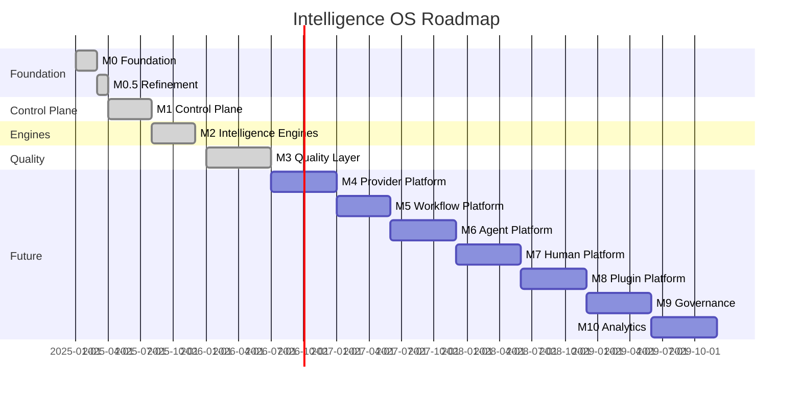
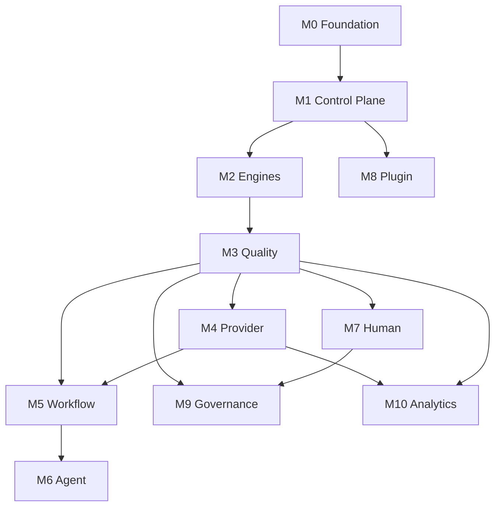

# UNAGENCY Intelligence Operating System — Roadmap

**Specification Version:** 1.0  
**Status:** Approved

---

## Purpose

This document records completed milestones and the planned future evolution of the Intelligence Operating System.

---

## Completed Milestones

### M0 — Platform Foundation

| Deliverable | Status |
|-------------|--------|
| Kernel (lifecycle, DI, health, composition) | Complete |
| Shared (identifiers, results, errors) | Complete |
| Config, Events, Security, Telemetry | Complete |
| Runtime, Policies, Scheduler (contracts) | Complete |
| CLI, Playground, Testing scaffolding | Complete |

### M0.5 — Architecture Refinement

| Deliverable | Status |
|-------------|--------|
| Single source of truth (`src/platform/intelligence/`) | Complete |
| Registry moved under kernel | Complete |
| Execution-planner renamed to execution-planning | Complete |
| Provider capability matrix under providers | Complete |

### M1 — Intelligence Control Plane

| Milestone | Deliverable | Status |
|-----------|-------------|--------|
| M1.1 | Intelligence Kernel | Complete |
| M1.2 | Capability Management (Registry + Catalog) | Complete |
| M1.3 | Provider Platform (metadata, matrix, contracts) | Complete |
| M1.4 | Execution Planning Engine | Complete |
| M1.5 | Execution Runtime | Complete |
| M1.6 | Intelligence Orchestrator | Complete |
| M1.7 | Intelligence Gateway | Complete |

### M2 — Intelligence Engines

| Milestone | Deliverable | Status |
|-----------|-------------|--------|
| M2.1 | Context Intelligence Engine | Complete |
| M2.2 | Knowledge Intelligence Engine | Complete |
| M2.3 | Prompt Compiler | Complete |
| M2.4 | Memory Intelligence Engine | Complete |

### M3 — Quality and Canonicalization

| Milestone | Deliverable | Status |
|-----------|-------------|--------|
| M3.1 | Intelligence Evaluation Platform | Complete |
| M3.2 | Intelligence Artifact Platform | Complete |
| M3.3 | Learning Intelligence Platform | Complete |
| M3.4 | Platform Specification v1.0 | Complete |

---

## Milestone Timeline

---

## Future Milestones

### M4 — Provider Platform

**Objective:** Live provider execution against external AI services.

| Deliverable | Description |
|-------------|-------------|
| Provider Runtime | Execute provider requests |
| SDK Adapters | OpenAI, Claude, Gemini adapters |
| Streaming | Token streaming support |
| Retries and circuit breakers | Resilience patterns |
| Authentication | Credential management |
| Cost metering | Per-request cost tracking |
| Provider renderers | Provider-specific prompt rendering |

**Dependency:** M1 Provider Platform contracts (complete).

See [13-PROVIDER_PLATFORM.md](./13-PROVIDER_PLATFORM.md).

---

### M5 — Workflow Platform

**Objective:** Multi-step intelligence orchestration with human nodes.

| Deliverable | Description |
|-------------|-------------|
| Workflow Runtime | Instance lifecycle management |
| Execution Graph | Node and edge execution |
| Human Nodes | Human Platform integration points |
| Conditions and Loops | Control flow |
| Event Triggers | External event handling |
| Scheduler Integration | Scheduled workflow execution |

**Dependency:** M1 Gateway, M3 Artifacts, Scheduler contracts.

See [14-WORKFLOW_PLATFORM.md](./14-WORKFLOW_PLATFORM.md).

---

### M6 — Agent Platform

**Objective:** Autonomous and multi-agent intelligence operations.

| Deliverable | Description |
|-------------|-------------|
| Agent Runtime | Goal-directed agent loop |
| Single Agent | Plan-act-observe-verify cycle |
| Multi-Agent | Coordination patterns |
| Supervisor | Task decomposition and monitoring |
| Planner | Agent-level action planning |
| Verifier | Goal satisfaction validation |
| Memory-aware agents | Historical context consumption |

**Dependency:** M5 Workflow (optional), M2 Memory, M1 Gateway.

See [15-AGENT_PLATFORM.md](./15-AGENT_PLATFORM.md).

---

### M7 — Human Platform

**Objective:** Operationalize human review and quality assurance.

| Deliverable | Description |
|-------------|-------------|
| Review Queues | Disposition-based queue management |
| Expert Routing | Skill-based reviewer assignment |
| Approvals | Accept/reject/revise/escalate workflows |
| Escalation | SLA breach and severity escalation |
| SLA Management | Review time tracking |
| Quality Assurance | Inter-reviewer calibration |

**Dependency:** M3.1 Evaluation (review signals).

See [16-HUMAN_PLATFORM.md](./16-HUMAN_PLATFORM.md).

---

### M8 — Plugin Platform

**Objective:** Third-party and internal extensions without core modification.

| Deliverable | Description |
|-------------|-------------|
| Plugin SDK | Registration and development toolkit |
| Marketplace | Discovery, installation, versioning |
| Plugin Lifecycle | Registration, validation, activation |
| Extension Registration | Capabilities, artifacts, analyzers, adapters |

**Dependency:** M1 Kernel registry, M3.2 Artifact registry.

See [17-PLUGIN_PLATFORM.md](./17-PLUGIN_PLATFORM.md).

---

### M9 — Governance

**Objective:** Enterprise governance, compliance, and administration.

| Deliverable | Description |
|-------------|-------------|
| Tenant Administration | Organization and workspace management |
| Policy Administration | Policy CRUD and enforcement |
| Compliance Workflows | Audit, retention, data handling |
| KMS Integration | Key management for encryption and signing |
| Cost Governance | Budget, quota, and chargeback |
| Access Management | Role-based access control |

**Dependency:** M1 Security contracts, M3 Artifacts, M7 Human Platform.

---

### M10 — Analytics

**Objective:** Platform-wide intelligence analytics and observability.

| Deliverable | Description |
|-------------|-------------|
| Intelligence Dashboards | Quality, cost, latency trends |
| Artifact Analytics | Lineage visualization, usage patterns |
| Learning Analytics | Recommendation effectiveness |
| Provider Analytics | Provider performance comparison |
| Evaluation Analytics | Judge performance, calibration trends |
| Alerting | Threshold-based notifications |

**Dependency:** M3 Artifacts, M3 Learning, M1 Telemetry, M4 Provider cost data.

---

## Roadmap Principles

1. **Additive extension** — Future milestones add modules; frozen milestones are not modified.
2. **ACP for changes** — Any frozen module change requires Architecture Change Proposal.
3. **Contract stability** — Public interfaces remain backward-compatible within platform versions.
4. **Gateway centrality** — All new platforms integrate through the gateway.
5. **Artifact canonicalization** — All new platforms produce and consume artifacts.

---

## Dependency Order

---

## Current Platform State

The Intelligence OS v1.0 (M0–M3) provides:

- Complete control plane without live provider execution
- Full intelligence engine pipeline (context → knowledge → prompt → memory)
- Quality layer (evaluation, artifacts, learning)
- Canonical artifact model for all intelligence objects
- Specification documentation (this document set)

The platform is ready for M4 Provider Platform implementation as the next milestone.
