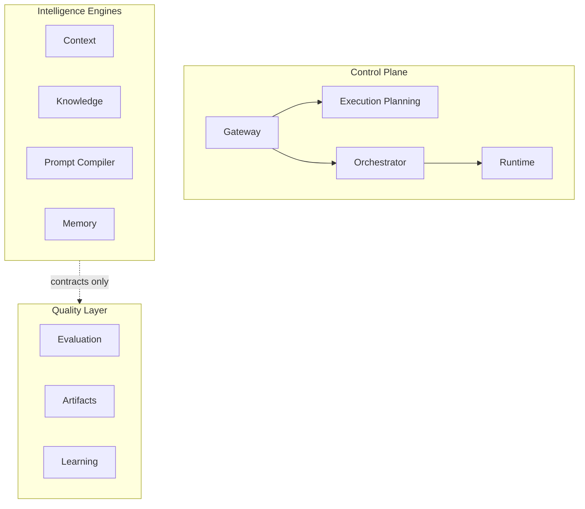
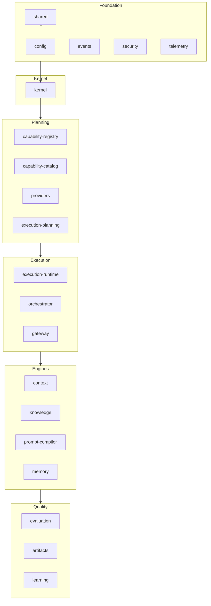

# Architecture Validation Report

**Milestone:** M3.5  
**Platform:** UNAGENCY Intelligence OS v1.0  
**Validation Date:** 2026-07-06  
**Status:** PASSED (with non-blocking observations)

---

## Executive Summary

The UNAGENCY Intelligence Operating System v1.0 demonstrates strong architectural consistency across 18 implemented modules. Module responsibilities are clearly delineated, dependency inversion is applied consistently, and intelligence engines remain provider-independent. No blocking architectural violations were identified.

---

## Validation Methodology

1. Static analysis of module structure under `src/platform/intelligence/`
2. Cross-reference against Platform Specification v1.0 (`docs/specification/`)
3. Import graph analysis for coupling and boundary violations
4. Interface and contract ownership review per module
5. SOLID and Clean Architecture compliance assessment

No source code was modified during this validation.

---

## Module Responsibility Validation

| Module | Responsibilities Aligned | Non-Responsibilities Respected | Result |
|--------|------------------------|-------------------------------|--------|
| Kernel | Yes | Yes | PASS |
| Capability Registry | Yes | Yes | PASS |
| Capability Catalog | Yes | Yes | PASS |
| Provider Platform | Yes (metadata only) | Yes (no SDK execution) | PASS |
| Execution Planning | Yes | Yes | PASS |
| Execution Runtime | Yes | Yes | PASS |
| Orchestrator | Yes | Yes | PASS |
| Gateway | Yes | Yes | PASS |
| Context | Yes | Yes | PASS |
| Knowledge | Yes | Yes | PASS |
| Prompt Compiler | Yes | Yes | PASS |
| Memory | Yes | Yes | PASS |
| Evaluation | Yes | Yes | PASS |
| Artifacts | Yes | Yes | PASS |
| Learning | Yes | Yes | PASS |

---

## Separation of Concerns



**Finding:** Control plane, intelligence engines, and quality layer are physically and logically separated. Gateway composition root wires control plane only; M2/M3 engines are independently composable. This is consistent with incremental milestone delivery and does not violate boundaries.

---

## Dependency Inversion

| Pattern | Evidence | Result |
|---------|----------|--------|
| Interface-first ports | All engines expose `I*` interfaces | PASS |
| Composition roots | Kernel + Platform composition roots wire concretions | PASS |
| Contract-based cross-module communication | `contracts/` directories per module | PASS |
| Result pattern | `Result<T>` used for expected failures | PASS |
| No service locators | No global singleton registries outside kernel | PASS |

---

## SOLID Compliance

| Principle | Assessment |
|-----------|------------|
| **S** — Single Responsibility | Each module owns one bounded context | PASS |
| **O** — Open/Closed | Extension via interfaces (judges, analyzers, strategies) | PASS |
| **L** — Liskov Substitution | Placeholder implementations honor interfaces | PASS |
| **I** — Interface Segregation | Focused port interfaces per concern | PASS |
| **D** — Dependency Inversion | High-level modules depend on abstractions | PASS |

---

## Interface and Contract Ownership

| Module | Owns Contracts | Owns Interfaces | Consumes External Contracts |
|--------|---------------|-----------------|----------------------------|
| Each engine module | Domain models | Service ports | Shared + upstream contracts only |
| Artifacts | Artifact model + typed payloads | Engine ports | Engine contracts (read-only types) |
| Gateway | Gateway request/response | `IIntelligenceGateway` | Planning, runtime, orchestrator interfaces |

**Observation:** `artifacts/contracts/typed-artifacts.ts` imports types from six engine modules. This is intentional — artifacts canonicalize engine outputs. Dependency direction is inward (artifacts depend on engines, not vice versa). PASS.

---

## Module Cohesion and Coupling

| Metric | Finding |
|--------|---------|
| Cohesion | High — subdirectories map to single concerns within each module |
| Afferent coupling | Gateway has highest fan-in (expected) |
| Efferent coupling | Engines depend on shared; quality layer depends on engine contracts |
| Cross-engine coupling | Prompt → Context + Knowledge contracts only (pipeline order) | PASS |

---

## Layering Validation

```
Layer 0: shared
Layer 1: config, events, security, telemetry, policies, runtime, scheduler
Layer 2: kernel
Layer 3: capability-registry, capability-catalog, providers, execution-planning
Layer 4: execution-runtime, orchestrator, gateway
Layer 5: context, knowledge, prompt-compiler, memory
Layer 6: evaluation, artifacts, learning
```

**Minor observation:** `context` imports `ExecutionPriority` from `execution-planning/contracts`. This is a contract-level dependency from Layer 5 to Layer 3. Functionally acceptable but ideally `ExecutionPriority` would live in `shared` (see ACP-002).

---

## Architectural Boundary Violations

| ID | Severity | Finding |
|----|----------|---------|
| — | — | No blocking violations detected |

---

## Non-Blocking Observations

| ID | Severity | Finding |
|----|----------|---------|
| OBS-001 | Low | Gateway composition does not yet wire M2/M3 engines (by milestone scope) |
| OBS-002 | Low | Compatibility shims remain (`execution-planner`, `provider-capability-matrix`, top-level `registry`) |
| OBS-003 | Low | `platform/intelligence/index.ts` exports `providers` publicly; business modules should use gateway only |
| OBS-004 | Info | Config `platformVersion` reads `0.1.0-m0`; specification declares v1.0 |

---

## Architecture Diagram — Validated Structure



---

## Conclusion

Architecture validation **PASSED**. The platform exhibits consistent module boundaries, proper dependency inversion, and clear ownership of contracts and interfaces. Observations are documented as ACPs; none block M4 entry.
