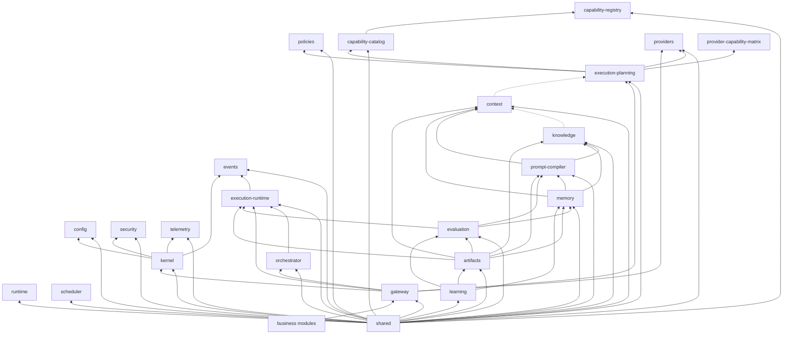

# Dependency Validation Report

**Milestone:** M3.5  
**Platform:** UNAGENCY Intelligence OS v1.0  
**Status:** PASSED

---

## Complete Dependency Graph



Dotted lines indicate contract-only imports (types, not implementations).

---

## Layer Stack Validation

```
Business Platform
      ↓  (no direct intelligence imports detected in src/)
Intelligence Gateway
      ↓
Control Plane (Planning → Orchestrator → Runtime)
      ↓
Provider Platform (metadata / matrix — leaf adapters deferred M4)
```

**Result:** Layer ordering is respected. No business module imports of `platform/intelligence` were detected outside the platform itself.

---

## Circular Dependency Detection

| Check | Result |
|-------|--------|
| shared → any module → shared | No cycles detected |
| planning ↔ orchestrator | Acyclic (orchestrator does not import planning engine) |
| evaluation ↔ learning | Acyclic (evaluation does not import learning) |
| artifacts ↔ engines | Acyclic (engines do not import artifacts) |
| gateway ↔ kernel | Acyclic (kernel does not import gateway) |

**Result:** PASS — no circular dependencies detected.

---

## Forbidden Import Detection

| Rule | Scan Result |
|------|-------------|
| OpenAI / Anthropic / Gemini SDKs | Not found |
| MongoDB / Mongoose | Not found |
| Redis / ioredis | Not found (string literal in memory store type union only) |
| BullMQ / Kafka | Not found |
| `process.env` outside config | Not found |
| Business → intelligence internals | Not found |
| Evaluation → providers | Not found |
| Learning → providers | Not found |
| Artifacts → providers | Not found |
| Context/Knowledge → providers | Not found |

**Result:** PASS

---

## Provider Reference Analysis

| Module | Provider Reference Type | Allowed |
|--------|------------------------|---------|
| execution-planning | `IProviderRegistry`, `ProviderDefinition` (metadata) | Yes |
| gateway composition | `ProviderRegistry`, `ProviderCapabilityMatrix` (wiring) | Yes |
| providers/adapters | `IProviderAdapter` abstract interface | Yes |
| prompt-compiler | `IPromptRenderer.target` union includes provider name strings | Yes (type literal, not SDK) |
| learning | `ProviderAnalyzer` (placeholder heuristic) | Yes (no SDK) |

---

## Inward Dependency Violations

| From | To | Severity | Assessment |
|------|----|----------|------------|
| context | execution-planning/contracts (ExecutionPriority) | Low | Contract-only; recommend shared extraction (ACP-002) |
| capability-catalog | capability-registry | None | Allowed — catalog reads registry via interface |
| memory builders | context, knowledge, prompt contracts | None | Allowed — artifact ingestion types |

No inward dependency violations that breach architectural intent.

---

## Module Dependency Matrix

| Module | Depends On | Forbidden Deps Avoided |
|--------|-----------|------------------------|
| shared | — | — |
| kernel | shared, config, events, security, telemetry | PASS |
| capability-registry | shared | PASS |
| capability-catalog | shared, capability-registry (interface) | PASS |
| providers | shared | PASS |
| execution-planning | shared, catalog, providers (metadata), policies | PASS |
| execution-runtime | shared, events, planning (contracts) | PASS |
| orchestrator | shared, runtime, planning (contracts) | PASS |
| gateway | planning, orchestrator, runtime, kernel, providers (wiring) | PASS |
| context | shared, planning (ExecutionPriority contract) | PASS |
| knowledge | shared, context (contract) | PASS |
| prompt-compiler | shared, context, knowledge (contracts) | PASS |
| memory | shared, context, knowledge, prompt (contracts) | PASS |
| evaluation | shared, runtime, prompt, memory (contracts) | PASS |
| artifacts | shared, all engine contracts | PASS |
| learning | shared, artifacts, evaluation, memory (contracts) | PASS |

---

## Composition Root Validation

| Root | Location | Wires |
|------|----------|-------|
| Kernel CompositionRoot | `kernel/composition/` | Foundation services, kernel, DI |
| PlatformCompositionRoot | `gateway/factories/` | Control plane + gateway |

**Finding:** Only composition roots instantiate concrete implementations. PASS.

---

## Conclusion

Dependency validation **PASSED**. The dependency graph is acyclic, forbidden imports are absent, and the Business → Gateway → Control Plane → Provider layering is intact.
