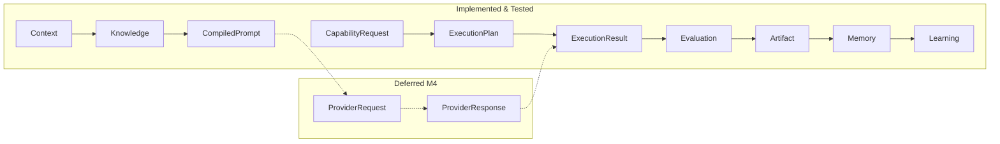

# Pipeline Validation Report

**Milestone:** M3.5  
**Platform:** UNAGENCY Intelligence OS v1.0  
**Status:** PASSED (composable; gateway integration deferred)

---

## Pipeline Under Validation

```
CapabilityRequest → ExecutionPlan → Context → Knowledge → CompiledPrompt
→ ProviderRequest → ProviderResponse → ExecutionResult → EvaluationReport
→ ConfidenceReport → ReviewDecision → Artifact → Memory → LearningSignal
```

---

## Step-by-Step Validation

### 1. CapabilityRequest

| Attribute | Validation |
|-----------|------------|
| Purpose | Express business intent | PASS |
| Input | Business parameters, tenant identity | PASS |
| Output | `GatewayCapabilityRequest` / `CapabilityRequest` | PASS |
| Owner | Business (origin) / Gateway (receiver) | PASS |
| Contract | `gateway/contracts/`, `execution-planning/contracts/` | PASS |
| Immutable | Request objects are readonly | PASS |
| Extensible | Attributes bag on request | PASS |

### 2. ExecutionPlan

| Attribute | Validation |
|-----------|------------|
| Purpose | Plan capability execution | PASS |
| Input | CapabilityRequest + catalog + matrix + policies | PASS |
| Output | `ExecutionPlan` with graph, stages, provider selection | PASS |
| Owner | Execution Planning Engine | PASS |
| Contract | `execution-planning/contracts/execution-plan.ts` | PASS |
| Gateway wired | Yes — `PlatformCompositionRoot` | PASS |

### 3. Context

| Attribute | Validation |
|-----------|------------|
| Purpose | Assemble operational context | PASS |
| Input | `ContextBuildRequest` | PASS |
| Output | `IntelligenceContext`, `ContextSnapshot` | PASS |
| Owner | Context Intelligence Engine | PASS |
| Contract | `context/contracts/intelligence-context.ts` | PASS |
| Gateway wired | No — standalone module (by milestone scope) | OBSERVED |
| Tests | `context-engine.test.ts` | PASS |

### 4. Knowledge

| Attribute | Validation |
|-----------|------------|
| Purpose | Package relevant knowledge | PASS |
| Input | `KnowledgeRequest` | PASS |
| Output | `KnowledgeSnapshot` | PASS |
| Owner | Knowledge Intelligence Engine | PASS |
| Contract | `knowledge/contracts/knowledge-models.ts` | PASS |
| Gateway wired | No — standalone | OBSERVED |
| Tests | `knowledge-engine.test.ts` | PASS |

### 5. CompiledPrompt

| Attribute | Validation |
|-----------|------------|
| Purpose | Provider-independent prompt | PASS |
| Input | Context + Knowledge + template | PASS |
| Output | `CompiledPrompt` | PASS |
| Owner | Prompt Compiler | PASS |
| Contract | `prompt-compiler/contracts/prompt-models.ts` | PASS |
| Provider independent | Neutral renderer only | PASS |
| Tests | `prompt-compiler.test.ts` | PASS |

### 6–7. ProviderRequest / ProviderResponse

| Attribute | Validation |
|-----------|------------|
| Purpose | Provider invocation and response capture | DEFINED |
| Owner | Provider Platform Runtime (M4) | NOT IMPLEMENTED |
| Artifact types | `ProviderRequestArtifact`, `ProviderResponseArtifact` | PASS |
| Contracts ready | Yes — artifact typed payloads exist | PASS |
| Status | Deferred to M4 — not a pipeline break | ACCEPTED |

### 8. ExecutionResult

| Attribute | Validation |
|-----------|------------|
| Purpose | Terminal execution output | PASS |
| Input | Approved ExecutionPlan | PASS |
| Output | `ExecutionResult` | PASS |
| Owner | Execution Runtime (via Orchestrator) | PASS |
| Gateway wired | Yes | PASS |
| Tests | Multiple runtime tests | PASS |

### 9–11. Evaluation → Confidence → ReviewDecision

| Attribute | Validation |
|-----------|------------|
| Purpose | Quality, trust, review disposition | PASS |
| Input | `EvaluationRequest` with ExecutionResult | PASS |
| Output | `EvaluationResult` bundle | PASS |
| Owner | Evaluation Platform | PASS |
| Provider independent | Confirmed — no provider imports | PASS |
| Gateway wired | No — standalone | OBSERVED |
| Tests | 14 evaluation tests | PASS |

### 12. Artifact

| Attribute | Validation |
|-----------|------------|
| Purpose | Canonicalize intelligence output | PASS |
| Input | `ArtifactInput` | PASS |
| Output | `ArtifactResult` (artifact + snapshot + validation) | PASS |
| Owner | Artifact Platform | PASS |
| Immutability | Enforced by design | PASS |
| Tests | 16 artifact tests | PASS |

### 13. Memory

| Attribute | Validation |
|-----------|------------|
| Purpose | Record experience artifacts | PASS |
| Input | `MemoryIngestInput` | PASS |
| Output | `MemorySnapshot` | PASS |
| Owner | Memory Intelligence Engine | PASS |
| Tests | `memory-engine.test.ts` | PASS |

### 14. LearningSignal

| Attribute | Validation |
|-----------|------------|
| Purpose | Extract patterns and recommendations | PASS |
| Input | `LearningRequest` with artifact snapshots | PASS |
| Output | `LearningResult` with signals, patterns, recommendations | PASS |
| Owner | Learning Platform | PASS |
| Behavior modification | None — advisory only | PASS |
| Tests | 12 learning tests | PASS |

---

## Pipeline Completeness Matrix



| Stage | Module Exists | Contract Defined | Unit Tested | Gateway Wired |
|-------|--------------|------------------|-------------|---------------|
| CapabilityRequest | Yes | Yes | Yes | Yes |
| ExecutionPlan | Yes | Yes | Yes | Yes |
| Context | Yes | Yes | Yes | No |
| Knowledge | Yes | Yes | Yes | No |
| CompiledPrompt | Yes | Yes | Yes | No |
| ProviderRequest | Artifact only | Yes | N/A | No |
| ProviderResponse | Artifact only | Yes | N/A | No |
| ExecutionResult | Yes | Yes | Yes | Yes |
| Evaluation | Yes | Yes | Yes | No |
| Artifact | Yes | Yes | Yes | No |
| Memory | Yes | Yes | Yes | No |
| Learning | Yes | Yes | Yes | No |

---

## Ownership Validation

| Stage | Single Owner | No Duplicate Logic |
|-------|-------------|-------------------|
| Provider selection | Execution Planning only | PASS |
| Context construction | Context Engine only | PASS |
| Prompt compilation | Prompt Compiler only | PASS |
| Evaluation judging | Evaluation Platform only | PASS |
| Artifact canonicalization | Artifact Platform only | PASS |
| Learning recommendations | Learning Platform only | PASS |

---

## Immutability Validation

All pipeline contracts use `readonly` properties. Snapshots (`ContextSnapshot`, `KnowledgeSnapshot`, `ArtifactSnapshot`, `MemorySnapshot`) are immutable consumption points. PASS.

---

## Future Extensibility

| Extension Point | Ready |
|-----------------|-------|
| Provider runtime insertion between CompiledPrompt and ExecutionResult | Yes |
| Gateway pipeline orchestration hook | Yes (ACP-001) |
| Additional judges | Yes — `IJudge` interface |
| Additional analyzers | Yes — `IAnalyzer` interface |
| Additional artifact types | Yes — `IArtifactRegistry` |

---

## Conclusion

Pipeline validation **PASSED**. All stages have defined contracts and responsible modules. Provider stages are correctly deferred to M4. Gateway wiring of M2/M3 engines is an integration task (ACP-001), not an architectural defect.
