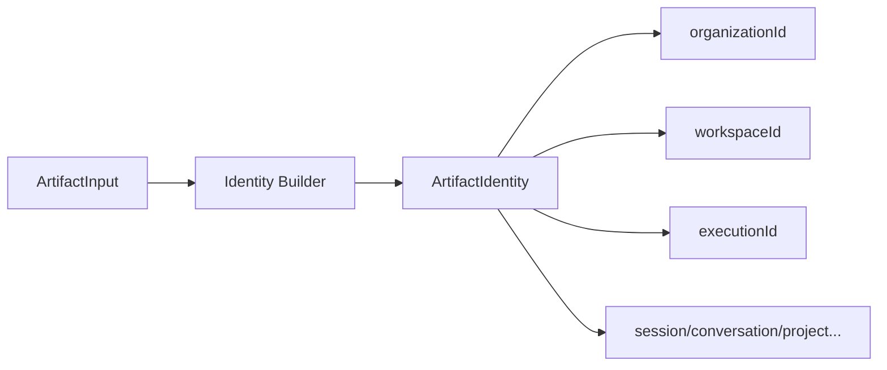
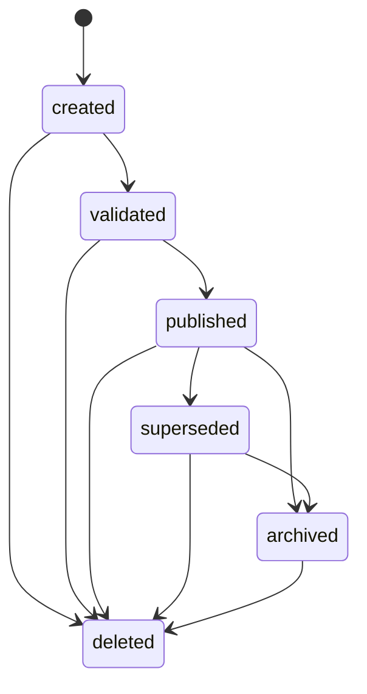

# Artifact Validation Report

**Milestone:** M3.5  
**Platform:** UNAGENCY Intelligence OS v1.0  
**Status:** PASSED

---

## Validation Scope

All artifact subsystem components implemented in `src/platform/intelligence/artifacts/`.

---

## Component Validation Matrix

| Component | Implemented | Interface Defined | Tested | Persistence-Ready |
|-----------|------------|-------------------|--------|-------------------|
| Identity | Yes | `IArtifactIdentityBuilder` | Yes | Yes |
| Metadata | Yes | `IArtifactMetadataBuilder` | Yes | Yes |
| Versioning | Yes | `IArtifactVersionEngine` | Yes | Yes |
| Lineage | Yes | `IArtifactLineageEngine` | Yes | Yes |
| Provenance | Yes | `IArtifactProvenanceEngine` | Yes | Yes |
| Relationships | Yes | Contract model | Yes | Yes |
| Snapshots | Yes | `IArtifactSnapshotBuilder` | Yes | Yes |
| Signatures | Yes | `IArtifactSignatureEngine` | Yes | Yes |
| Lifecycle | Yes | `IArtifactLifecycleManager` | Yes | Yes |
| Registry | Yes | `IArtifactRegistry` | Yes | Yes |
| Collections | Yes | `IArtifactCollectionStore` | Yes | In-memory |
| Validation | Yes | `IArtifactValidator` | Yes | Yes |
| Serialization | Yes | `IArtifactSerializer` | Yes | Yes |
| Manifest | Yes | `IArtifactManifestBuilder` | Yes | Yes |

---

## Immutability Validation

| Rule | Evidence |
|------|----------|
| Artifacts never mutate in place | All contract fields are `readonly` |
| Version changes create new artifacts | `ArtifactVersionEngine.bump()` produces new version object |
| Lifecycle transitions return new state | `ArtifactLifecycleManager.transition()` returns new artifact |
| Snapshots are point-in-time | `capturedAt` + `checksum` on every snapshot |
| Signature covers full payload | Canonical JSON signing over identity + payload |

**Result:** PASS

---

## Identity Validation

- Branded identifiers used for `organizationId`, `workspaceId`, `executionId`
- `artifactId` generated with type prefix (`art_{type}_{uuid}`)
- Identity assigned at creation, never modified

**Result:** PASS

---

## Lineage and Provenance

| Feature | Parents/Children | derivedFrom/createdFrom | Scope Dimensions | Provenance Sources |
|---------|-----------------|------------------------|-------------------|-------------------|
| Supported | Yes | Yes | Yes (9 dimensions) | Yes (11 source kinds) |

Lineage engine populates from `ArtifactInput` parents and scope. Provenance engine auto-generates sources from artifact type and parent references.

**Result:** PASS

---

## Lifecycle State Machine

- Invalid transitions rejected with `ArtifactLifecycleError`
- Engine transitions to `validated` after structural validation, before signing
- Signing occurs after lifecycle transition (checksum matches final state)

**Result:** PASS

---

## Registry Validation

15 default artifact types registered:

`context`, `knowledge`, `prompt`, `provider_request`, `provider_response`, `execution`, `evaluation`, `memory`, `learning`, `workflow`, `decision`, `human`, `brand`, `capability`, `policy`

Plugin registration path via `IArtifactRegistry.register()` is available for M8.

**Result:** PASS

---

## Serialization

| Format | Implemented | Round-Trip Tested |
|--------|------------|-------------------|
| JSON | Yes | Yes |
| Canonical JSON | Yes | Yes |
| Binary | Interface-ready | No (deferred) |

**Result:** PASS

---

## Future Persistence Compatibility

| Concern | Readiness |
|---------|-----------|
| External blob store | Artifact snapshots are self-contained export units |
| Content-addressed storage | Manifest checksum + artifact signature support dedup |
| Index backends | `IArtifactIndex` ports defined (5 index kinds) |
| No storage coupling | Artifact engine has zero persistence imports |

**Result:** PASS — architecture is storage-agnostic.

---

## Typed Artifact Payloads

All 15 typed artifact contracts reference engine domain types via contract imports only. No engine module imports the artifact implementation.

**Result:** PASS

---

## Conclusion

Artifact validation **PASSED**. The artifact platform fully implements the specification model and is ready for external persistence adapters without architectural change.
