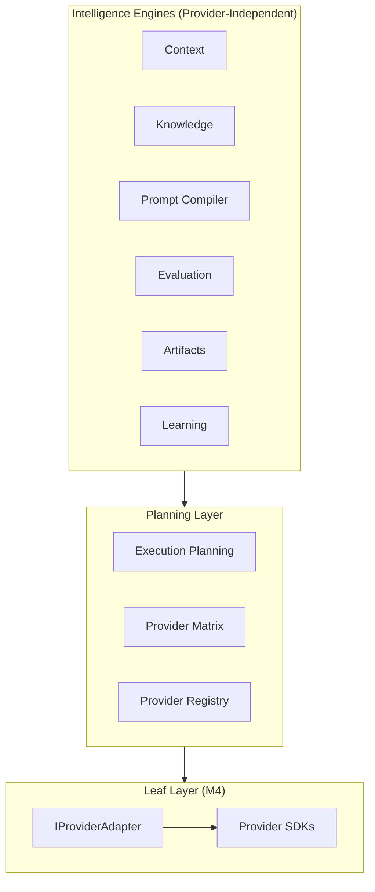

# Provider Independence Validation Report

**Milestone:** M3.5  
**Platform:** UNAGENCY Intelligence OS v1.0  
**Status:** PASSED

---

## Validation Objective

Confirm that no intelligence engine module imports provider SDKs or couples to vendor-specific implementations.

---

## SDK Scan Results

| Provider / Technology | Scan Pattern | Found In Engines |
|-----------------------|-------------|------------------|
| OpenAI | `openai`, `@openai` | Not found |
| Anthropic | `anthropic`, `@anthropic` | Not found |
| Google Gemini | `@google`, `gemini` (SDK) | Not found |
| OpenRouter | `openrouter` | Not found |
| DeepSeek | `deepseek` | Not found |
| Mistral | `mistral` (SDK) | Not found |
| Groq | `groq` (SDK) | Not found |
| Perplexity | `perplexity` | Not found |
| Runway | `runway` (SDK) | Not found |
| ElevenLabs | `elevenlabs` | Not found |
| MongoDB | `mongodb`, `mongoose` | Not found |
| Redis | `redis`, `ioredis` | Not found (type literal only) |
| BullMQ / Kafka | `bullmq`, `kafka` | Not found |

**Result:** PASS — zero provider SDK imports across the platform.

---

## Module Independence Matrix

| Module | Imports Provider Platform | Imports Provider SDK | Result |
|--------|--------------------------|---------------------|--------|
| Kernel | No | No | PASS |
| Capability Registry | No | No | PASS |
| Capability Catalog | No | No | PASS |
| Execution Planning | Metadata interfaces only | No | PASS |
| Execution Runtime | No | No | PASS |
| Orchestrator | No | No | PASS |
| Gateway | Wiring only (composition root) | No | PASS |
| Context | No | No | PASS |
| Knowledge | No | No | PASS |
| Prompt Compiler | No | No | PASS |
| Memory | No | No | PASS |
| Evaluation | No | No | PASS |
| Artifacts | No | No | PASS |
| Learning | No | No | PASS |

---

## Provider Abstraction Validation



| Abstraction | Status |
|-------------|--------|
| `IProviderAdapter` | Abstract interface — `execute()` reserved for M4 |
| `IProviderRegistry` | Metadata only |
| `IProviderFactory` | Returns adapters — no SDK in factory |
| `IProviderCapabilityMatrix` | Feature matching — no SDK |
| `IPromptRenderer` | Neutral renderer implemented; vendor renderers deferred |
| `ProviderAnalyzer` (Learning) | Placeholder heuristic on artifact metadata — no SDK |

---

## Provider Name References (Non-SDK)

The following references to provider names exist and are **acceptable**:

| Location | Reference Type | Risk |
|----------|---------------|------|
| `prompt-compiler/interfaces/prompt-ports.ts` | `IPromptRenderer.target` union type | Low — string literal, not SDK |
| `providers/adapters/provider-adapter.ts` | Comment documentation | None |
| `prompt-compiler/renderers/neutral-renderer.ts` | Comment | None |
| `learning/analyzers/provider-analyzer.ts` | Analyzer name for artifact type | None |

**Recommendation:** Move renderer target types to Provider Platform in M4 (ACP-006). Non-blocking.

---

## Adapter Leaf Node Validation

```
IProviderAdapter (abstract)
  └── Future: OpenAIAdapter, ClaudeAdapter, GeminiAdapter (M4 only)
```

- Adapters live exclusively under `providers/adapters/`
- No engine module extends or imports concrete adapters
- `ProviderFactory` returns `IProviderAdapter` interface
- M1.3 explicitly states adapters must not perform AI execution

**Result:** PASS

---

## Provider Selection Ownership

Provider selection occurs only in Execution Planning via `IProviderSelectionStrategy`. No other module overrides provider choice.

**Result:** PASS

---

## Conclusion

Provider independence validation **PASSED**. The platform is fully decoupled from vendor SDKs. Provider Platform metadata and abstract interfaces are correctly positioned as the sole provider touchpoint, with concrete adapters deferred to M4 leaf nodes.
