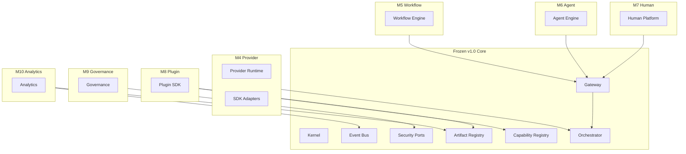

# Extension Point Validation Report

**Milestone:** M3.5  
**Platform:** UNAGENCY Intelligence OS v1.0  
**Status:** PASSED

---

## Validation Objective

Confirm that future platforms (M4–M10) can be added without modifying frozen v1.0 modules.

---

## Extension Point Inventory

| Extension Point | Interface / Mechanism | Location | Frozen Module Change Required |
|-----------------|----------------------|----------|------------------------------|
| Provider adapters | `IProviderAdapter` | `providers/adapters/` | No |
| Provider registry | `IProviderRegistry` | `providers/registry/` | No |
| Provider factory | `IProviderFactory` | `providers/factory/` | No |
| Capability registration | `ICapabilityRegistry.register()` | `capability-registry/` | No |
| Artifact type registration | `IArtifactRegistry.register()` | `artifacts/registry/` | No |
| Judge registration | `IJudge` | `evaluation/judges/` | No |
| Analyzer registration | `IAnalyzer` | `learning/analyzers/` | No |
| Orchestrator hooks | `IHookManager` | `orchestrator/hooks/` | No |
| Context enrichment | `IContextEnrichmentStage` | `context/interfaces/` | No |
| Knowledge connectors | `IKnowledgeSource` | `knowledge/interfaces/` | No |
| Prompt renderers | `IPromptRenderer` | `prompt-compiler/interfaces/` | No |
| Policy enforcement | `IAuthorizationPolicy` | `security/interfaces/` | No |
| Event bus | `IEventBus` | `events/interfaces/` | No |
| Scheduler | `IScheduler` | `scheduler/interfaces/` | No |
| Gateway composition | `PlatformCompositionRoot` | `gateway/factories/` | Wiring only |

---

## Future Platform Readiness

### M4 — Provider Execution Platform

| Requirement | v1.0 Readiness | Change to Frozen Modules |
|-------------|---------------|--------------------------|
| `IProviderAdapter.execute()` implementation | Interface reserved | No |
| Provider runtime service | New module under `providers/` | No |
| SDK adapters (OpenAI, Claude, etc.) | Leaf nodes under `providers/adapters/` | No |
| Streaming / retries / circuit breakers | New runtime submodules | No |
| `ProviderRequestArtifact` / `ProviderResponseArtifact` | Typed contracts exist | No |
| Execution plan provider selection | Planning engine owns selection | No |

**Result:** PASS — M4 extends `providers/` without touching engines.

### M5 — Workflow Intelligence Platform

| Requirement | v1.0 Readiness | Change to Frozen Modules |
|-------------|---------------|--------------------------|
| Multi-step execution graphs | `ExecutionPlan` graph model exists | No |
| Workflow artifact type | `workflow` registered in artifact registry | No |
| Orchestrator hook points | `IHookManager` defined | No |
| Human-in-the-loop deferral | Review decision contract exists | No |

**Result:** PASS — M5 adds new `workflow/` module consuming gateway and orchestrator interfaces.

### M6 — Agent Intelligence Platform

| Requirement | v1.0 Readiness | Change to Frozen Modules |
|-------------|---------------|--------------------------|
| Agent artifact type | `decision` artifact type registered | No |
| Memory for agent state | `MemoryIntelligenceEngine` exists | No |
| Capability catalog for agent tools | `ICapabilityCatalog` extensible | No |
| Orchestrator for agent loops | `IIntelligenceOrchestrator` composable | No |

**Result:** PASS — M6 adds `agent/` module; no core redesign.

### M7 — Human Intelligence Platform

| Requirement | v1.0 Readiness | Change to Frozen Modules |
|-------------|---------------|--------------------------|
| Review decision contract | `ReviewDecision` in evaluation | No |
| Human artifact type | `human` registered | No |
| Escalation hooks | Orchestrator hooks available | No |
| Approval workflows | Deferred to M5/M7 workflow layer | No |

**Result:** PASS — M7 extends review and human artifact flows.

### M8 — Plugin Platform

| Requirement | v1.0 Readiness | Change to Frozen Modules |
|-------------|---------------|--------------------------|
| Capability plugin registration | `ICapabilityRegistry.register()` | No |
| Artifact type plugin registration | `IArtifactRegistry.register()` | No |
| Analyzer plugin registration | `IAnalyzer` interface | No |
| Kernel plugin lifecycle | Kernel composition extensible | No |

**Result:** PASS — Plugin SDK wraps existing registration interfaces.

### M9 — Enterprise Governance

| Requirement | v1.0 Readiness | Change to Frozen Modules |
|-------------|---------------|--------------------------|
| RBAC / ABAC | `IAuthorizationPolicy` port defined | No |
| Audit logging | `IAuditLogger` port defined | No |
| Data classification | `IDataClassifier` port defined | No |
| Policy enforcement | `policies/` module with contracts | No |
| Tenant scoping | `organizationId` / `workspaceId` on all contracts | No |

**Result:** PASS — Governance implements security ports without engine changes.

### M10 — Analytics Platform

| Requirement | v1.0 Readiness | Change to Frozen Modules |
|-------------|---------------|--------------------------|
| Telemetry ports | `ITelemetry` in kernel | No |
| Event bus | `IEventBus` with envelopes | No |
| Artifact indexing | `IArtifactIndex` ports defined | No |
| Learning signals | `LearningSignal` contract | No |
| Execution events | `IExecutionEventPublisher` | No |

**Result:** PASS — Analytics consumes events and artifact indexes externally.

---

## Extension Architecture Diagram

All future platforms attach via composition roots, registration interfaces, or port implementations. No frozen module modification required.

---

## Composition Root Extension Validation

| Root | Extension Pattern | M4–M10 Compatible |
|------|------------------|-------------------|
| `KernelCompositionRoot` | Register foundation services | Yes |
| `PlatformCompositionRoot` | Wire control plane + gateway | Yes — add engines via wiring |
| `createIntelligenceEvaluationEngine()` | Factory with DI | Yes |
| `createArtifactEngine()` | Factory with DI | Yes |
| `createLearningIntelligenceEngine()` | Factory with DI | Yes |

New platforms add factories and wire through composition roots. Existing factories remain unchanged.

---

## Anti-Pattern Check

| Anti-Pattern | Detected |
|-------------|----------|
| Modifying frozen contracts for new platforms | No |
| Hard-coded capability lists blocking registration | No |
| Closed artifact type enum | No — registry is open |
| Monolithic gateway preventing pipeline extension | No — gateway is composable |
| Provider coupling blocking adapter addition | No |

---

## Conclusion

Extension point validation **PASSED**. All seven future platforms (M4–M10) can be implemented as additive modules using existing registration interfaces, composition roots, and port abstractions. No redesign of frozen v1.0 modules is required.
