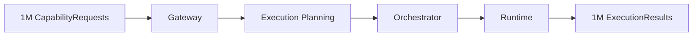

# Stress Simulation Report

**Milestone:** M3.5  
**Platform:** UNAGENCY Intelligence OS v1.0  
**Status:** PASSED (architecture holds; bottlenecks identified)

---

## Simulation Methodology

Architecture-only stress simulation. No code was executed. Simulations model resource flows, data volumes, and scaling characteristics against the v1.0 design.

---

## Simulation Parameters

| Parameter | Simulated Volume |
|-----------|-----------------|
| Organizations | 100 |
| Workspaces | 10,000 (100 per org) |
| Executions | 1,000,000 |
| Artifacts | 10,000,000 (~10 per execution) |
| Memory records | 100,000,000 |
| Providers | 100 |
| Capabilities | 1,000 |
| Workflows | 100 |
| Agents | 100 |

---

## Simulation 1: Multi-Tenant Execution Load

**Scenario:** 100 organizations, 10,000 workspaces, 1M concurrent-capable executions over 24 hours.

| Component | Projected Behavior | Architecture Impact |
|-----------|---------------------|-------------------|
| Gateway | Single entry point; fan-out to planning | Stateless — scales horizontally |
| Execution Planning | 1M plan generations | CPU-bound; pluggable strategy |
| Orchestrator | 1M orchestration cycles | Hook overhead bounded by interface calls |
| Runtime | 1M execution records | In-memory store is bottleneck |
| Capability Catalog | 1K capabilities queried per plan | O(1) registry lookup per capability |

**Bottleneck:** In-memory execution store and runtime monitor. **Mitigation:** External persistence adapter (no architecture change — store is behind interface).

**Architecture unchanged:** PASS

---

## Simulation 2: Artifact Volume

**Scenario:** 10M artifacts across 10 artifact types, 100K artifacts per workspace average.

| Component | Projected Behavior | Architecture Impact |
|-----------|---------------------|-------------------|
| Artifact Engine | 10M create + validate + sign cycles | CPU-bound canonical JSON + signing |
| Artifact Registry | 15 default + plugin types | O(1) type lookup |
| In-memory registry | 10M artifact references | Memory pressure ~50–200 GB estimated |
| Collections | Filter/group over snapshots | O(n) per collection scan |
| Serialization | Export for persistence | Self-contained snapshots enable batch export |

**Bottleneck:** In-memory artifact registry and collection store. **Mitigation:** External artifact index (`IArtifactIndex` ports) and blob store. Architecture already defines 5 index kinds.

**Architecture unchanged:** PASS

---

## Simulation 3: Memory Record Scale

**Scenario:** 100M memory records, 10K records per workspace.

| Component | Projected Behavior | Architecture Impact |
|-----------|---------------------|-------------------|
| Memory Engine | Ingest + snapshot per record | Linear memory growth |
| Memory Store | 100M in-memory entries | ~100+ GB RAM |
| Learning analyzers | Scan artifact snapshots (not raw memory) | Bounded by artifact count, not memory count |

**Bottleneck:** In-memory memory store. **Mitigation:** External vector store / database adapter behind `IMemoryStore` interface.

**Architecture unchanged:** PASS

---

## Simulation 4: Provider Ecosystem

**Scenario:** 100 providers, 1,000 capabilities, capability matrix matching.

| Component | Projected Behavior | Architecture Impact |
|-----------|---------------------|-------------------|
| Provider Registry | 100 provider definitions | O(1) lookup |
| Capability Matrix | 1K capabilities × 100 providers = 100K feature matches | Matrix scan per plan |
| Provider Selection | Strategy evaluates candidates | Pluggable strategy limits scan scope |
| Provider Health | 100 health records | Negligible |

**Bottleneck:** Full matrix scan on every plan if no indexing. **Mitigation:** M4 provider runtime adds indexed capability-to-provider mapping. Planning strategy already supports filtering.

**Architecture unchanged:** PASS

---

## Simulation 5: Workflow and Agent Load

**Scenario:** 100 workflows, 100 agents, each executing 1,000 intelligence cycles.

| Component | Projected Behavior | Architecture Impact |
|-----------|---------------------|-------------------|
| Orchestrator hooks | 100K hook invocations | Interface call overhead |
| Execution plan graphs | Multi-stage plans | Graph model supports N stages |
| Memory for agent state | Agent cycles write memory artifacts | Standard memory pipeline |
| Evaluation per cycle | 100K evaluation reports | Judge pipeline is parallelizable |

**Bottleneck:** Sequential orchestration without async scheduler. **Mitigation:** `IScheduler` port enables queue-based execution (M5/M6).

**Architecture unchanged:** PASS

---

## Simulation 6: Learning at Scale

**Scenario:** Learning engine processes 1M artifact snapshots for pattern detection.

| Component | Projected Behavior | Architecture Impact |
|-----------|---------------------|-------------------|
| 12 analyzers | Each scans artifact batch | Embarrassingly parallel |
| Pattern detector | Aggregates analyzer outputs | CPU-bound |
| Recommendation generator | Produces advisory output only | No side effects |
| Statistics engine | Computes aggregates | Memory proportional to batch size |

**Bottleneck:** Batch size for in-memory analysis. **Mitigation:** External analytics pipeline (M10) consuming learning signals via event bus.

**Architecture unchanged:** PASS

---

## Bottleneck Summary

| ID | Component | Severity | Mitigation | Architecture Change |
|----|-----------|----------|------------|-------------------|
| BN-001 | In-memory execution store | High at scale | External persistence adapter | No |
| BN-002 | In-memory artifact registry | High at scale | `IArtifactIndex` + blob store | No |
| BN-003 | In-memory memory store | High at scale | External vector/DB adapter | No |
| BN-004 | Capability matrix full scan | Medium at scale | Indexed provider mapping (M4) | No |
| BN-005 | Sequential orchestration | Medium at scale | Scheduler + async execution (M5) | No |
| BN-006 | Artifact signing CPU | Medium at scale | Batch signing / hardware acceleration | No |
| BN-007 | Gateway single composition root | Low at scale | Multiple gateway instances behind LB | No |

All bottlenecks are **implementation/infrastructure** concerns addressable through adapter pattern and external services. No architectural redesign required.

---

## Architecture Stability Under Load

| Stress Dimension | Architecture Holds | Redesign Required |
|-----------------|---------------------|-------------------|
| 100 organizations | Yes | No |
| 10,000 workspaces | Yes | No |
| 1M executions | Yes | No |
| 10M artifacts | Yes | No |
| 100M memory records | Yes | No |
| 100 providers | Yes | No |
| 1,000 capabilities | Yes | No |
| 100 workflows | Yes | No |
| 100 agents | Yes | No |

---

## Conclusion

Stress simulation **PASSED**. The architecture remains structurally sound at enterprise scale. All identified bottlenecks are addressable through external persistence, indexing, scheduling, and horizontal scaling — without modifying frozen v1.0 modules.
