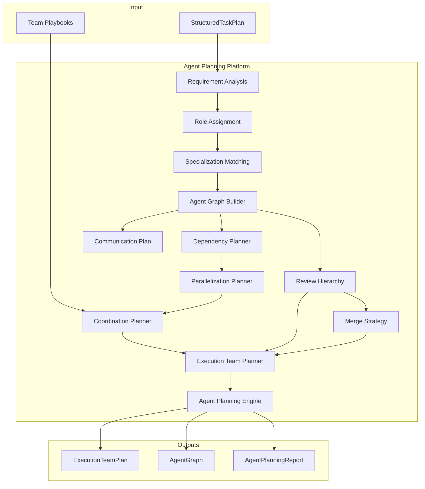

# Agent Planning Platform — Architecture Review

## Mission

Given a `StructuredTaskPlan` from Task Intelligence, determine how work should be
distributed across specialized AI agents **before** Execution Intelligence begins.
No AI execution. No providers.

## Position

```
Task Intelligence (M5.3)
        ↓
StructuredTaskPlan
        ↓
Agent Planning (M5.4) ← NEW
        ↓
ExecutionTeamPlan
        ↓
Execution Intelligence (future input)
```

## Architecture Diagram



## Pipeline

```
StructuredTaskPlan → Agent Requirements → Role Assignment
  → Agent Graph → Dependencies → Parallelization
  → Coordination → Review → Merge → ExecutionTeamPlan
```

## Agent Taxonomy

Five departments with 40+ canonical roles: Marketing, Software Engineering,
Design, Business, Research.

## Design Principles

- Heuristic role matching — no AI calls
- Artifact-only communication between agents
- Constructor injection; `Result<T>`; immutable contracts
- Consumes Task Intelligence contracts only

## Dependencies

```
agent-planning → task-intelligence (contracts), shared
agent-planning ⇏ execution-intelligence, model-intelligence, providers
```
