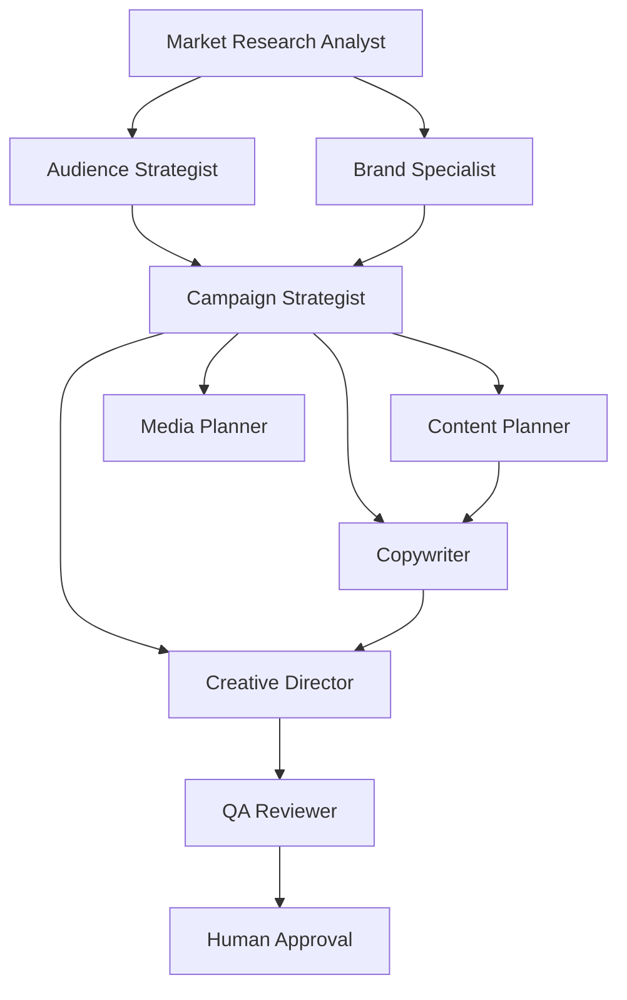

# Agent Planning — Models & Diagrams

## Agent Collaboration Graph (Sneaker Launch)

## Dependency Graph

Agent edges mirror task dependencies with artifact types:
- `research_artifact` — research → strategy
- `task_artifact` — sequential handoffs
- `review_artifact` — QA gates
- `decision_artifact` — human approval

## Unit Test Summary

| Suite | Tests | Coverage |
|-------|-------|----------|
| `engine.test.ts` | 5 | Full pipeline, graph, assignments, plans, explainability |

Run: `npx jest tests/platform/intelligence/agent-planning`

## Output Artifacts

| Artifact | Contract |
|----------|----------|
| ExecutionTeamPlan | `contracts/team-plan.ts` |
| AgentGraph | `contracts/graph.ts` |
| AgentAssignment | `contracts/assignment.ts` |
| AgentRoleProfile | `contracts/agent-profile.ts` |
| CommunicationPlan | `contracts/coordination.ts` |
| ReviewHierarchy | `contracts/review.ts` |
| MergePlan | `contracts/merge.ts` |
| CoordinationPlan | `contracts/coordination.ts` |
| DelegationPlan | `contracts/delegation.ts` |
| EscalationPlan | `contracts/delegation.ts` |
| TeamRecommendation | `contracts/explainability.ts` |
