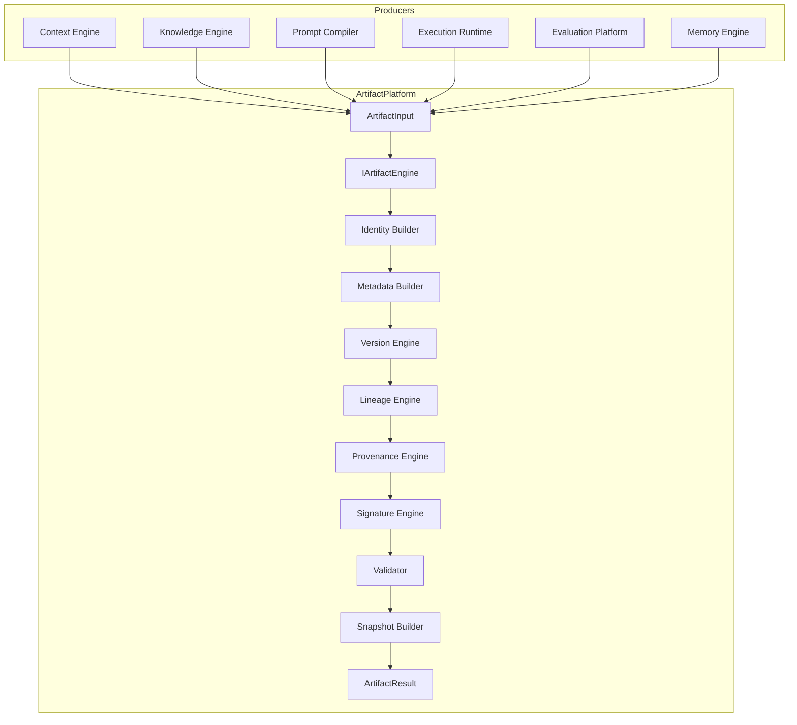
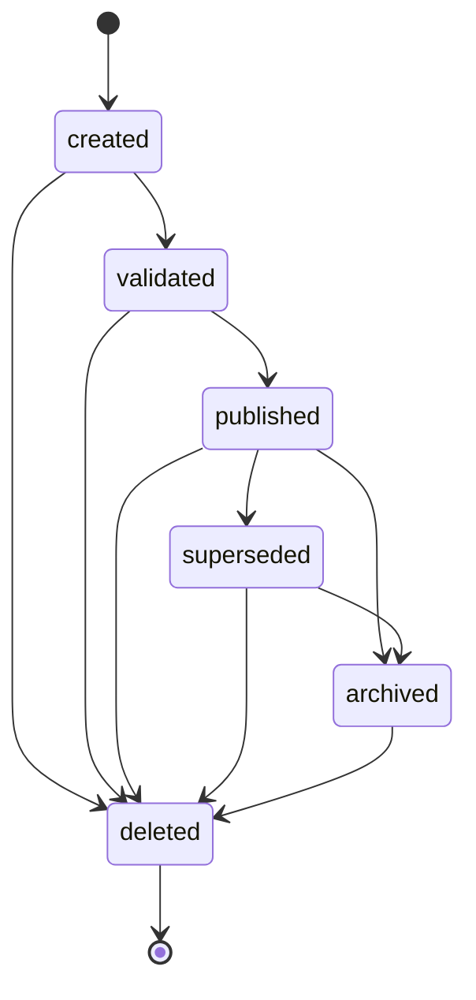

# Architecture Review — M3.2 Intelligence Artifact Platform

## Status

**Aligned** with approved design: canonical immutable intelligence objects without persistence.

## Confirmed

| Principle | Status |
|-----------|--------|
| Artifacts are immutable | ✓ New versions create new artifacts |
| Not storage / DB / ORM | ✓ In-memory collections only |
| Provider-independent | ✓ No provider platform imports |
| Lineage + provenance | ✓ Dedicated engines |
| Versioning | ✓ Semver-style with states |
| Signatures | ✓ Placeholder checksum engine |
| Frozen milestones untouched | ✓ |
| Typed artifact contracts | ✓ 15 artifact types |

## Pipeline fidelity

```
ArtifactInput → Identity → Metadata → Version → Lineage → Provenance → Signature → Validation → Snapshot → Result
```

## Artifact Architecture Diagram



## Artifact Lifecycle Diagram



## Lineage Model

```
parents[] ──► Artifact ◄── children[]
                 │
    createdFrom[] / derivedFrom[]
                 │
         executionId + scope dimensions
```

## Provenance Model

```
sources[]: { kind, artifactId?, providerId?, modelId?, timestamp }
createdByModule
policyIds[], capabilityId
versions map
```

## Versioning Strategy

- Format: `major.minor.patch+revision`
- States: draft → published → deprecated → archived
- Bump API on `IArtifactVersionEngine`
- No persistence — version metadata travels with artifact

## Registry Architecture

```
IArtifactRegistry
  ├── register(ArtifactDescriptor)
  ├── resolve(ArtifactType)
  └── list()
```

Default descriptors seeded for all 15 artifact types. Future plugins register via same port.

## Dependency Graph

```
shared
  ↑
context contracts ──┐
knowledge contracts ┤
prompt-compiler ────┼──► artifacts (M3.2)
memory contracts ───┤
evaluation contracts┤
execution-runtime ──┘

✗ providers
✗ learning engine
✗ workflow engine
```

## ACPs

None required. No modifications to frozen modules.
