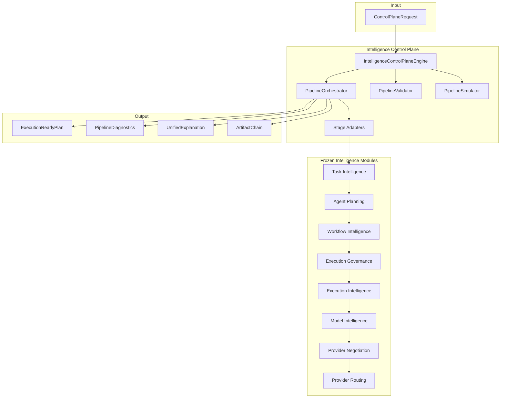
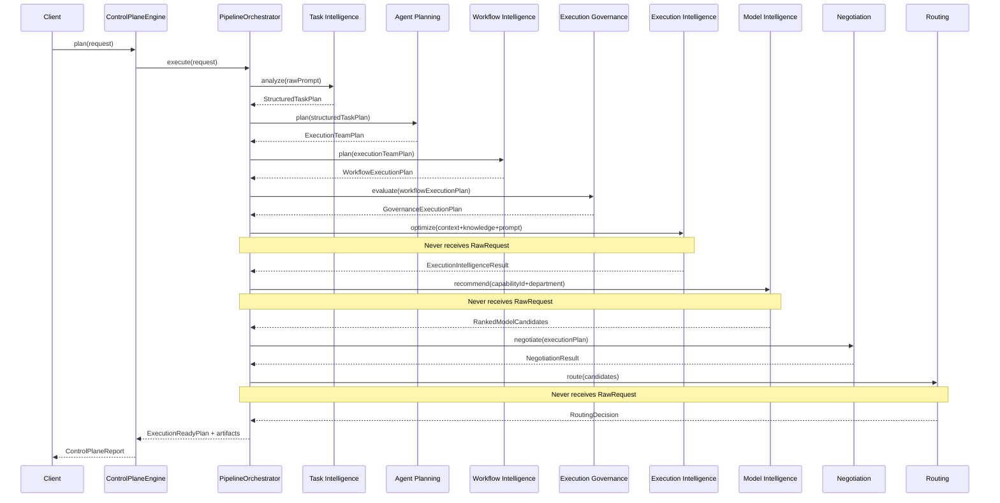
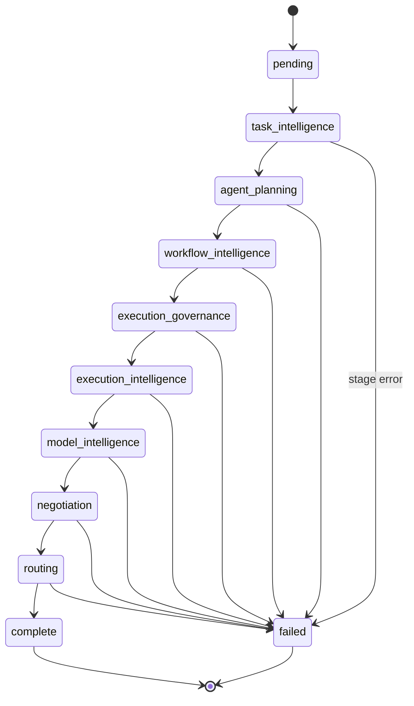
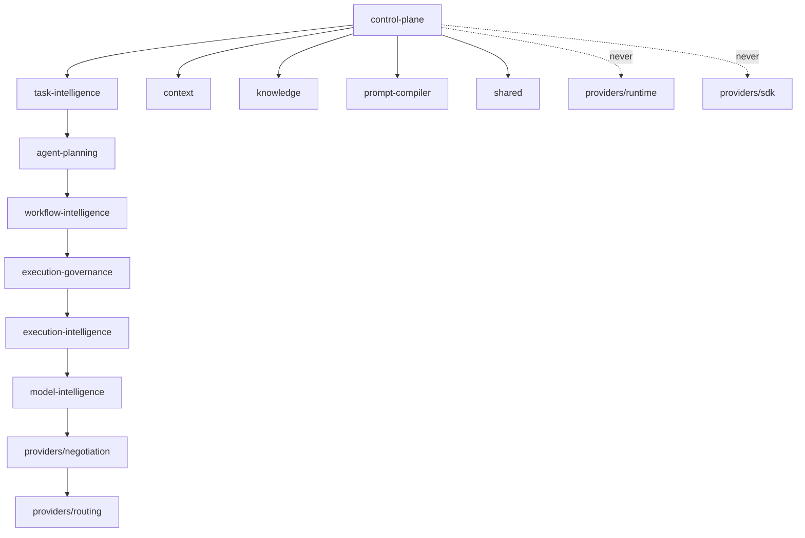

# Intelligence Control Plane — Architecture Review

## Mission

The Control Plane is the **single orchestration entry point** for UNAGENCY intelligence planning.
It coordinates every frozen intelligence module into one deterministic pipeline and produces an
`ExecutionReadyPlan` without executing providers, SDKs, networking, or AI.

## Position

```
ControlPlaneRequest (raw prompt)
        ↓
Intelligence Control Plane (M6)
        ↓
ExecutionReadyPlan
        ↓
(future) Execution Runtime — not in this milestone
```

## Control Plane Architecture Diagram



## Pipeline Sequence Diagram



## Artifact Flow Diagram

```mermaid
flowchart LR
  R[RawRequest] --> TA[TaskArtifact]
  TA --> TMA[TeamArtifact]
  TMA --> WA[WorkflowArtifact]
  WA --> GA[GovernanceArtifact]
  GA --> EA[ExecutionIntelligenceArtifact]
  EA --> MA[ModelDecisionArtifact]
  MA --> NA[NegotiationArtifact]
  NA --> RA[RoutingArtifact]
  RA --> ERA[ExecutionReadyArtifact]
```



## State Machine Diagram



## Design Principles

- **Constructor injection** — all engines wired via `createIntelligenceControlPlane()`
- **Immutable contracts** — frozen artifacts passed stage-to-stage
- **Result&lt;T&gt;** — no thrown errors across module boundaries
- **No singleton state** — deterministic helpers for tests
- **No shortcuts** — downstream stages never receive `RawRequest`
- **No frozen module modifications** — adapters live in control-plane only

## Dependency Graph



## Responsibilities

| Component | Role |
|-----------|------|
| `IntelligenceControlPlaneEngine` | Public API: `plan`, `simulate`, `explain` |
| `PipelineOrchestrator` | Sequential stage execution, timing, artifact assembly |
| `Stage Adapters` | Map canonical artifacts to downstream requests |
| `DefaultPipelineValidator` | Artifact integrity and stage ordering |
| `DefaultPipelineSimulator` | Dry-run report without provider execution |
