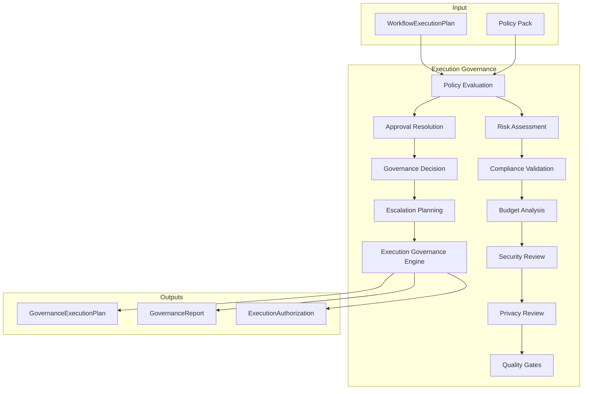

# Execution Governance Platform — Architecture Review

## Mission

Governance layer between Workflow Intelligence and Execution Intelligence.
Decides **whether and how** a workflow is allowed to execute — evaluates, validates,
approves, blocks, escalates. Never executes AI.

## Position

```
Workflow Intelligence (M5.5)
        ↓
WorkflowExecutionPlan
        ↓
Execution Governance (M5.6) ← NEW
        ↓
GovernanceExecutionPlan
        ↓
Execution Intelligence (future input)
```

## Architecture Diagram



## Pipeline

```
WorkflowExecutionPlan → Policies → Risk → Compliance → Budget
  → Security → Privacy → Quality → Approvals → Decision → GovernanceExecutionPlan
```

## Design Principles

- Configurable policies via repository — not hardcoded in evaluators
- Placeholder compliance/security/privacy evaluators — extension-ready
- Immutable governance decisions
- Constructor injection; `Result<T>`; no frozen module changes

## Dependencies

```
execution-governance → workflow-intelligence (contracts), shared
execution-governance ⇏ execution-intelligence, providers
```
