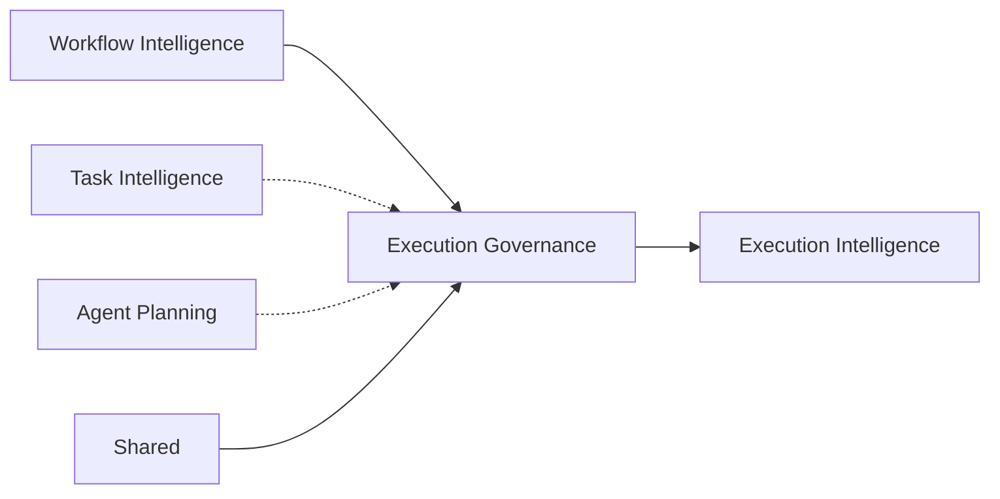

# Execution Governance — Models & Diagrams

## Dependency Graph

Dashed = optional contract context. Solid = direct dependency.

## Unit Test Summary

| Suite | Tests | Coverage |
|-------|-------|----------|
| `engine.test.ts` | 6 | Full pipeline, policies, decision, budget, explainability, block |

Run: `npx jest tests/platform/intelligence/execution-governance`

Full intelligence suite: **498 tests passing**.

## Output Artifacts

| Artifact | Contract |
|----------|----------|
| GovernanceExecutionPlan | `contracts/plan.ts` |
| GovernanceDecision | `contracts/decision.ts` |
| RiskAssessment | `contracts/risk.ts` |
| BudgetAssessment | `contracts/budget.ts` |
| ComplianceAssessment | `contracts/compliance.ts` |
| SecurityAssessment | `contracts/compliance.ts` |
| PrivacyAssessment | `contracts/compliance.ts` |
| GovernanceApprovalPlan | `contracts/approvals.ts` |
| ExecutionAuthorization | `contracts/decision.ts` |
| GovernanceReport | `contracts/result.ts` |
