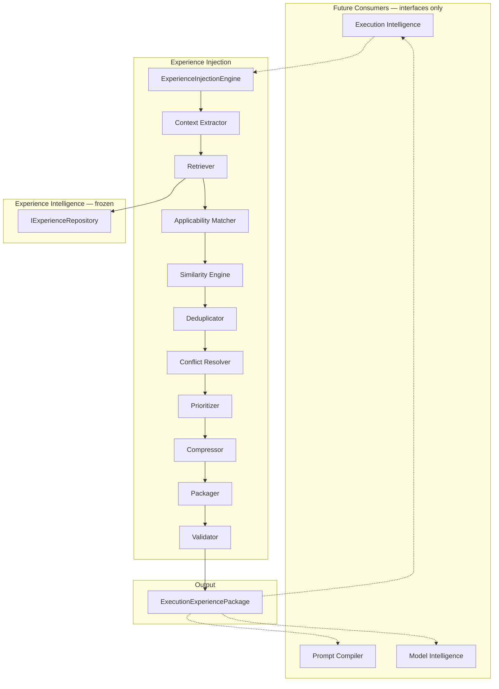
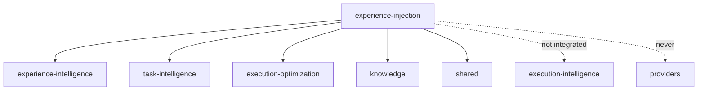

# Experience Injection — Architecture Review

## Mission

Bridge between Experience Repository and execution consumers. Retrieve, rank, resolve
conflicts, compress, and package organizational experience for advisory consumption.

## Experience Retrieval Architecture



## Pipeline

```
Execution Request
  → Context Extraction
  → Experience Retrieval
  → Applicability Matching
  → Similarity Scoring
  → Deduplication
  → Conflict Resolution
  → Priority Ranking
  → Compression (Top N)
  → Packaging
  → Validation
  → ExecutionExperiencePackage
```

## Design Principles

- Consumes `IExperienceRepository` — never duplicates Experience Intelligence
- Never contains raw prompts or prompt fragments
- Corrections remain `advisoryOnly`
- Semantic similarity is a placeholder (deterministic Jaccard) — never calls AI
- Constructor injection, `Result<T>`, immutable contracts
- No networking, SDKs, providers, databases, frozen module modifications

## Dependency Graph


