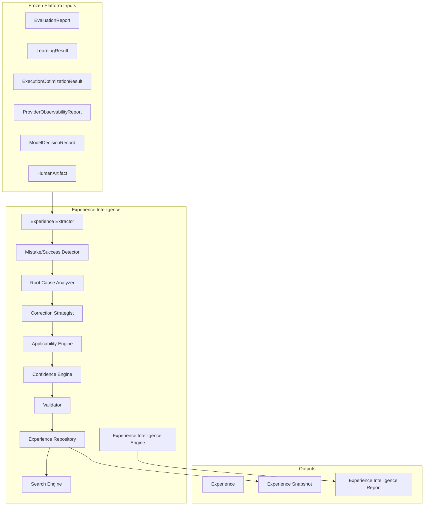
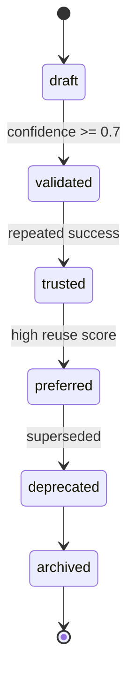
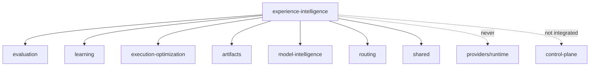

# Experience Intelligence — Architecture Review

## Mission

Transform historical execution outcomes into reusable organizational experience that
continuously improves future executions. The platform accumulates experience — not AI models.

## Architectural Principle

| Module | Role |
|--------|------|
| Evaluation | Evaluate ONE execution |
| Learning | Discover platform-wide patterns |
| Execution Optimization | Recommend improvements |
| **Experience Intelligence** | Remember strategies and feed back structured experience |

## Experience Architecture Diagram



## Experience Lifecycle Diagram



## Pipeline

```
Historical Executions → Extraction → Mistake Detection → Success Detection
→ Root Cause → Correction → Applicability → Confidence → Validation
→ Repository → Snapshot → Report
```

## Design Principles

- Reuse frozen contracts — never duplicate Evaluation, Learning, Memory, Optimization
- Corrections are advisory only — never modify prompts
- Constructor injection, `Result<T>`, immutable contracts
- In-memory repository only — no database
- Future integration interfaces defined, not implemented

## Dependency Graph


