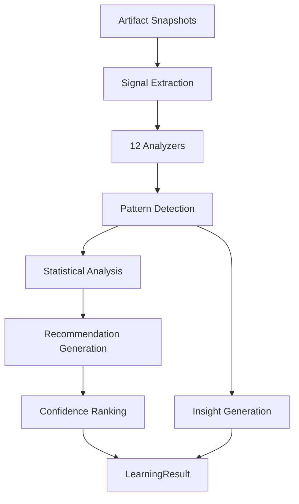

# Architecture Review — M3.3 Learning Intelligence Platform

## Status

**Aligned** with approved design: observe, analyze, recommend — no behavior modification.

## Confirmed

| Principle | Status |
|-----------|--------|
| No automatic optimization | ✓ Optimization interface only |
| No ML / online learning | ✓ Placeholder heuristics only |
| No provider SDKs | ✓ No provider platform imports |
| Recommendations never modify modules | ✓ Read-only recommendations |
| Artifact-driven | ✓ Consumes `ArtifactSnapshot[]` |
| Frozen milestones untouched | ✓ |

## Learning Pipeline Diagram



## Signal Model

```
LearningSignal
  signalId, kind, sourceArtifactId, sourceArtifactType
  value, normalizedValue, label, extractedAt
```

Kinds: quality, latency, cost, brand, prompt, provider, human, workflow, evaluation, knowledge, memory, routing, pattern, anomaly

## Recommendation Model

```
LearningRecommendation
  recommendationId, type, reason, confidence
  evidence[], affectedModule, applicableScope
  signalIds[], patternId?, generatedAt
```

**Never applies changes** — advisory only.

## Analyzer Architecture

```
ISignalExtractor
  └── AnalyzerSignalExtractor
        └── IAnalyzer[] (12 placeholder analyzers)
              Provider, Prompt, Brand, Human, Workflow
              Cost, Latency, Quality, Evaluation
              Knowledge, Memory, Routing
```

## Dependency Graph

```
shared
  ↑
artifacts contracts ──┐
evaluation contracts ─┼──► learning (M3.3)
memory contracts ─────┘

✗ providers
✗ automatic optimization
✗ ML training
```

## ACPs

None required. No frozen module modifications.
