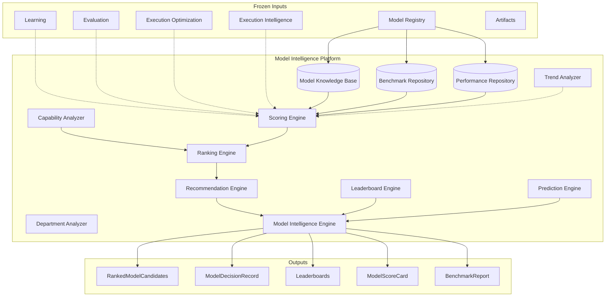

# Model Intelligence Platform — Architecture Review

## Mission

Build the AI brain that understands every model across all providers — capabilities,
benchmarks, strengths, weaknesses, cost, latency, reliability, and rankings —
**without executing providers**. Powers Provider Negotiation and Routing downstream.

## Position

```
Model Registry (M5.1) ──► Model Intelligence (NEW)
                              │
                              ├── Model Knowledge Base
                              ├── Benchmark Repository
                              ├── Scoring / Ranking
                              ├── Recommendation Engine
                              └── Model Decision Record
                              │
                              ▼
                    Negotiation / Routing (FROZEN — consume only)
```

## Architecture Diagram



## Model Knowledge Base

Every model has a rich intelligence profile beyond numeric scores:

| Field | Purpose |
|-------|---------|
| Release history | Introduced, updated, deprecated |
| Known strengths | Coding, reasoning, marketing copy, multimodal |
| Known weaknesses | Hallucination, latency, JSON adherence |
| Recommended use cases | Legal drafting, UI code, social content |
| Unsupported / limited features | No vision, limited context |
| Cost / performance tier | Economy → frontier |
| Provider caveats | Rate limits, regions, API constraints |

Knowledge profiles are seeded from Model Registry canonical models and merged
with benchmark scores and future telemetry for explainable rankings.

## Pipeline

```
Canonical Models → Capability Analysis → Benchmark Repository
  → Performance Repository → Scoring → Ranking → Recommendation
  → Model Decision Record → Leaderboards
```

## Design Principles

- Constructor injection; no singletons
- Immutable contracts; `Result<T>` everywhere
- No networking, SDKs, or provider execution
- Consumes frozen platform contracts only
- Extension points for live benchmarks and telemetry (interfaces only)

## Dependencies

```
model-intelligence → model-registry, shared, learning*, evaluation*,
                     execution-optimization*, execution-intelligence*, artifacts*
model-intelligence ⇏ providers, adapters, SDK, transport, routing, negotiation

* contracts / optional inputs only — no live integration in M5.2
```

## Success Criteria

Given `content.create.carousel` / `social_media`, return ranked candidates with
scores, explanations, trade-offs, and a `ModelDecisionRecord` — without calling
any provider.
