# Model Intelligence Platform — Implementation Report

## Milestone

**M5.2 Model Intelligence** — AI model understanding, scoring, ranking, and
recommendation without provider execution.

## Implemented Modules

| Module | Path | Status |
|--------|------|--------|
| Contracts | `contracts/` | Complete |
| Interfaces | `interfaces/` | Complete |
| Model Knowledge Base | `repositories/in-memory-knowledge-base.ts` | Complete |
| Knowledge seed | `repositories/knowledge-base-seed.ts` | Complete |
| Benchmark repository | `repositories/in-memory-benchmark-repository.ts` | Complete |
| Performance repository | `repositories/in-memory-performance-repository.ts` | Complete |
| Profile builder | `repositories/default-profile-builder.ts` | Complete |
| Scoring engine | `scoring/default-scoring-engine.ts` | Complete |
| Capability / department analysis | `capability-analysis/` | Complete |
| Ranking engine | `ranking/default-ranking-engine.ts` | Complete |
| Recommendation engine | `recommendation/default-recommendation-engine.ts` | Complete |
| Leaderboard engine | `leaderboards/default-leaderboard-engine.ts` | Complete |
| Trend analyzer | `trend-analysis/` | Placeholder |
| Prediction engine | `prediction/` | Placeholder |
| Simulation engine | `simulation/` | Complete |
| Engine orchestrator | `engine/model-intelligence-engine.ts` | Complete |
| Factory | `factories/create-model-intelligence-platform.ts` | Complete |
| Request builder | `builders/model-intelligence-request-builder.ts` | Complete |
| Testing utilities | `testing/` | Complete |

## Ranking Pipeline

```mermaid
flowchart LR
  A[ModelIntelligenceRequest] --> B[Score All Models]
  B --> C[Capability Fit Score]
  C --> D[Constraint Adjustment]
  D --> E[Sort by Overall Score]
  E --> F[Build Explanations]
  F --> G[RankedModelCandidates]
  G --> H[ModelRecommendation]
  H --> I[ModelDecisionRecord]
```



## Scoring Formula

```
weightedOverall = Σ(dimensionScore × dimensionWeight)
                + strengthBoost
                - weaknessPenalty

rankingScore = weightedOverall × 0.6 + capabilityScore × 0.4
             - budgetPenalty
             - latencyPenalty

displayScore = round(rankingScore × 100, 1)
```

### Dimension Weights (18 dimensions)

| Dimension | Weight |
|-----------|--------|
| reasoning | 0.08 |
| creativity | 0.07 |
| coding | 0.07 |
| writing | 0.08 |
| reliability | 0.08 |
| latency | 0.07 |
| cost | 0.07 |
| ... | 0.03–0.06 |

### Dynamic Scoring (interfaces only)

```
Static Benchmarks → Production Telemetry → Evaluation Reports
  → Learning Signals → Execution Optimization → Historical Success
  → Customer Feedback → Weighted Score
```

`DynamicScoreInput` contract accepts optional inputs; live wiring deferred.

## Benchmark Model

26 canonical benchmark categories: reasoning, coding, creative_writing,
marketing, brand_copy, seo, research, math, vision, ocr, image_understanding,
image_generation, video_understanding, video_generation, translation,
summarization, planning, tool_calling, function_calling, structured_output,
conversation, long_context, agent_tasks, multimimodal_tasks, audio, speech.

Scores are heuristic placeholders derived from model quality tier and flags.

## Department & Capability Rankings

- **21 departments** — marketing through business_intelligence
- **Capability mapping** — e.g. `content.create.carousel` → marketing benchmark
- Leaderboards: global, per-provider, per-department, per-capability, per-scope

## Explainability Model

Every `RankedModelCandidate` includes:

- `summary` — overall rationale
- `strengths` — from knowledge base + dimension scores
- `weaknesses` — known limitations + cost/latency
- `tradeoffs` — cost vs quality, latency vs quality
- `whyRanked` — primary selection reason
- `whyAlternativesLower` — comparative explanation

## Model Decision Record

First-class artifact (`ModelDecisionRecord`) with capability, department,
candidates, ranking scores, winning model, fallbacks, expected cost/latency/
quality/confidence, policy and constraint decisions, timestamp, version.

## Factory Usage

```typescript
import { createModelIntelligencePlatform } from "./model-intelligence";

const { engine } = createModelIntelligencePlatform();
const result = await engine.recommend({
  requestId: "req_1",
  capabilityId: "content.create.carousel",
  department: "social_media",
  taskDescription: "Generate Instagram Carousel",
});
```

## Frozen Module Policy

No modifications to M0–M5.1.1 modules. Model Intelligence consumes Model Registry
via `createModelRegistryPlatform({ loadSeed: true })`.
