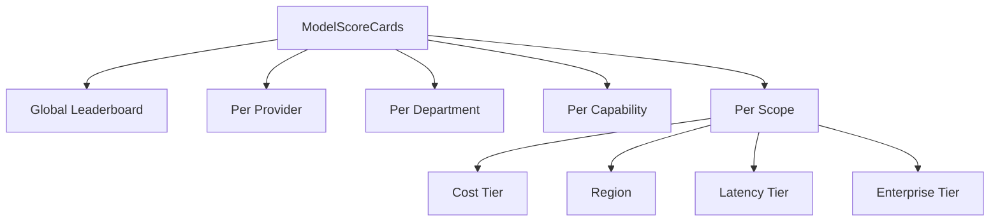
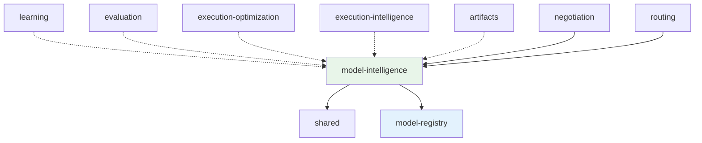
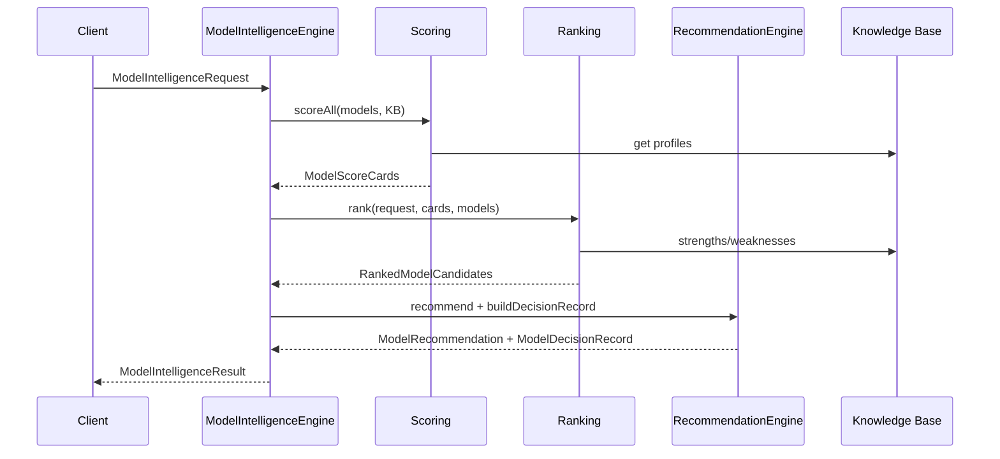

# Model Intelligence — Models & Diagrams

## Leaderboard Architecture



## Dependency Graph



Solid = direct dependency. Dashed = optional contract inputs. Downstream
platforms consume outputs; Model Intelligence does not import them.

## Recommendation Pipeline



## Model Intelligence Profile

| Field | Source |
|-------|--------|
| Provider / Model / Version | Model Registry |
| Lifecycle | Model Registry + Knowledge Base |
| Capabilities / Modalities | Model Registry |
| Context / Output windows | Model Registry limits |
| Flags (streaming, reasoning, vision, etc.) | Model Registry |
| Pricing | Model Registry |
| Latency / Reliability | Performance Repository |
| Known limitations | Knowledge Base |
| Enterprise ready | Knowledge Base |

## Model Decision Record Schema

```
ModelDecisionRecord
├── recordId
├── capabilityId, department?
├── candidateModels[]
├── rankingScores: Record<modelId, score>
├── rankingExplanation
├── winningModel
├── fallbackModels[]
├── expectedCost, expectedTokens, expectedLatencyMs
├── expectedQuality, expectedConfidence
├── reasonForSelection
├── policyDecisions[], constraintDecisions[]
├── timestamp, version
```

## Unit Test Summary

| Suite | Tests | Coverage |
|-------|-------|----------|
| `engine.test.ts` | 4 | Full pipeline, explainability, decision record, leaderboards |
| `knowledge.test.ts` | 3 | Knowledge profile seeding, KB storage, registry integration |

**Total: 7 tests** — all passing without provider execution.

Run: `npx jest tests/platform/intelligence/model-intelligence`
