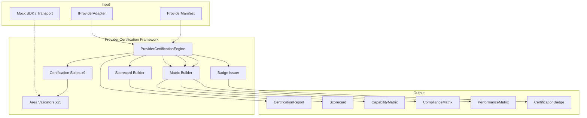
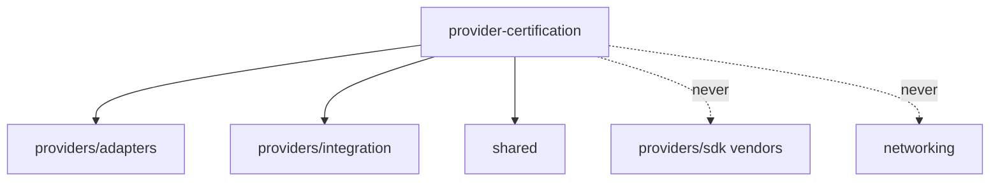

# Provider Certification Framework — Architecture Review

## Mission

Gate every provider adapter before it enters Routing or Negotiation. The framework validates
conformance to UNAGENCY adapter contracts using mocks — **no networking, no vendor SDKs**.

## Certification Architecture Diagram

## Certification Pipeline

```mermaid
flowchart LR
  REQ[CertificationRequest] --> CONF[Conformance Suite]
  CONF --> STR[Streaming Suite]
  STR --> FC[Function Calling Suite]
  FC --> JSON[Structured Output Suite]
  JSON --> TOK[Tokenization Suite]
  TOK --> ERR[Errors Suite]
  ERR --> OBS[Observability Suite]
  OBS --> SEC[Security Suite]
  SEC --> PERF[Performance Suite]
  PERF --> AGG[Aggregate Scores]
  AGG --> STATUS[Resolve Status]
  STATUS --> RPT[CertificationReport]
```

## Design Principles

- Constructor injection; `Result<T>`; immutable contracts
- Mock-only execution — adapters exercised via wire payloads
- 25 certification areas across 9 suites
- 13 benchmark scenarios (interface compatibility only)
- No frozen module modifications

## Dependency Graph

## Certification Statuses

| Status | Condition |
|--------|-----------|
| certified | All suites pass, score ≥ 70 |
| certified_with_warnings | Pass with warnings |
| rejected | Suite failures or score < 70 |
| experimental | Manifest maturity = experimental |
| deprecated | Manifest maturity/status deprecated |
