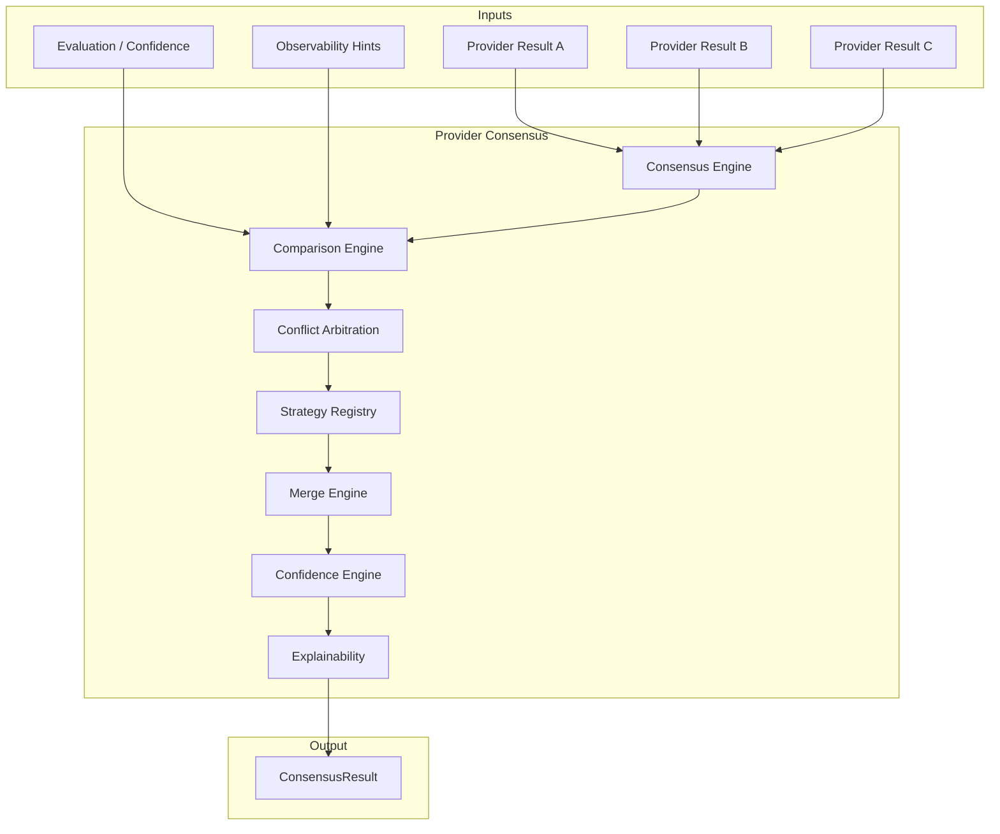
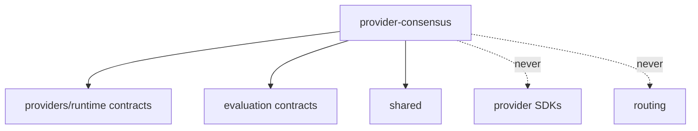

# Provider Consensus — Architecture Review

## Mission

Post-runtime ensemble platform that compares and combines already-executed
provider results into a single explainable canonical outcome.

## Position

```
Provider Runtime (OpenAI / Claude / Gemini / …)
        ↓
CanonicalExecutionResults[]
        ↓
Provider Consensus ← NEW
        ↓
ConsensusResult (single canonical)
```

## Architecture Diagram



## Design Principles

- Does **not** replace routing or negotiation
- Does **not** call providers / SDKs / network
- Consumes immutable `ProviderExecutionResult` (+ optional evaluation/observability)
- Never merges blindly — merge mode is explicit and explained
- Constructor injection, `Result<T>`, immutable contracts
- No frozen module modifications

## Dependency Graph


