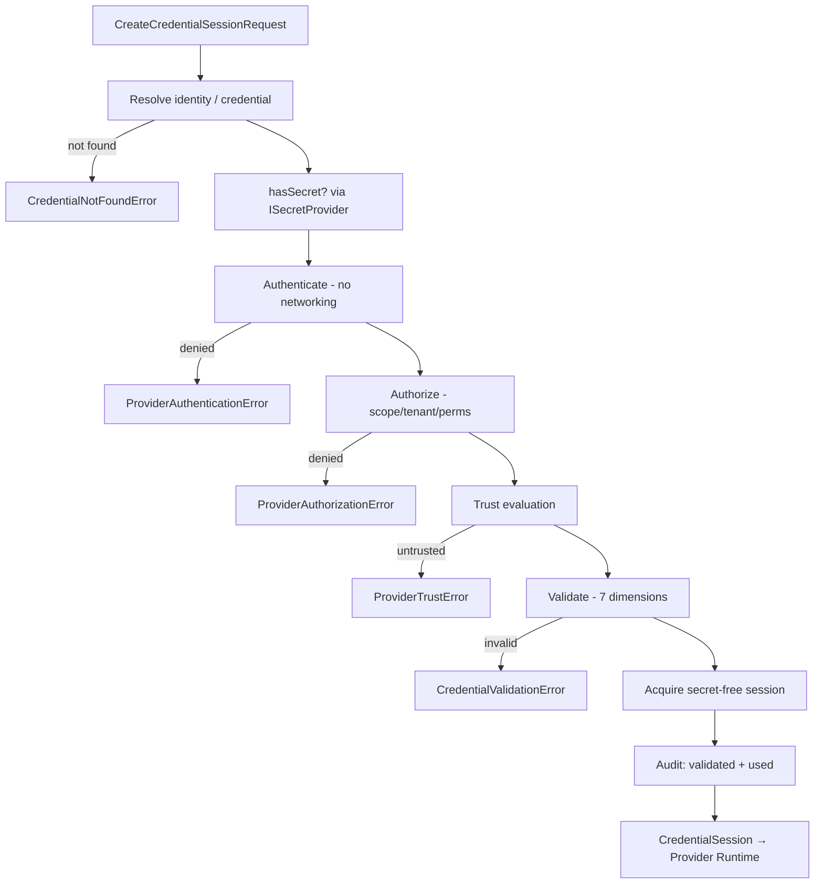
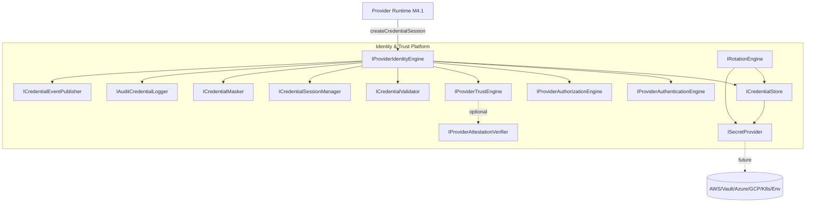
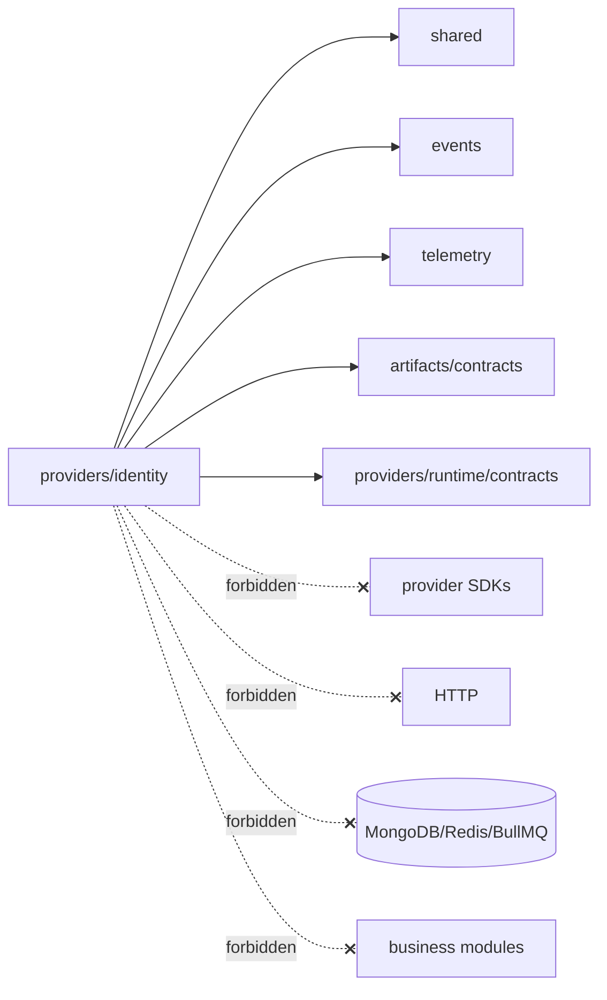

# M4.2 Provider Identity & Trust Platform — Architecture Review

## 1. Mission & scope

The Provider Identity & Trust Platform **owns every provider credential** and is
the single authority for **identity** and **trust** in the platform. It answers
one question for the Provider Runtime:

> "Given a provider + tenant + capability, may this execution proceed, and with
> what validated credential session?"

It is explicitly **not** responsible for:

- executing provider requests (M4.1 Provider Runtime),
- provider SDKs (OpenAI/Anthropic/Gemini/... — later milestones),
- networking or OAuth flows,
- secret persistence (delegated to a future secret manager via `ISecretProvider`).

## 2. Design principles

| Principle | How it is applied |
|-----------|-------------------|
| Dependency inversion | Every capability is a port (`I*`); the engine depends on interfaces only |
| Single responsibility | One engine per concern (auth, authz, trust, validation, rotation, sessions, masking, audit) |
| Provider independence | No vendor SDK, HTTP, or OAuth flow anywhere in the module |
| Secret isolation | Raw secrets exist only inside `ISecretProvider`; contracts carry a `secretRef` handle |
| Immutability | All public contracts are `readonly`; builders `Object.freeze` their output |
| Result pattern | Expected failures return `Result<T>`; no throw-for-control-flow |
| Open/closed | Attestation, secret managers, auth verifiers plug in without editing the engine |

## 3. The credential session flow

`ProviderIdentityEngine.createCredentialSession()` orchestrates a strict pipeline.
Each stage is an injected port; any failure short-circuits with a typed error.

Note stage C: the engine checks that the secret **exists** without ever
retrieving its value. Secret material is redeemed later, only by a future
provider adapter, directly against `ISecretProvider`.

## 4. Identity architecture diagram

## 5. Dependency graph (allowed edges only)

Actual imports used by the module:

- `shared/result`, `shared/errors`, `shared/interfaces`, `shared/identifiers`
- `events/implementations/event-factory`, `events/interfaces/event-bus` (optional wiring)
- `crypto.randomUUID` (Node stdlib, factory default id generator only)

No import of any provider SDK, HTTP client, database driver, queue, or business
module exists in the module. Verified by inspection and `tsc`.

## 6. Boundary with the Provider Runtime (M4.1)

The two modules communicate **only through contracts**:

- Identity produces `CredentialSession` (secret-free).
- Runtime consumes a session it treats as opaque proof of authorization.

The Runtime remains frozen and unmodified. Wiring the two (Runtime calling the
identity engine before dispatch) is deferred to an integration milestone and
tracked as **ACP-I1** so no frozen contract changes now.

## 7. SOLID / clean-architecture compliance

- **S** — each engine has exactly one reason to change.
- **O** — new schemes, secret managers, attestation verifiers extend via ports.
- **L** — all implementations honor their port contracts (Result semantics).
- **I** — narrow, role-specific interfaces (no god interface).
- **D** — the facade depends on abstractions; concretes are injected by the factory.

Hexagonal: contracts + interfaces form the domain core; `vault/`, `credentials/`,
`sessions/`, `auditing/` are adapters; `factories/` is composition root.
