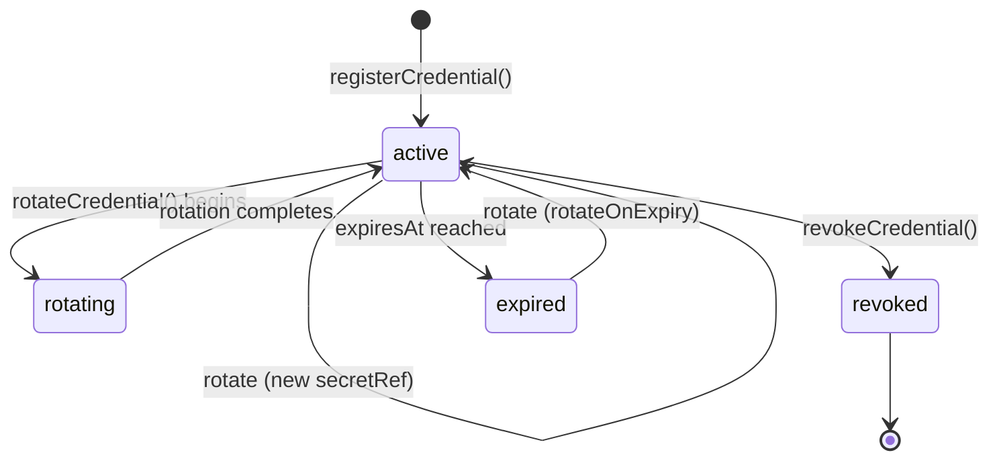
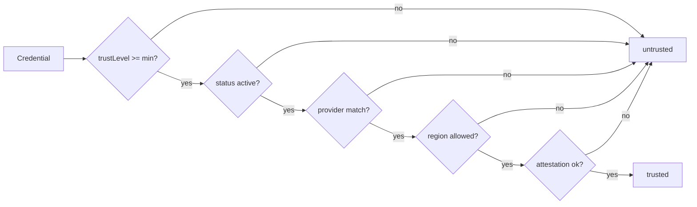
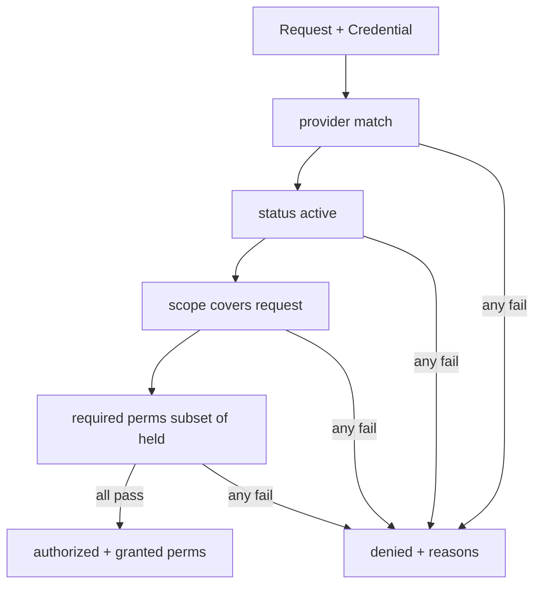
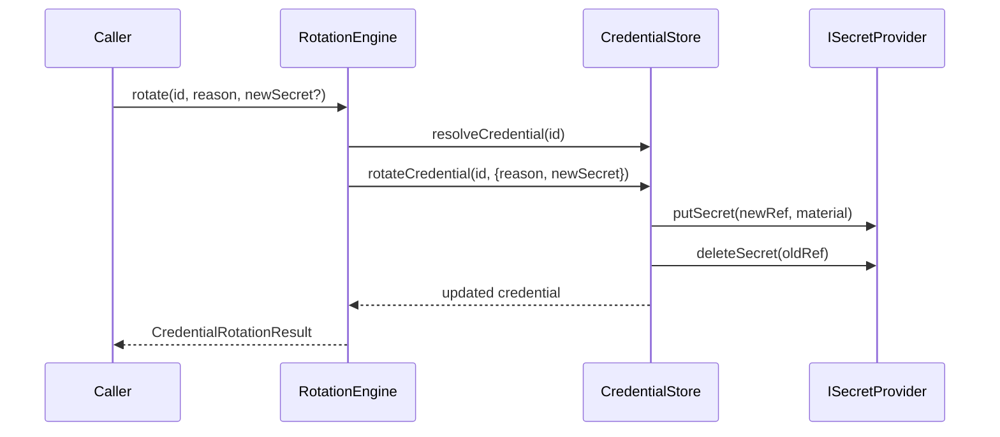
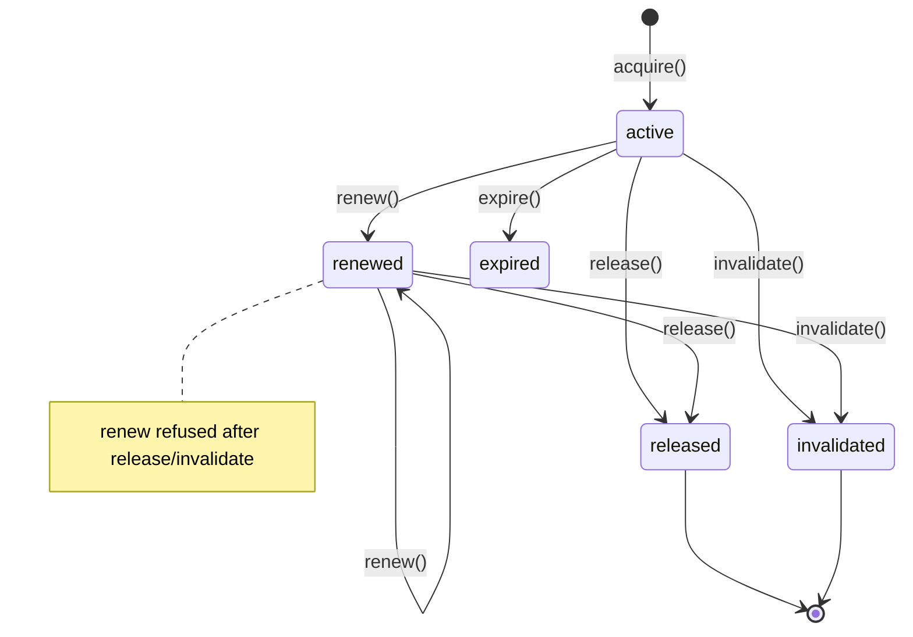

# M4.2 — Models & Diagrams

Deliverables 4–9: Identity Architecture Diagram, Credential Lifecycle Diagram,
Trust Model, Authorization Model, Credential Rotation Model, Session Model.
(The identity architecture diagram + dependency graph also appear in the
Architecture Review.)

---

## Credential lifecycle diagram



- `registerCredential()` mints a `CredentialId` + `secretRef`, stores the raw
  secret in `ISecretProvider`, and keeps only metadata + reference in the store.
- `rotateCredential()` writes new material under a **new** `secretRef`, updates
  `rotatedAt` / `lastRotationReason`, and best-effort deletes the old material.
- Revoked credentials are never returned by `selectCredential` (status filter).

---

## Trust model

Trust levels are ordered (least → most trusted):

```
untrusted < low < standard < high < verified
```

`IProviderTrustEngine.evaluate()` returns a `TrustEvaluation` that must pass all
checks:

| Check (dimension) | Rule |
|-------------------|------|
| trust | `credential.trustLevel >= minTrustLevel` (default `standard`) |
| identity (status) | credential status is `active` |
| identity (provider) | credential provider matches the request |
| region | request region satisfies `ProviderRegionConstraint` |
| policy (attestation) | optional `IProviderAttestationVerifier` returns verified |

`untrusted` credentials always fail. Attestation is an **injected hook** — future
hardware/remote attestation plugs in without modifying the engine.



---

## Authorization model

`IProviderAuthorizationEngine.authorize()` evaluates, in order:

1. **Provider check** — credential provider == requested provider.
2. **Status check** — credential is `active`.
3. **Tenant/scope check** — credential scope *covers* the request. A scope field
   that is absent acts as a wildcard; a present field must match
   (organization, workspace, project, user, provider, capability).
4. **Permission check** — every required permission is present on the credential.

Permissions: `read`, `execute`, `manage`, `rotate`, `delete`, `delegate`, `audit`.
Granted permissions = the intersection of requested and held permissions (or all
held permissions when none are explicitly requested).

Tenancy levels: `platform`, `organization`, `workspace`, `project`, `user`
(service accounts reserved for the future).



---

## Credential rotation model

`IRotationEngine` performs **rotation logic only** (no secret-manager calls).

Reasons/strategies: `scheduled`, `manual`, `forced`, `expired`, `revoked`.

`shouldRotate(credential, nowMs)`:

- `false` if no policy or `enabled === false`.
- `true` if `rotateOnExpiry` and `expiresAt <= now`.
- `true` if age since `rotatedAt|createdAt` `>= maxAgeMs` or `>= intervalMs`.

`rotate(id, reason, newSecret?)`:

- resolves the credential (refuses to rotate an already-revoked credential when
  `reason === "revoked"`),
- generates a synthetic secret when the caller supplies none (placeholder — a
  real secret manager would mint the material),
- delegates to `store.rotateCredential()` which swaps `secretRef`,
- returns `{ previousSecretRef, newSecretRef, reason, rotatedAt }`.



---

## Session model

`ICredentialSessionManager` owns in-memory, secret-free sessions.

Session states: `active`, `renewed`, `expired`, `released`, `invalidated`.

Operations: `acquire`, `get`, `renew`, `release`, `expire`, `invalidate`.

Each session carries a `CredentialLease` (`leaseId`, `sessionId`, `credentialId`,
`acquiredAt`, `expiresAt`) plus the authentication/authorization/validation
outputs and the `CredentialReference` — **never a raw secret**.


