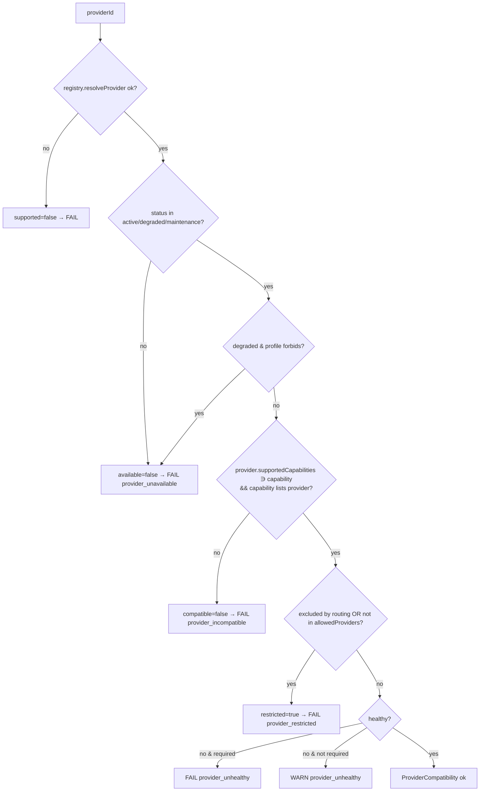
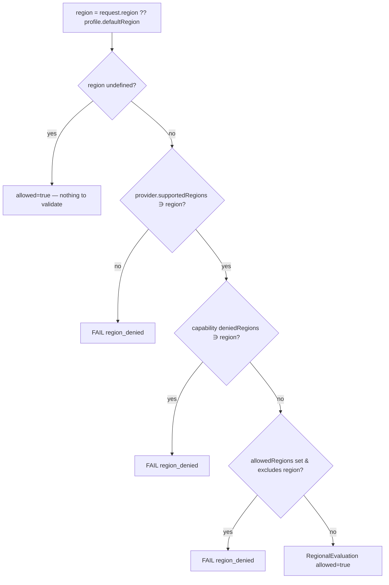
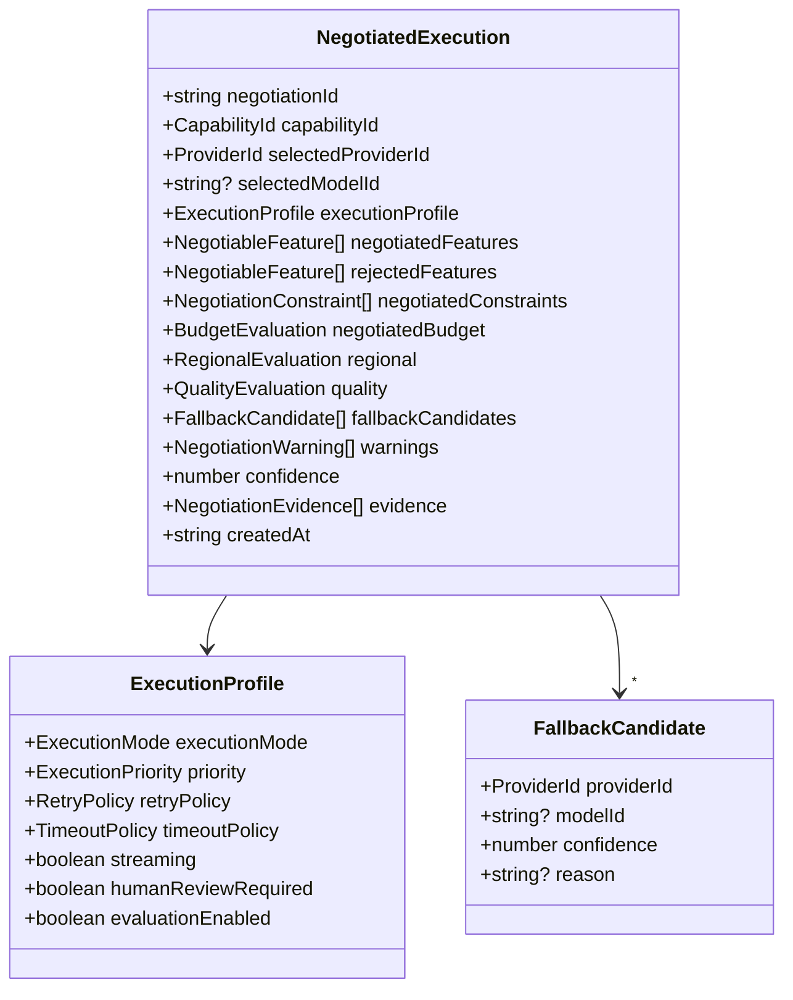

# M4.3 — Negotiation Models

Deliverables 5–11: the per-concern negotiation models and the
`NegotiatedExecution` object diagram.

## 5. Capability Negotiation Model

```mermaid
flowchart TD
    A[capabilityId from plan] --> B{registry.resolve ok?}
    B -- no --> F1[exists=false → FAIL capability_not_found]
    B -- yes --> C{status archived/disabled?}
    C -- yes --> F2[enabled=false → FAIL capability_disabled]
    C -- no --> D{experimental/draft?}
    D -- yes & not allowed --> F3[enabled=false → FAIL]
    D -- yes & allowed --> W1[maturity beta/experimental → WARN]
    D -- no --> E{provider in compatibleProviderIds\n(or list empty)?}
    E -- no --> F4[compatible=false → FAIL capability_incompatible]
    E -- yes --> OK[CapabilityCompatibility ok]
```

Outputs `CapabilityCompatibility { exists, enabled, maturity, compatible,
requiredPermissions, humanReviewRequired, reasons }`.

## 6. Provider Negotiation Model



Provider health uses the placeholder `IProviderHealthStore` (M1). Maturity is
derived from `ProviderStatus`.

## 7. Model Negotiation Model

Matrix (`IProviderCapabilityMatrix`) exposes 9 feature booleans +
`maxContextTokens` + free-form `attributes`. Model capabilities are derived:

| ModelCompatibility field | Source |
| --- | --- |
| `supportsStreaming` | `features.supportsStreaming` |
| `supportsVision` | `features.supportsVision` |
| `supportsAudio` | `features.supportsAudio` |
| `supportsEmbeddings` | `features.supportsEmbeddings` |
| `supportsFunctionCalling` | `features.supportsFunctionCalling` |
| `supportsReasoning` | `attributes.supportsReasoning` (default false) |
| `supportsStructuredOutput` | `attributes.supportsStructuredOutput` (default = functionCalling) |
| `supportsJsonMode` | `attributes.supportsJsonMode` (default false) |
| `supportsToolUse` | `attributes.supportsToolUse` (default = functionCalling) |
| `contextWindow` | `maxContextTokens` |

No profile registered → `available=false` → `FAIL model_unavailable`.

## 8. Constraint Negotiation Model

```mermaid
flowchart TD
    T[timeout] --> Tc[negotiated = min(plan, provider.maxTimeout, capability.maxDuration)] --> Tw{capped?}
    Tw -- yes --> WARN[WARN timeout_capped]
    RT[retry] --> RTn[maxAttempts, backoff pass-through]
    BU[budget] --> BUn[negotiated cost = min(plan, capability, ceiling)]
    LA[latency] --> LAp[placeholder — satisfied]
    PR[priority] --> PRn[plan.priority]
    EM[execution mode] --> EMn[plan.executionMode]
    HR[human review] --> HRn[plan OR capability requires]
    EV[evaluation] --> EVn[plan OR capability enabled]
```

Each produces a `NegotiationConstraint { kind, satisfied, requested,
negotiated, reason }`. Hard budget enforcement lives in the Budget stage to
avoid double-counting.

## 9. Budget Negotiation Model

```mermaid
flowchart TD
    A[plan.budget.maxCost] --> B[ceiling = min(capability.costLimit,\ncapability.maxCost constraint, request.costCeiling)]
    B --> C{plannedCost <= ceiling?}
    C -- no --> F[withinBudget=false → FAIL budget_exceeded]
    C -- yes --> OK[BudgetEvaluation { maxCost, maxTokens, currency, costCeiling }]
```

No billing, no persistence — pure comparison.

## 10. Regional Negotiation Model



Future data-residency proofs attach to `RegionalEvaluation` without contract
changes (additive fields).

## 11. NegotiatedExecution Object Diagram



`ExecutionProfile.retryPolicy` / `timeoutPolicy` are the **M4.1 runtime
contracts**, so `NegotiatedExecution` projects one-to-one into a
`ProviderExecutionRequest`.
