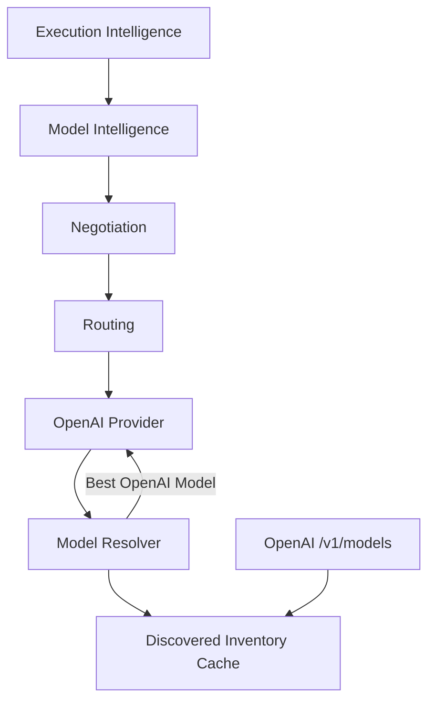
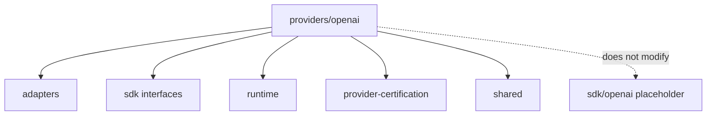

# OpenAI Provider — Architecture Review

## Mission

Reference provider integration proving the Provider Platform works end-to-end:

Template concepts → SDK → Transport (leaf HTTP) → Runtime → Adapter → Integration
patterns → Certification.

## Model Resolution Flow

## Reference Pattern for Future Providers

| Seam | OpenAI Leaf |
|------|-------------|
| Manifest | `buildManifestFromDiscovery` |
| SDK Wrapper | `OpenAISdkClient` implements `IOpenAISdk` |
| Authentication | API key / org / project |
| Request Mapper | `mapCanonicalToOpenAIRequest` |
| Response Mapper | `mapOpenAIResponseToCanonical` |
| Model Resolver | `OpenAIModelResolver` (mandatory) |

## Design Rules

- No hardcoded Intelligence OS model targets (`gpt-4` / `gpt-5`)
- Inventory from discovery API (live or simulated HTTP)
- Capability enrichment inferred from discovered model ids
- Networking only inside `providers/openai/` leaf
- Frozen `sdk/openai` placeholder left unmodified
- Certification required before `active`

## Dependency Graph

