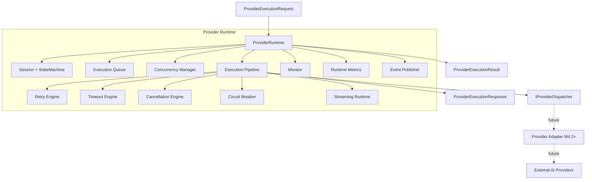
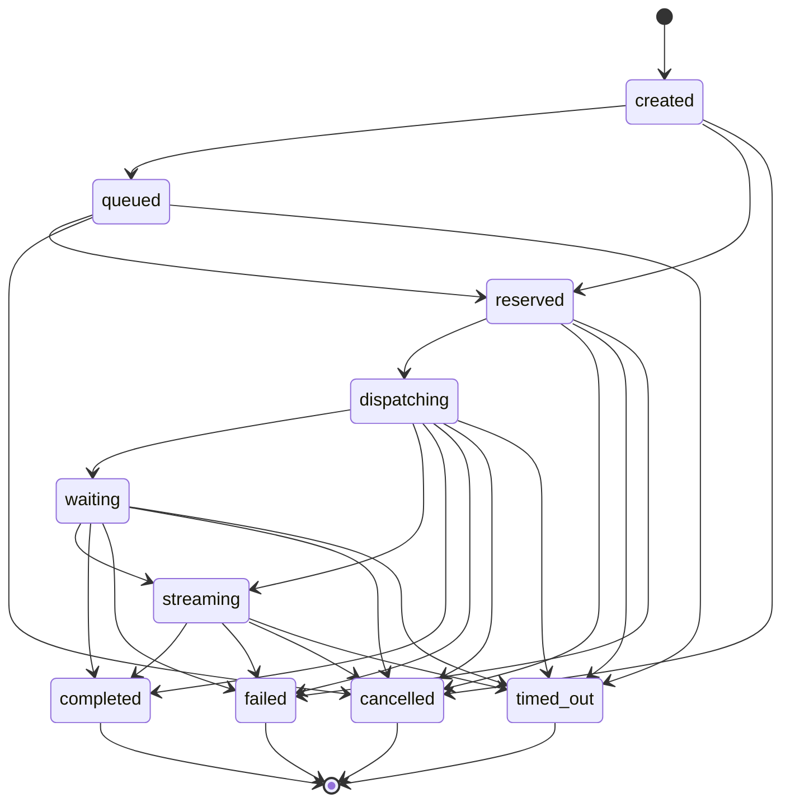
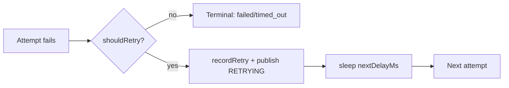
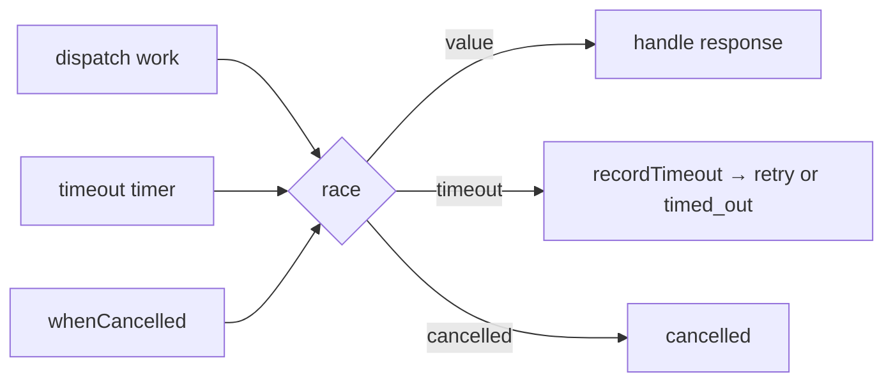
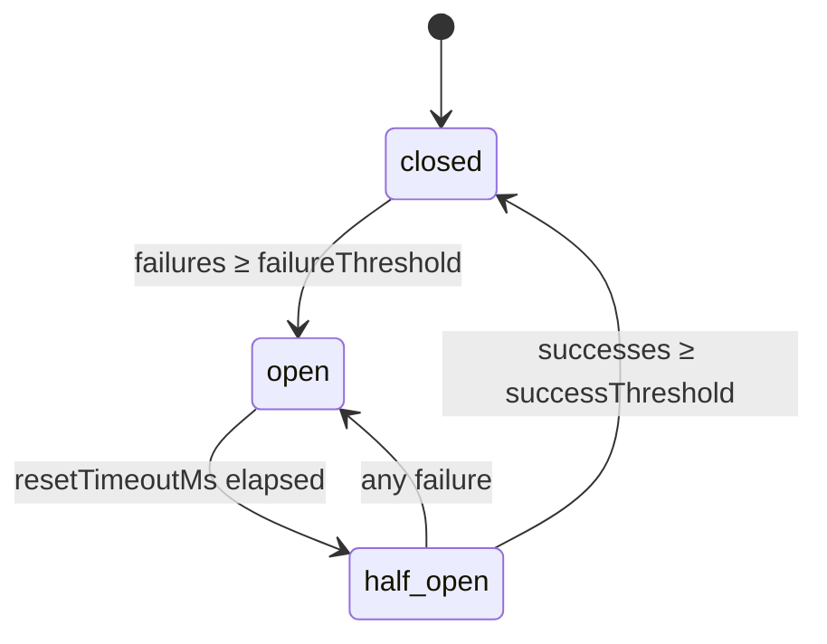
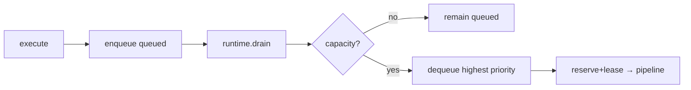
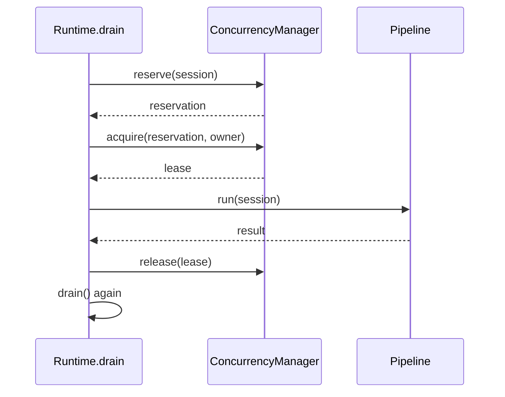
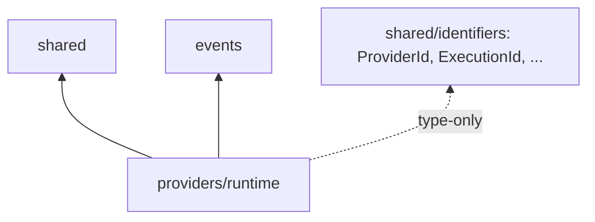

# Provider Runtime — Architecture Review (M4.1)

**Module:** `src/platform/intelligence/providers/runtime/`
**Status:** Implemented — provider-independent, no vendor SDKs.

---

## 1. Purpose & boundaries

The Provider Runtime executes **provider-independent** execution requests
through a full lifecycle: session creation, queueing, concurrency control,
dispatch (with retry, timeout, cancellation, streaming), circuit-breaking, and
metrics. It is the seam into which future provider adapters plug via a single
port — `IProviderDispatcher`.

**In scope:** runtime orchestration, sessions, queue, concurrency, retry,
timeout, cancellation, circuit breaker, streaming coordination, monitor,
metrics.

**Out of scope (later milestones):** OpenAI/Claude/Gemini SDKs, authentication,
API keys, networking, persistence, distributed coordination.

---

## 2. Runtime architecture diagram

The only path to an external provider is through `IProviderDispatcher`. The
default `PlaceholderProviderDispatcher` returns a synthetic, SDK-free response.

---

## 3. Session lifecycle diagram

Lifecycle phase order:
`create → reserve → queue → dispatch → execute → stream → complete → snapshot`.

---

## 4. Retry model

`IRetryEngine` computes deterministic backoff from a `RetryPolicy`:

| Strategy | `nextDelayMs(attempt)` |
|----------|------------------------|
| `none` | never retries (delay 0) |
| `immediate` | 0 |
| `fixed` | `baseDelayMs` |
| `linear` | `baseDelayMs × attempt` |
| `exponential` | `baseDelayMs × multiplier^(attempt-1)` |

- `shouldRetry(policy, attempt)` returns `attempt < maxAttempts` (except `none`).
- `maxDelayMs` caps the computed delay.
- `JitterMode` + `IJitterStrategy` are declared for a future milestone; the
  default `NoJitterStrategy` is a pass-through so retry policies stay
  forward-compatible.

---

## 5. Timeout model

`ITimeoutEngine` resolves three budgets and can race work against a deadline:

| Timeout | Source | Applied |
|---------|--------|---------|
| Execution | `executionTimeoutMs` | per non-streaming dispatch attempt |
| Streaming | `streamingTimeoutMs` (falls back to execution) | per streaming dispatch |
| Queue | `queueTimeoutMs` | checked on dequeue vs. queue wait |

The pipeline races the dispatch against a timeout **and** the cancellation
signal:

Timers use `unref()` so they never keep the process alive.

---

## 6. Circuit breaker model

`ICircuitBreaker` guards each provider (`ICircuitBreakerRegistry.forProvider`).

- `closed`: dispatch allowed; consecutive failures counted.
- `open`: dispatch denied until `resetTimeoutMs` elapses (time-based, injectable clock).
- `half_open`: a probe window; enough successes close it, one failure re-opens.

Future: integrate with the Provider Health Store.

---

## 7. Queue architecture

`IExecutionQueue` (`InMemoryExecutionQueue`) — **in-memory only**, no BullMQ/Redis.

- Ordering: **priority descending**, ties broken by **FIFO** (`enqueuedAtMs`).
- Operations: `enqueue`, `dequeue`, `peek`, `remove`, `list`, `clear`.
- Duplicate session guard prevents double-enqueue.

---

## 8. Concurrency model

`IConcurrencyManager` bounds in-flight executions with **reservations** and
**leases** — no distributed coordination.

- `reserve(session, provider)` → `ExecutionReservation` (counts toward capacity).
- `acquire(reservation, owner)` → `ExecutionLease` (converts reservation to an active lease).
- `release(leaseId)` frees capacity and triggers a re-drain.
- `hasCapacity()` = `active + reserved < max`.

---

## 9. Dependency graph

**Allowed dependencies (per milestone):** Execution Planning contracts,
Execution Runtime contracts, Artifacts, Shared, Telemetry, Events.

**Actual dependencies:** `shared` (result, errors, identifiers) and `events`
(optional bus-backed publisher). The runtime deliberately keeps its dependency
surface minimal; the `ProviderExecutionRequest` is a provider-independent
projection so the runtime need not import planning internals. See ACP-R1.

**Forbidden (verified absent):** provider SDKs, authentication, HTTP,
MongoDB, Redis, BullMQ, Kafka, business modules.

---

## 10. SOLID & clean-architecture compliance

| Principle | Evidence |
|-----------|----------|
| SRP | Each subsystem owns one concern (retry, timeout, queue, …). |
| OCP | New dispatchers/strategies plug in via interfaces; runtime unchanged. |
| LSP | Placeholder and controllable dispatchers honor `IProviderDispatcher`. |
| ISP | Focused ports per concern; no god interface. |
| DIP | Engine depends on abstractions; factory is the sole composition root. |
| Ports & adapters | `IProviderDispatcher` is the driven port; adapters are leaves. |
| Immutability | All contracts are `readonly`; results/snapshots are point-in-time. |

---

## 11. Provider independence

- Zero vendor SDK imports (verified by scan; matches only in doc comments).
- The only external seam is `IProviderDispatcher`.
- The default dispatcher performs no I/O — it returns a synthetic response.
- Provider selection remains owned by Execution Planning; the runtime executes
  the already-selected provider carried on the request.
