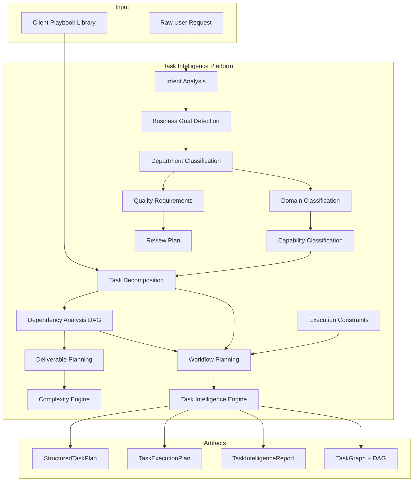

# Task Intelligence Platform — Architecture Review

## Mission

Convert raw user requests into fully structured execution blueprints **before**
Execution Intelligence, Model Intelligence, Negotiation, Routing, or provider
execution. This is the **entry point** of the Intelligence Operating System.

## Position

```
User Request
     ↓
Task Intelligence (M5.3) ← NEW ENTRY POINT
     ↓
StructuredTaskPlan
     ↓
Execution Intelligence → Model Intelligence → Negotiation → Routing
```

## Architecture Diagram



## Pipeline

```
Raw User Request → Intent → Business Goal → Department → Domain
  → Capability → Decomposition → Dependencies → Deliverables
  → Complexity → Constraints → Quality → Review → Structured Task Plan
```

## Client Playbook & Workflow Library

Versioned, configurable playbooks expand recognized business scenarios:

| Playbook | Industry | Example Scenario |
|----------|----------|------------------|
| Retail Product Launch | retail | Sneaker collection launch |
| Real Estate Marketing | real_estate | Property listing campaign |
| Software Product Workflow | software | PRD → release notes |

Playbooks are matched by keywords and industry hints, then expanded into
full task graphs with dependencies.

## Design Principles

- Heuristic classification only — no AI model calls, no networking
- Constructor injection; immutable contracts; `Result<T>`
- Consumes shared contracts only; no frozen module modifications
- `StructuredTaskPlan` designed as future input to Execution Intelligence

## Dependencies

```
task-intelligence → shared
task-intelligence ⇏ execution-intelligence, model-intelligence (no imports)
task-intelligence ⇏ providers, SDK, business modules
```
