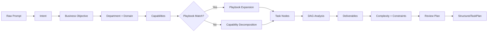
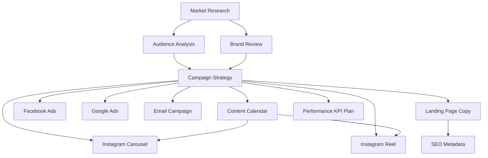

# Task Intelligence — Models & Diagrams

## Ranking / Planning Pipeline

## Dependency Graph

## Unit Test Summary

| Suite | Tests | Coverage |
|-------|-------|----------|
| `engine.test.ts` | 4 | Full pipeline, DAG, explainability, deliverables |
| `playbook.test.ts` | 3 | Playbook library, matching |

**Total: 7 tests** — all passing without AI or provider calls.

Run: `npx jest tests/platform/intelligence/task-intelligence`

Full intelligence suite: **481 tests passing**.

## Output Artifacts

| Artifact | Contract |
|----------|----------|
| StructuredTask | `contracts/task.ts` |
| TaskNode | `contracts/task.ts` |
| TaskGraph | `contracts/graph.ts` |
| DependencyGraph | `contracts/graph.ts` |
| CapabilityMap | `contracts/capability.ts` |
| DepartmentClassification | `contracts/classification.ts` |
| IntentProfile | `contracts/intent.ts` |
| BusinessObjective | `contracts/business.ts` |
| ComplexityProfile | `contracts/complexity.ts` |
| DeliverablePlan | `contracts/deliverable.ts` |
| ExecutionConstraintProfile | `contracts/constraints.ts` |
| TaskExecutionPlan | `contracts/planning.ts` |
| TaskIntelligenceReport | `contracts/result.ts` |
