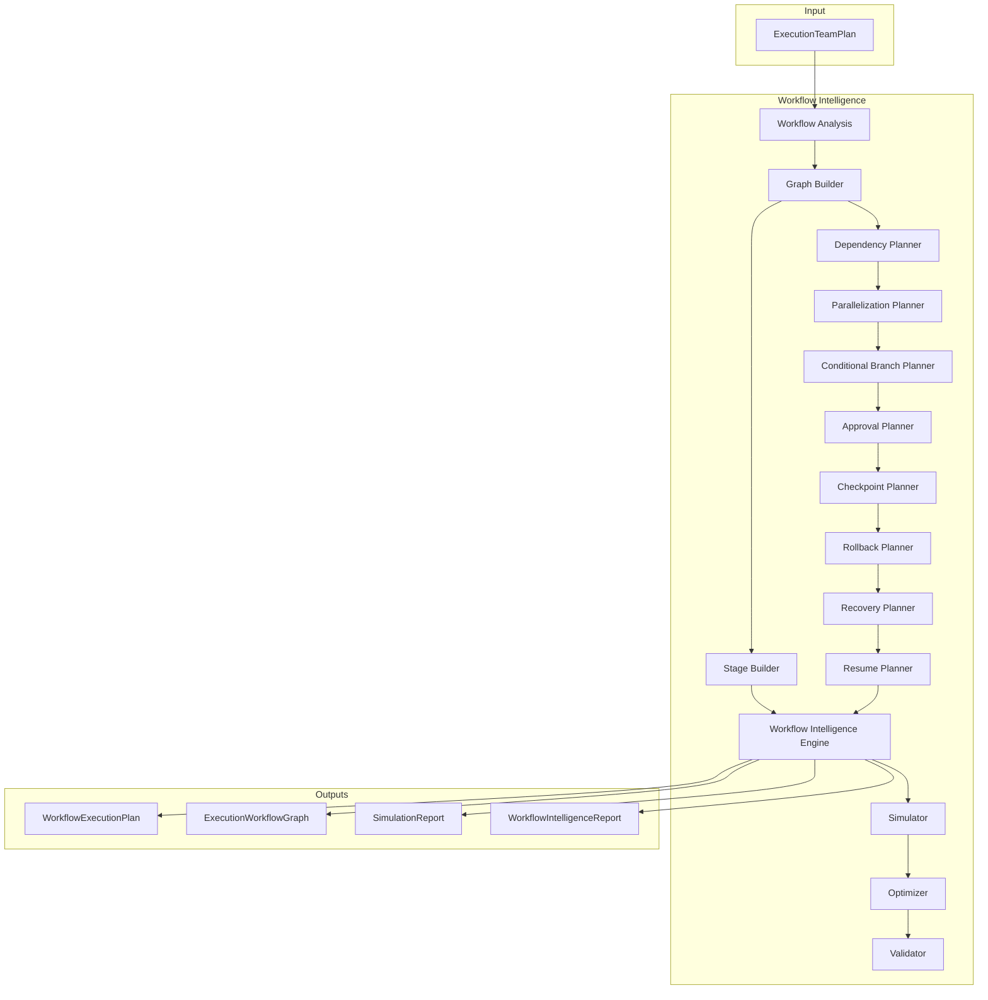

# Workflow Intelligence Platform — Architecture Review

## Mission

Convert an `ExecutionTeamPlan` from Agent Planning into a complete executable
workflow graph for the Execution Platform. Plans, orchestrates, simulates, and
validates — **never executes AI**.

## Position

```
Agent Planning (M5.4)
        ↓
ExecutionTeamPlan
        ↓
Workflow Intelligence (M5.5) ← NEW
        ↓
WorkflowExecutionPlan
        ↓
Execution Intelligence (future input)
```

## Architecture Diagram



## Pipeline

```
ExecutionTeamPlan → Graph → Stages → Dependencies → Parallelization
  → Approvals → Checkpoints → Rollback/Recovery/Resume
  → Simulation → Optimization → Validation → WorkflowExecutionPlan
```

## Design Principles

- Immutable DAG nodes and edges
- Artifact-only flow between nodes (no prompts)
- Dry-run simulation without AI
- Optimization recommendations only — never modifies graph
- Constructor injection; `Result<T>`; no frozen module changes

## Dependencies

```
workflow-intelligence → agent-planning (contracts), shared
workflow-intelligence ⇏ execution-intelligence, providers, model-intelligence
```
