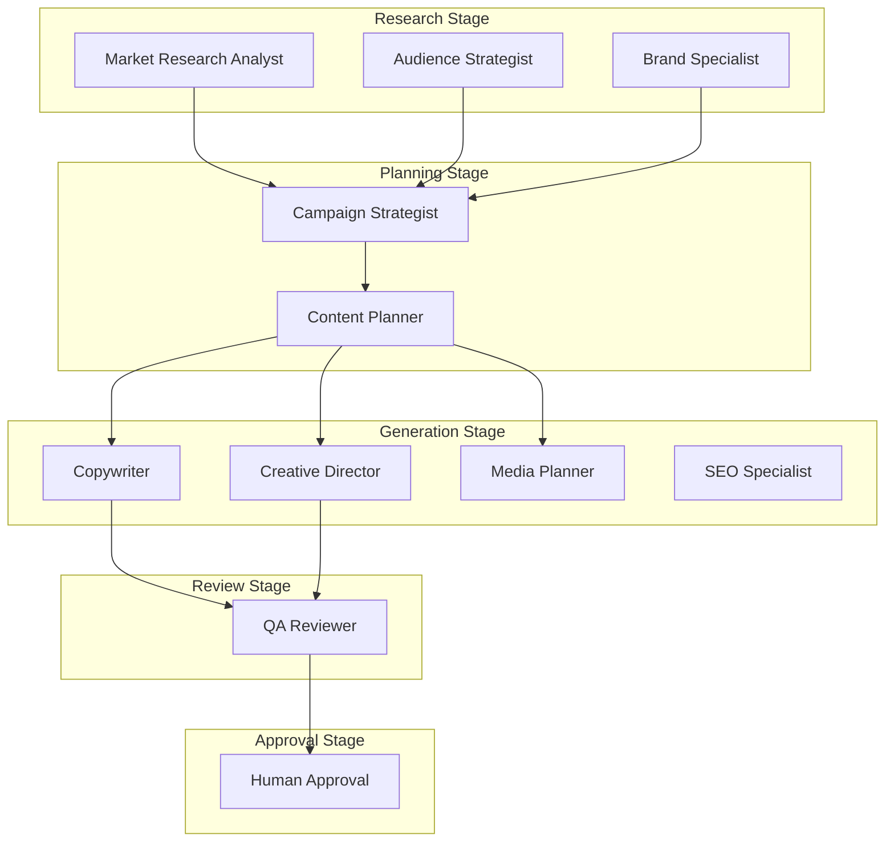

# Workflow Intelligence — Models & Diagrams

## Workflow DAG (Product Launch)

## Dependency Graph

Edges carry dependency kind and artifact flow (consumes/produces).

## Unit Test Summary

| Suite | Tests | Coverage |
|-------|-------|----------|
| `engine.test.ts` | 6 | Full pipeline, DAG, plans, simulation, explainability, optimization |

Run: `npx jest tests/platform/intelligence/workflow-intelligence`

## Output Artifacts

| Artifact | Contract |
|----------|----------|
| WorkflowExecutionPlan | `contracts/plan.ts` |
| ExecutionWorkflowGraph | `contracts/graph.ts` |
| WorkflowStage | `contracts/stages.ts` |
| ApprovalPlan | `contracts/approvals.ts` |
| CheckpointPlan | `contracts/checkpoints.ts` |
| RollbackPlan | `contracts/recovery.ts` |
| RecoveryPlan | `contracts/recovery.ts` |
| ResumePlan | `contracts/recovery.ts` |
| SimulationReport | `contracts/simulation.ts` |
| WorkflowIntelligenceReport | `contracts/result.ts` |
